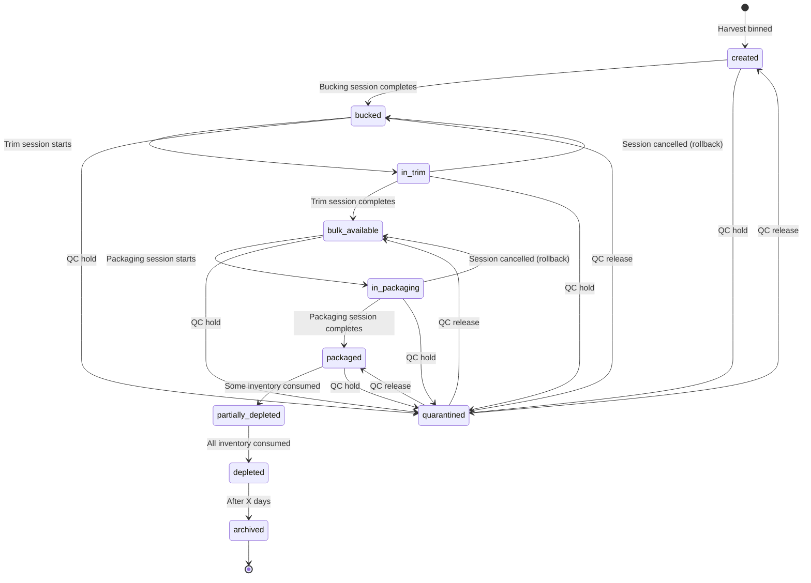

# BATCHES - Batch Lifecycle & Traceability System

> **Status:** Authoritative Reference Documentation (v2.0) ⭐ **PRIMARY REFERENCE FOR BATCH ARCHITECTURE**
> **Purpose:** Complete specification of batch-centric architecture, lifecycle management, and traceability infrastructure
> **Foundation:** This system is batch-centric - batches are the architectural foundation, not an add-on feature
> **Critical:** 5 batch-related integrity gaps exist (Migration Batch 1 ready for deployment)
> **Cross-References:** [SYSTEM-WORKFLOW](./SYSTEM-WORKFLOW.md), [SESSIONS](./SESSIONS.md), [INVENTORY-TRACKING](./INVENTORY-TRACKING.md), [COA-HANDLING](./COA-HANDLING.md)

---

## ⭐ START HERE: Why This Document Matters

**This is the most important document for understanding this system's architecture.**

Every design decision, every workflow, every compliance requirement flows from one fundamental principle:

> **Every product MUST be traceable to its harvest batch.**

This is not a feature request or a nice-to-have. **Batch traceability is legally required** for cannabis operations and is the foundation upon which the entire system is built. Without batch integrity:
- You cannot prove compliance
- You cannot track recalls
- You cannot manage quality
- You cannot pass regulatory audits
- You cannot legally operate

**If you're new to this codebase:** Read this document first to understand the batch-centric architecture before diving into other modules.

**If you're implementing features:** Always ask: "How does this feature maintain batch lineage?"

**If you're debugging:** Most data integrity issues trace back to broken batch linkage.

---

## TABLE OF CONTENTS

0. [⭐ START HERE: Why This Document Matters](#-start-here-why-this-document-matters)
1. [Overview](#overview)
2. [Batch-Centric Architecture](#batch-centric-architecture)
3. [Batch Creation](#batch-creation)
4. [Lifecycle States](#lifecycle-states)
5. [Lifecycle Transitions](#lifecycle-transitions)
6. [Quarantine Management](#quarantine-management)
7. [Batch Allocation](#batch-allocation)
8. [Traceability & Lineage](#traceability--lineage)
9. [Batch Analytics](#batch-analytics)
10. [Implementation Status & Critical Gaps](#implementation-status--critical-gaps)
11. [SQL Reference](#sql-reference)
12. [Cross-Reference Links](#cross-reference-links)

---

## Overview

The batch system provides **end-to-end traceability** from harvest through final sale. Every package of cannabis, every inventory movement, and every processing session is linked to a batch, creating an unbreakable audit trail required for compliance and quality management.

### What is a Batch?

A **batch** represents a specific harvest of cannabis material from a particular strain, harvested on a specific date. All products derived from that harvest inherit the batch's identity, creating complete seed-to-sale traceability.

### Core Principles

```
┌─────────────────────────────────────────────────────────────────────┐
│ BATCH-CENTRIC SYSTEM PRINCIPLES                                     │
├─────────────────────────────────────────────────────────────────────┤
│ 1. Every inventory item has a batch_id (immutable)                  │
│ 2. Batch lifecycle states track progression through stages          │
│ 3. All processing sessions linked to batches                        │
│ 4. COAs attached to batches, not individual packages                │
│ 5. Quarantine operates at batch level (blocks all operations)       │
│ 6. Traceability via batch_production_history (immutable log)        │
│ 7. Parent-child lineage preserved through processing                │
│ 8. Strain inherited from batch through all transformations          │
└─────────────────────────────────────────────────────────────────────┘
```

### Batch Lifecycle Pipeline

```
┌──────────────────────────────────────────────────────────────────────┐
│ BATCH LIFECYCLE (From Harvest to Depletion)                         │
├──────────────────────────────────────────────────────────────────────┤
│                                                                       │
│  CREATED                                                             │
│  └─ Harvest binned, batch record created                             │
│     ├─ batch_number: YYMMDD-STRAIN-NN                                │
│     ├─ strain_id: FK to strains table                                │
│     ├─ harvest_date: Actual harvest date                             │
│     ├─ initial_weight_grams: Wet weight (optional)                   │
│     └─ lifecycle_state: 'created'                                    │
│                                                                       │
│  BUCKED                                                              │
│  └─ Bucking session completed                                        │
│     ├─ Output: Bucked Flower + Bucked Smalls                         │
│     └─ lifecycle_state: 'bucked'                                     │
│                                                                       │
│  IN_TRIM                                                             │
│  └─ Trim session active                                              │
│     └─ lifecycle_state: 'in_trim'                                    │
│                                                                       │
│  BULK_AVAILABLE                                                      │
│  └─ Trim session completed                                           │
│     ├─ Output: Bulk Flower + Bulk Smalls + Trim                      │
│     └─ lifecycle_state: 'bulk_available'                             │
│                                                                       │
│  IN_PACKAGING                                                        │
│  └─ Packaging session active                                         │
│     └─ lifecycle_state: 'in_packaging'                               │
│                                                                       │
│  PACKAGED                                                            │
│  └─ Packaging session completed                                      │
│     ├─ Output: Packaged units (3.5g, 14g, 28g, etc.)                 │
│     ├─ COA attached (required for compliance)                        │
│     └─ lifecycle_state: 'packaged'                                   │
│                                                                       │
│  PARTIALLY_DEPLETED                                                  │
│  └─ Some inventory consumed                                          │
│     └─ lifecycle_state: 'partially_depleted'                         │
│                                                                       │
│  DEPLETED                                                            │
│  └─ All inventory consumed                                           │
│     └─ lifecycle_state: 'depleted'                                   │
│                                                                       │
│  ARCHIVED                                                            │
│  └─ Retention period complete                                        │
│     └─ lifecycle_state: 'archived'                                   │
│                                                                       │
│  QUARANTINED (Can occur from ANY state)                              │
│  └─ QC hold, investigation, or compliance issue                      │
│     ├─ is_quarantined: true                                          │
│     ├─ quarantine_reason: Required explanation                       │
│     └─ Blocks all processing and fulfillment                         │
│                                                                       │
└──────────────────────────────────────────────────────────────────────┘
```

### Evidence

**Database Schema:**
- `supabase/migrations/20251020000000_phase1_batch_centric_foundation.sql`
- `supabase/migrations/20251020000100_phase1_batch_lifecycle_triggers.sql`
- `supabase/migrations/20251017202020_create_batch_management_foundation.sql`

**Frontend Components:**
- `src/features/batches/components/BatchManagement.tsx`
- `src/features/batches/services/batch.service.ts`

---

## Batch-Centric Architecture

### Design Philosophy

The system is **batch-centric**, meaning batches are the organizing principle for all inventory, processing, and sales operations. This architecture ensures:

1. **Traceability**: Every package traces back to a harvest batch
2. **Compliance**: COAs, quarantines, and recalls operate at batch level
3. **Quality**: Consistent strain characteristics throughout processing
4. **Analytics**: Yield, variance, and performance tracked per batch

### Core Schema

**batch_registry Table:**
```sql
CREATE TABLE batch_registry (
  id uuid PRIMARY KEY DEFAULT gen_random_uuid(),
  batch_number text UNIQUE NOT NULL,  -- YYMMDD-STRAIN format
  strain_id uuid NOT NULL REFERENCES strains(id),
  harvest_date date NOT NULL,
  room text,  -- Cultivation room identifier
  initial_weight_grams numeric(10, 2),

  -- Lifecycle tracking
  lifecycle_state text NOT NULL DEFAULT 'created',
  bucking_started_at timestamptz,
  trimming_started_at timestamptz,
  packaging_started_at timestamptz,
  completed_at timestamptz,
  depleted_at timestamptz,

  -- Quality & compliance
  is_quarantined boolean DEFAULT false,
  quarantine_reason text,
  quarantined_at timestamptz,
  coa_id uuid REFERENCES certificates_of_analysis(id),

  -- Audit
  created_at timestamptz DEFAULT now(),
  updated_at timestamptz DEFAULT now(),
  created_by uuid REFERENCES auth.users(id),

  CONSTRAINT valid_batch_lifecycle_state CHECK (
    lifecycle_state IN (
      'created', 'bucked', 'in_trim', 'bulk_available',
      'in_packaging', 'packaged', 'partially_depleted',
      'depleted', 'archived'
    )
  )
);
```

### Foreign Key Architecture

Every entity is linked to batches:

```
batch_registry (root)
  ├─── trim_sessions.batch_registry_id
  ├─── packaging_sessions.batch_registry_id
  ├─── inventory_items.batch_id
  ├─── batch_allocations.batch_id
  ├─── batch_production_history.batch_id (audit trail)
  ├─── batch_lifecycle_events.batch_id (state changes)
  └─── certificates_of_analysis.batch_id (COA linkage)
```

### Immutable Batch Properties

Once created, these fields **NEVER change**:
- `batch_number` - Unique identifier
- `strain_id` - Strain type (inherited by all packages)
- `harvest_date` - Original harvest date
- `created_by` - User who created batch

**Rationale:** Immutability ensures audit trail integrity and prevents compliance violations from retroactive data changes.

---

## Batch Creation

### Creation Workflow

```
┌──────────────────────────────────────────────────────────────────────┐
│ BATCH CREATION WORKFLOW                                              │
├──────────────────────────────────────────────────────────────────────┤
│                                                                       │
│  1. HARVEST COMPLETION                                               │
│     └─ Material binned per strain/room                               │
│                                                                       │
│  2. BATCH RECORD CREATION (Manager via UI)                           │
│     ├─ Enter:                                                        │
│     │  ├─ strain_id: Select from strains table                       │
│     │  ├─ harvest_date: Date material was harvested                  │
│     │  ├─ room: Cultivation room identifier (optional)               │
│     │  ├─ initial_weight_grams: Wet weight at binning (optional)     │
│     │  └─ is_quarantined: QC hold checkbox (default: false)          │
│     ├─ System generates:                                             │
│     │  ├─ batch_number: YYMMDD-STRAIN format                          │
│     │  │  Example: 250106-GSC (2025-01-06, Girl Scout Cookies)       │
│     │  ├─ id: UUID primary key                                       │
│     │  ├─ lifecycle_state: 'created'                                 │
│     │  ├─ created_at: now()                                          │
│     │  └─ created_by: Current user ID                                │
│     └─ Validation:                                                   │
│        ├─ strain_id exists in strains table                          │
│        ├─ batch_number unique (constraint enforced)                  │
│        ├─ initial_weight_grams > 0 (if provided)                     │
│        └─ harvest_date <= current_date                               │
│                                                                       │
│     Note: initial_weight_grams is optional                           │
│        - May not be known at batch creation time                     │
│        - Can be added later during bucking session                   │
│        - Some facilities skip wet weight measurement entirely        │
│        - Field is informational only (does not affect workflow)      │
│                                                                       │
│  3. AUDIT TRAIL CREATION (Automatic)                                 │
│     └─ Insert batch_production_history:                              │
│        ├─ event_type: 'batch_created'                                │
│        ├─ batch_id: New batch ID                                     │
│        ├─ created_by: Current user ID                                │
│        └─ notes: 'Batch created from harvest'                        │
│                                                                       │
│  4. BATCH READY FOR BUCKING                                          │
│     └─ Batch appears in bucking queue                                │
│        └─ Filter: lifecycle_state = 'created' AND is_quarantined = false │
│                                                                       │
└──────────────────────────────────────────────────────────────────────┘
```

### Batch Number Format

**Format:** `YYMMDD-STRAIN`

**Components:**
- `YYMMDD` - Harvest date (e.g., 250106 = January 6, 2025)
- `STRAIN` - Strain code (3-5 uppercase letters)

**Examples:**
- `250106-GSC` - Girl Scout Cookies, harvested on 2025-01-06
- `250112-GDP` - Grandaddy Purple, harvested on 2025-01-12
- `250120-MAC` - Miracle Alien Cookies, harvested on 2025-01-20

**Same-Strain Same-Day Harvests:**
If the same strain is harvested on the same day (even from different rooms), both harvests share the same batch number. This consolidation simplifies tracking while maintaining accurate traceability.

### Batch Number Generation

**Function:** `fn_generate_batch_number(strain_id, harvest_date)`

**Implementation Status:** 🔴 NOT IMPLEMENTED (currently manual entry)

**Algorithm:**
```sql
-- Proposed function (not yet created)
CREATE FUNCTION fn_generate_batch_number(
  p_strain_id uuid,
  p_harvest_date date
) RETURNS text AS $$
DECLARE
  v_strain_code text;
  v_date_prefix text;
  v_batch_number text;
BEGIN
  -- Get strain code
  SELECT abbreviation INTO v_strain_code
  FROM strains WHERE id = p_strain_id;

  -- Format date as YYMMDD
  v_date_prefix := to_char(p_harvest_date, 'YYMMDD');

  -- Build batch number (simplified - no sequence suffix)
  v_batch_number := v_date_prefix || '-' || v_strain_code;

  RETURN v_batch_number;
END;
$$ LANGUAGE plpgsql;
```

---

## Lifecycle States

### State Definitions

| State | Description | Entry Condition | Exit Condition |
|-------|-------------|----------------|----------------|
| `created` | Initial state after harvest | Batch created | Bucking session completed |
| `bucked` | Bucked into flower and smalls | Bucking completed | Trim session started |
| `in_trim` | Active trim session | Trim started | Trim session completed |
| `bulk_available` | Trimmed into bulk material | Trim completed | Packaging session started |
| `in_packaging` | Active packaging session | Packaging started | Packaging session completed |
| `packaged` | Packaged units ready for sale | Packaging completed | First order fulfilled |
| `partially_depleted` | Some inventory consumed | Fulfillment occurs | All inventory consumed |
| `depleted` | All inventory consumed | Last fulfillment | Retention period complete |
| `archived` | Historical record only | Retention complete | N/A (terminal state) |

### State Timestamps

Each lifecycle state has an associated timestamp:

```sql
-- Timestamp fields in batch_registry
bucking_started_at      -- When bucking session starts (created → bucked)
trimming_started_at     -- When trim session starts (bucked → in_trim)
packaging_started_at    -- When packaging session starts (bulk_available → in_packaging)
completed_at            -- When packaging completes (in_packaging → packaged)
depleted_at             -- When all inventory consumed (partially_depleted → depleted)
```

**Usage:**
- Calculate processing time per stage
- Analyze batch velocity through pipeline
- Identify bottlenecks in production workflow

### Lifecycle State Queries

**Current State Distribution:**
```sql
SELECT
  lifecycle_state,
  COUNT(*) as batch_count,
  SUM(initial_weight_grams) as total_initial_weight
FROM batch_registry
WHERE lifecycle_state NOT IN ('depleted', 'archived')
GROUP BY lifecycle_state
ORDER BY
  CASE lifecycle_state
    WHEN 'created' THEN 1
    WHEN 'bucked' THEN 2
    WHEN 'in_trim' THEN 3
    WHEN 'bulk_available' THEN 4
    WHEN 'in_packaging' THEN 5
    WHEN 'packaged' THEN 6
    WHEN 'partially_depleted' THEN 7
  END;
```

**Batches Ready for Next Stage:**
```sql
-- Ready for bucking
SELECT * FROM batch_registry
WHERE lifecycle_state = 'created'
  AND is_quarantined = false
ORDER BY harvest_date ASC;

-- Ready for trim
SELECT * FROM batch_registry
WHERE lifecycle_state = 'bucked'
  AND is_quarantined = false
ORDER BY bucking_started_at ASC;

-- Ready for packaging
SELECT * FROM batch_registry
WHERE lifecycle_state = 'bulk_available'
  AND is_quarantined = false
ORDER BY trimming_started_at ASC;
```

---

## Lifecycle Transitions

### State Machine



### Valid Transitions

**Forward Progression:**
1. `created` → `bucked` - Bucking session completed
2. `bucked` → `in_trim` - Trim session started
3. `in_trim` → `bulk_available` - Trim session completed
4. `bulk_available` → `in_packaging` - Packaging session started
5. `in_packaging` → `packaged` - Packaging session completed
6. `packaged` → `partially_depleted` - First fulfillment
7. `partially_depleted` → `depleted` - Last fulfillment
8. `depleted` → `archived` - Retention period complete

**Quarantine Transitions:**
- Any → `quarantined` - QC hold applied
- `quarantined` → Previous state - QC hold released

**Rollback Transitions (Cancellation):**
- `in_trim` → `bucked` - Trim session cancelled
- `in_packaging` → `bulk_available` - Packaging session cancelled

### Blocked Transitions

**Invalid Operations:**
- ❌ Cannot skip stages (e.g., `created` → `packaged`)
- ❌ Cannot regress (e.g., `packaged` → `bucked`) except via cancellation
- ❌ Cannot transition while quarantined (must release quarantine first)
- ❌ Cannot archive until depleted

### Transition Triggers

**Evidence:** `supabase/migrations/20251020000100_phase1_batch_lifecycle_triggers.sql`

**Automatic Transitions:**
```sql
-- Trim session completion updates batch lifecycle
CREATE TRIGGER trg_update_batch_lifecycle_on_trim_complete
AFTER UPDATE ON trim_sessions
FOR EACH ROW
WHEN (NEW.session_status = 'completed' AND OLD.session_status = 'active')
EXECUTE FUNCTION fn_update_batch_lifecycle_on_session_complete();

-- Packaging session completion updates batch lifecycle
CREATE TRIGGER trg_update_batch_lifecycle_on_packaging_complete
AFTER UPDATE ON packaging_sessions
FOR EACH ROW
WHEN (NEW.session_status = 'completed' AND OLD.session_status = 'active')
EXECUTE FUNCTION fn_update_batch_lifecycle_on_session_complete();
```

**Manual Transitions:**
- Quarantine: Manager sets `is_quarantined = true` + `quarantine_reason`
- Release: Manager sets `is_quarantined = false`
- Archive: Automated job after retention period

---

## Quarantine Management

### Purpose

Quarantine allows managers to **immediately halt all operations** on a batch due to:
- Quality concerns (mold, contamination, off-spec testing)
- Compliance issues (missing documentation, licensing problems)
- Investigation (customer complaints, recall notices)
- Testing delays (awaiting COA results)

### Quarantine Workflow

```
┌──────────────────────────────────────────────────────────────────────┐
│ QUARANTINE WORKFLOW                                                  │
├──────────────────────────────────────────────────────────────────────┤
│                                                                       │
│  1. QUARANTINE APPLIED (Manager)                                     │
│     ├─ Update batch_registry:                                        │
│     │  ├─ is_quarantined: true                                       │
│     │  ├─ quarantine_reason: Required explanation                    │
│     │  ├─ quarantined_at: now()                                      │
│     │  └─ quarantined_by: Current user ID                            │
│     └─ Insert batch_lifecycle_events:                                │
│        ├─ event_type: 'quarantined'                                  │
│        ├─ notes: quarantine_reason                                   │
│        └─ created_by: Current user ID                                │
│                                                                       │
│  2. OPERATIONS BLOCKED (Automatic)                                   │
│     ├─ Processing sessions: Cannot start new sessions                │
│     ├─ Order allocation: Batch excluded from batch selection         │
│     ├─ Fulfillment: Existing allocations blocked                     │
│     └─ Conversions: Manager cannot finalize packages                 │
│                                                                       │
│  3. QUARANTINE RELEASED (Manager, after resolution)                  │
│     ├─ Update batch_registry:                                        │
│     │  ├─ is_quarantined: false                                      │
│     │  ├─ quarantine_reason: NULL (or keep for audit)                │
│     │  └─ quarantine_released_at: now()                              │
│     └─ Insert batch_lifecycle_events:                                │
│        ├─ event_type: 'quarantine_released'                          │
│        ├─ notes: Resolution explanation                              │
│        └─ created_by: Current user ID                                │
│                                                                       │
│  4. OPERATIONS RESUME                                                │
│     └─ Batch returns to normal processing workflow                   │
│                                                                       │
└──────────────────────────────────────────────────────────────────────┘
```

### Quarantine Enforcement

**Where Quarantine is Checked:**

1. **Session Start:**
```sql
-- Cannot start session on quarantined batch
CREATE FUNCTION fn_validate_session_start() RETURNS trigger AS $$
BEGIN
  IF EXISTS (
    SELECT 1 FROM batch_registry
    WHERE id = NEW.batch_registry_id
    AND is_quarantined = true
  ) THEN
    RAISE EXCEPTION 'Cannot start session: Batch is quarantined';
  END IF;
  RETURN NEW;
END;
$$ LANGUAGE plpgsql;
```

2. **Batch Allocation:**
```sql
-- Quarantined batches excluded from batch selection view
CREATE VIEW v_batch_selection_for_strain AS
SELECT *
FROM batch_registry
WHERE is_quarantined = false
  AND lifecycle_state IN ('packaged', 'bulk_available', 'partially_depleted')
  -- ... other conditions
;
```

3. **Order Fulfillment:**
```sql
-- Cannot fulfill from quarantined batch
CREATE FUNCTION fn_validate_fulfillment() RETURNS trigger AS $$
BEGIN
  IF EXISTS (
    SELECT 1
    FROM order_fulfillment_items ofi
    JOIN inventory_items ii ON ii.id = ofi.item_id
    JOIN batch_registry br ON br.id = ii.batch_id
    WHERE ofi.id = NEW.id
    AND br.is_quarantined = true
  ) THEN
    RAISE EXCEPTION 'Cannot fulfill: Batch is quarantined';
  END IF;
  RETURN NEW;
END;
$$ LANGUAGE plpgsql;
```

### Quarantine Reasons

**Common Reasons:**
- `failed_testing` - COA results below compliance thresholds
- `contamination` - Mold, pests, or foreign material detected
- `pending_results` - Awaiting COA from lab
- `customer_complaint` - Product quality issue reported
- `recall_investigation` - Investigating potential recall
- `documentation_missing` - Missing required compliance docs
- `equipment_malfunction` - Processing equipment contamination

---

## Batch Allocation

### Purpose

Batch allocation links specific batches to order line items, creating soft inventory reservations and enabling strain-aware fulfillment.

### Allocation Workflow

**Evidence:** `supabase/migrations/20251020161901_create_batch_hierarchical_allocation_system.sql`

```
┌──────────────────────────────────────────────────────────────────────┐
│ BATCH ALLOCATION WORKFLOW                                            │
├──────────────────────────────────────────────────────────────────────┤
│                                                                       │
│  1. VIEW AVAILABLE BATCHES (Manager)                                 │
│     └─ Query v_batch_selection_for_strain:                           │
│        ├─ Filter by product.strain_id                                │
│        ├─ Show: batch_number, available_qty, lifecycle_state         │
│        └─ Exclude: quarantined batches, depleted batches             │
│                                                                       │
│  2. ALLOCATE BATCH TO ORDER ITEM (Manager)                           │
│     ├─ Manager selects batch from list                               │
│     ├─ Manager enters allocation_qty (weight OR units)               │
│     ├─ System validates:                                             │
│     │  ├─ allocation_qty <= batch available_qty                      │
│     │  ├─ Batch not quarantined                                      │
│     │  ├─ COA active (if packaging stage)                            │
│     │  └─ Strain match: batch.strain_id = product.strain_id          │
│     ├─ Insert batch_allocations:                                     │
│     │  ├─ batch_id: Selected batch FK                                │
│     │  ├─ order_id: Parent order FK                                  │
│     │  ├─ order_item_id: Specific line item FK                       │
│     │  ├─ allocated_weight_grams OR allocated_units: Manager input   │
│     │  ├─ status: 'pending'                                          │
│     │  └─ created_at: now()                                          │
│     └─ Create soft reservation:                                      │
│        └─ Insert inventory_movements:                                │
│           ├─ movement_kind: 'RESERVE'                                │
│           ├─ source_item_id: Batch's packaged inventory item         │
│           ├─ qty: allocation_qty                                     │
│           ├─ order_id: Parent order FK                               │
│           └─ reason_code: 'order_allocation'                         │
│                                                                       │
│  3. UPDATE ORDER STATUS                                              │
│     ├─ Update order_items.status: 'allocated'                        │
│     └─ IF all items allocated:                                       │
│        └─ Update orders.status: 'processing'                         │
│                                                                       │
└──────────────────────────────────────────────────────────────────────┘
```

### Strain-Aware Allocation

**Key View:** `v_batch_selection_for_strain`

```sql
CREATE VIEW v_batch_selection_for_strain AS
SELECT
  br.id as batch_id,
  br.batch_number,
  br.strain_id,
  s.name as strain_name,
  br.lifecycle_state,
  br.is_quarantined,
  coa.is_active as coa_active,

  -- Calculate available quantity across all inventory stages
  COALESCE(SUM(ii.on_hand_qty), 0) as available_qty,

  -- Show which stages have inventory
  COUNT(DISTINCT ii.product_stage_id) as stage_count,

  -- Earliest package date (for FIFO if desired)
  MIN(ii.package_date) as earliest_package_date

FROM batch_registry br
JOIN strains s ON s.id = br.strain_id
LEFT JOIN certificates_of_analysis coa ON coa.id = br.coa_id
LEFT JOIN inventory_items ii ON ii.batch_id = br.id
WHERE br.is_quarantined = false
  AND br.lifecycle_state IN ('packaged', 'bulk_available', 'partially_depleted')
  AND ii.on_hand_qty > 0
GROUP BY br.id, br.batch_number, br.strain_id, s.name,
         br.lifecycle_state, br.is_quarantined, coa.is_active
HAVING COALESCE(SUM(ii.on_hand_qty), 0) > 0
ORDER BY br.harvest_date ASC;  -- FIFO by harvest date
```

### Allocation Validation

**Strain Match Validation:**
```sql
-- Ensure allocated batch matches product strain
CREATE FUNCTION fn_validate_batch_strain_match() RETURNS trigger AS $$
BEGIN
  IF NOT EXISTS (
    SELECT 1
    FROM order_items oi
    JOIN products p ON p.id = oi.product_id
    JOIN batch_registry br ON br.id = NEW.batch_id
    WHERE oi.id = NEW.order_item_id
    AND p.strain_id = br.strain_id
  ) THEN
    RAISE EXCEPTION 'Strain mismatch: Batch strain does not match product strain';
  END IF;
  RETURN NEW;
END;
$$ LANGUAGE plpgsql;
```

**Status:** 🟡 PLANNED (validation function exists but trigger NOT created)

---

## Traceability & Lineage

### Audit Trail Tables

**batch_production_history:**
Complete log of all batch transformations and events.

```sql
CREATE TABLE batch_production_history (
  id uuid PRIMARY KEY DEFAULT gen_random_uuid(),
  batch_id uuid NOT NULL REFERENCES batch_registry(id),
  event_type text NOT NULL,  -- 'batch_created', 'bucking_completed', etc.
  event_timestamp timestamptz DEFAULT now(),
  session_id uuid,  -- FK to trim_sessions or packaging_sessions
  input_weight numeric,
  output_weight numeric,
  variance_weight numeric,
  variance_reason text,
  notes text,
  created_by uuid REFERENCES auth.users(id),
  created_at timestamptz DEFAULT now()
);
```

**Event Types:**
- `batch_created` - Initial batch creation
- `bucking_completed` - Bucking session finished
- `trim_completed` - Trim session finished
- `packaging_completed` - Packaging session finished
- `allocation_created` - Batch allocated to order
- `allocation_fulfilled` - Fulfillment completed
- `quarantined` - Batch quarantined
- `quarantine_released` - Quarantine lifted
- `coa_attached` - COA uploaded and linked
- `manual_adjustment` - Inventory adjustment or cancellation

### Lineage Tracking

**Parent-Child Relationships:**
```sql
-- Inventory lineage via parent_item_id
SELECT
  child.package_id as child_package,
  child.product_stage_id as child_stage,
  parent.package_id as parent_package,
  parent.product_stage_id as parent_stage,
  br.batch_number,
  s.name as strain
FROM inventory_items child
LEFT JOIN inventory_items parent ON parent.id = child.parent_item_id
JOIN batch_registry br ON br.id = child.batch_id
JOIN strains s ON s.id = br.strain_id
WHERE child.batch_id = :batch_id
ORDER BY child.created_at ASC;
```

**Full Batch Lineage:**
```sql
-- Recursive query to trace full lineage
WITH RECURSIVE lineage AS (
  -- Base case: root packages (no parent)
  SELECT
    id,
    package_id,
    parent_item_id,
    product_stage_id,
    batch_id,
    0 as depth,
    ARRAY[package_id] as lineage_path
  FROM inventory_items
  WHERE batch_id = :batch_id
    AND parent_item_id IS NULL

  UNION ALL

  -- Recursive case: child packages
  SELECT
    ii.id,
    ii.package_id,
    ii.parent_item_id,
    ii.product_stage_id,
    ii.batch_id,
    l.depth + 1,
    l.lineage_path || ii.package_id
  FROM inventory_items ii
  JOIN lineage l ON l.id = ii.parent_item_id
)
SELECT * FROM lineage
ORDER BY depth, package_id;
```

### Batch Summary View

**batch_summary View:**
```sql
CREATE VIEW batch_summary AS
SELECT
  br.id as batch_id,
  br.batch_number,
  br.lifecycle_state,
  br.is_quarantined,
  s.name as strain,
  br.harvest_date,
  br.initial_weight_grams,

  -- Session counts
  (SELECT COUNT(*) FROM trim_sessions WHERE batch_registry_id = br.id AND session_status = 'completed') as trim_session_count,
  (SELECT COUNT(*) FROM packaging_sessions WHERE batch_registry_id = br.id AND session_status = 'completed') as packaging_session_count,

  -- Current inventory
  COALESCE((SELECT SUM(on_hand_qty) FROM inventory_items WHERE batch_id = br.id), 0) as current_inventory_qty,

  -- Allocations
  COALESCE((SELECT SUM(allocated_weight_grams + allocated_units) FROM batch_allocations WHERE batch_id = br.id AND status = 'pending'), 0) as allocated_qty,

  -- COA status
  coa.is_active as coa_active,
  coa.test_date as coa_test_date,
  coa.thc_percent,
  coa.cbd_percent,

  -- Timestamps
  br.created_at,
  br.bucking_started_at,
  br.trimming_started_at,
  br.packaging_started_at,
  br.completed_at,
  br.depleted_at

FROM batch_registry br
JOIN strains s ON s.id = br.strain_id
LEFT JOIN certificates_of_analysis coa ON coa.id = br.coa_id;
```

---

## Batch Analytics

### Yield Analysis

**Bucking Yield:**
```sql
SELECT
  br.batch_number,
  s.name as strain,
  ts.input_weight_lbs * 453.592 as input_grams,
  ts.bucked_flower_weight + ts.bucked_smalls_weight as usable_output,
  ts.waste_weight,
  ((ts.bucked_flower_weight + ts.bucked_smalls_weight) /
   NULLIF(ts.input_weight_lbs * 453.592, 0) * 100) as yield_percentage
FROM trim_sessions ts
JOIN batch_registry br ON br.id = ts.batch_registry_id
JOIN strains s ON s.id = br.strain_id
WHERE ts.session_status = 'completed'
  AND ts.source_stage IS NULL  -- Bucking sessions
ORDER BY ts.completed_at DESC;
```

**Trim Yield:**
```sql
SELECT
  br.batch_number,
  s.name as strain,
  ii_input.on_hand_qty as input_qty,
  ts.bulk_flower_weight + ts.bulk_smalls_weight as usable_output,
  ts.bulk_trim_weight,
  ts.waste_weight,
  ((ts.bulk_flower_weight + ts.bulk_smalls_weight) /
   NULLIF(ii_input.on_hand_qty, 0) * 100) as yield_percentage
FROM trim_sessions ts
JOIN batch_registry br ON br.id = ts.batch_registry_id
JOIN strains s ON s.id = br.strain_id
JOIN inventory_items ii_input ON ii_input.id = ts.input_package_id
WHERE ts.session_status = 'completed'
  AND ts.source_stage IS NOT NULL  -- Trim sessions
ORDER BY ts.completed_at DESC;
```

**Packaging Efficiency:**
```sql
SELECT
  br.batch_number,
  s.name as strain,
  ps.input_weight,
  ps.output_units,
  p.unit_weight,
  (ps.output_units * p.unit_weight) as expected_output,
  ps.waste_weight,
  (ps.input_weight - (ps.output_units * p.unit_weight) - ps.waste_weight) as variance,
  ((ps.output_units * p.unit_weight) / NULLIF(ps.input_weight, 0) * 100) as efficiency_percentage
FROM packaging_sessions ps
JOIN batch_registry br ON br.id = ps.batch_registry_id
JOIN strains s ON s.id = br.strain_id
JOIN products p ON p.id = ps.target_product_id
WHERE ps.session_status = 'completed'
ORDER BY ps.completed_at DESC;
```

### Velocity Analysis

**Time in Each Stage:**
```sql
SELECT
  br.batch_number,
  br.harvest_date,

  -- Stage durations (in days)
  EXTRACT(EPOCH FROM (br.bucking_started_at - br.created_at)) / 86400 as days_to_bucking,
  EXTRACT(EPOCH FROM (br.trimming_started_at - br.bucking_started_at)) / 86400 as days_bucked_to_trim,
  EXTRACT(EPOCH FROM (br.packaging_started_at - br.trimming_started_at)) / 86400 as days_trim_to_packaging,
  EXTRACT(EPOCH FROM (br.completed_at - br.packaging_started_at)) / 86400 as days_in_packaging,

  -- Total time
  EXTRACT(EPOCH FROM (br.completed_at - br.created_at)) / 86400 as total_days_to_packaged

FROM batch_registry br
WHERE br.completed_at IS NOT NULL
ORDER BY br.harvest_date DESC;
```

### Strain Performance Comparison

```sql
SELECT
  s.name as strain,
  COUNT(DISTINCT br.id) as batch_count,

  -- Average yields
  AVG(
    (ts.bucked_flower_weight + ts.bucked_smalls_weight) /
    NULLIF(ts.input_weight_lbs * 453.592, 0) * 100
  ) as avg_bucking_yield_pct,

  -- Average time to packaged
  AVG(
    EXTRACT(EPOCH FROM (br.completed_at - br.created_at)) / 86400
  ) as avg_days_to_packaged,

  -- Total production volume
  SUM(br.initial_weight_grams) as total_initial_weight,

  -- Current packaged inventory
  COALESCE(
    (SELECT SUM(ii.on_hand_qty)
     FROM inventory_items ii
     WHERE ii.batch_id = br.id
     AND ii.product_stage_id IN (SELECT id FROM product_stages WHERE name LIKE 'Packaged%')
    ), 0
  ) as current_packaged_qty

FROM strains s
JOIN batch_registry br ON br.strain_id = s.id
LEFT JOIN trim_sessions ts ON ts.batch_registry_id = br.id AND ts.source_stage IS NULL
WHERE br.created_at >= now() - INTERVAL '90 days'
GROUP BY s.name
ORDER BY batch_count DESC;
```

---

## Implementation Status & Critical Gaps

> **Complete Gap Tracking:** See [DOCS-INTEGRATION-PROGRESS.md - Implementation Gaps Dashboard](./DOCS-INTEGRATION-PROGRESS.md#implementation-gaps-dashboard) for full list of 18 tracked gaps across all modules.

### Batch Integrity Status

**Current State:** ⚠️ **5 CRITICAL batch-related gaps compromise the system foundation**

The batch-centric architecture requires enforcement at the database level. Without these constraints, the foundation is fragile:

| Gap ID | Issue | Status | Migration |
|--------|-------|--------|-----------|
| **GAP-001** | `inventory_items.batch_id` allows NULL | ⚠️ CRITICAL GAP | ✅ Batch1-001 Ready |
| **GAP-002** | `batch_id` not immutable | ⚠️ CRITICAL GAP | ✅ Batch1-002 Ready |
| **GAP-003** | `inventory_movements` allows UPDATE/DELETE | ⚠️ CRITICAL GAP | ✅ Batch1-004 Ready |
| **GAP-004** | Lifecycle state updates at session START | ⚠️ HIGH GAP | ✅ Batch1-003 Ready |
| **GAP-005** | No quarantine validation before operations | ⚠️ HIGH GAP | ✅ Batch1-005 Ready |

**Good News:** All 5 gaps are addressed in **Migration Batch 1**, which is ready for deployment to STAGING.

See: [supabase/migrations/batch1_critical_integrity_fixes/README.md](../supabase/migrations/batch1_critical_integrity_fixes/README.md)

### What Migration Batch 1 Enforces

**After Batch 1 Deployment:**
1. ✅ **Every inventory item MUST have a batch_id** (NOT NULL constraint)
2. ✅ **batch_id is IMMUTABLE** (trigger blocks updates after creation)
3. ✅ **Inventory ledger is immutable** (RLS blocks UPDATE/DELETE on movements)
4. ✅ **Lifecycle states update on completion** (not start)
5. ✅ **Quarantine gate enforced** (triggers block operations on quarantined batches)

**Impact:** Transforms system from "functional but risky" to "production-ready with enforced compliance."

### Completed Features ✅

1. **Batch Registry Schema**
   - Status: ✅ IMPLEMENTED
   - Evidence: `batch_registry` table with lifecycle states
   - Notes: Fully functional with lifecycle tracking

2. **Lifecycle State Machine**
   - Status: ✅ IMPLEMENTED
   - Evidence: State transitions via session triggers
   - Notes: 9 states with validation (⚠️ GAP-004: timing needs fix)

3. **Quarantine Management**
   - Status: ✅ IMPLEMENTED (⚠️ enforcement gap)
   - Evidence: `is_quarantined` field + enforcement
   - Notes: Field exists, but GAP-005: validation not enforced at DB level

4. **Batch Production History**
   - Status: ✅ IMPLEMENTED
   - Evidence: `batch_production_history` table
   - Notes: Immutable audit trail working

5. **Batch Allocation System**
   - Status: ✅ IMPLEMENTED (⚠️ strain validation gap)
   - Evidence: `batch_allocations` table + views
   - Notes: Strain-aware allocation working, but GAP-010: no validation trigger

6. **Batch Summary View**
   - Status: ✅ IMPLEMENTED
   - Evidence: `batch_summary` view
   - Notes: Real-time batch status

### Additional Gaps (Non-Critical)

**GAP-017: Batch Number Auto-Generation**
- **Status:** 🔴 NOT IMPLEMENTED
- **Impact:** MEDIUM - Manual entry causes typos and duplicates
- **Required:** `fn_generate_batch_number()` function with DEFAULT constraint
- **Format:** `YYMMDD-STRAIN` (simplified from previous `YYMMDD-STRAIN-NN`)
- **Workaround:** Manual entry with UNIQUE constraint catching duplicates
- **Priority:** MEDIUM (Batch 3 backlog)
- **Gap ID:** GAP-017 in [Gaps Dashboard](./DOCS-INTEGRATION-PROGRESS.md#implementation-gaps-dashboard)

**GAP-010: Strain Mismatch Validation**
- **Status:** 🔴 MANUAL ONLY
- **Impact:** HIGH - Wrong strain could be allocated to orders
- **Required:** Trigger validating `batch.strain_id = product.strain_id`
- **Workaround:** UI displays strain, manager must verify visually
- **Priority:** HIGH (Batch 2 planned)
- **Gap ID:** GAP-010 in [Gaps Dashboard](./DOCS-INTEGRATION-PROGRESS.md#implementation-gaps-dashboard)

### Planned Features 🟡

**FEATURE #1: Automatic Archival**
- **Status:** PLANNED
- **Impact:** MEDIUM - Old batches clutter system
- **Required:** pg_cron job to archive depleted batches after retention period
- **Priority:** LOW

**FEATURE #2: Batch Recall System**
- **Status:** PLANNED
- **Impact:** HIGH - Critical for compliance
- **Required:** Recall workflow with customer notification
- **Priority:** MEDIUM

---

## SQL Reference

### Create New Batch

```sql
INSERT INTO batch_registry (
  batch_number,
  strain_id,
  harvest_date,
  room,
  initial_weight_grams,
  lifecycle_state,
  created_by
) VALUES (
  '250106-GSC',
  (SELECT id FROM strains WHERE abbreviation = 'GSC'),
  '2025-01-06',
  'Room A',
  10000,  -- 10 kg
  'created',
  auth.uid()
);
```

### Quarantine Batch

```sql
UPDATE batch_registry
SET
  is_quarantined = true,
  quarantine_reason = 'Failed COA - THC below threshold',
  quarantined_at = now()
WHERE batch_number = '250106-GSC';

-- Log event
INSERT INTO batch_lifecycle_events (batch_id, event_type, notes, created_by)
VALUES (
  (SELECT id FROM batch_registry WHERE batch_number = '250106-GSC'),
  'quarantined',
  'Failed COA - THC below threshold',
  auth.uid()
);
```

### Release Quarantine

```sql
UPDATE batch_registry
SET
  is_quarantined = false,
  quarantine_reason = NULL
WHERE batch_number = '250106-GSC';

-- Log event
INSERT INTO batch_lifecycle_events (batch_id, event_type, notes, created_by)
VALUES (
  (SELECT id FROM batch_registry WHERE batch_number = '250106-GSC'),
  'quarantine_released',
  'Issue resolved - retested and passed',
  auth.uid()
);
```

### Get Batch Full History

```sql
SELECT
  bph.event_timestamp,
  bph.event_type,
  bph.notes,
  bph.input_weight,
  bph.output_weight,
  bph.variance_weight,
  bph.variance_reason,
  u.email as created_by_email
FROM batch_production_history bph
LEFT JOIN auth.users u ON u.id = bph.created_by
WHERE bph.batch_id = (SELECT id FROM batch_registry WHERE batch_number = :batch_number)
ORDER BY bph.event_timestamp ASC;
```

---

## Cross-Reference Links

### Related Documentation

**Primary Architecture Documents:**
- [SYSTEM-WORKFLOW.md](./SYSTEM-WORKFLOW.md#batch-centric-architecture) - Batch-centric architecture overview and workflow rules
- [DOCS-INTEGRATION-PROGRESS.md](./DOCS-INTEGRATION-PROGRESS.md#implementation-gaps-dashboard) - Implementation Gaps Dashboard with 18 tracked gaps
- [DATASETS.md](./DATASETS.md) - Database schema and Tech-Debt Register

**Module Documentation:**
- [SESSIONS.md](./SESSIONS.md) - Processing sessions that drive batch lifecycle transitions
- [INVENTORY-TRACKING.md](./INVENTORY-TRACKING.md) - Inventory items linked to batches via batch_id FK
- [COA-HANDLING.md](./COA-HANDLING.md) - COA attachment to batches (batch-scoped compliance)
- [ORDERS.md](./ORDERS.md) - Batch allocation and fulfillment traceability

### Database Migrations

**Batch Foundation:**
- `20251020000000_phase1_batch_centric_foundation.sql` - Batch registry and tracking tables
- `20251020000100_phase1_batch_lifecycle_triggers.sql` - Lifecycle state triggers
- `20251017202020_create_batch_management_foundation.sql` - Early batch management
- `20251020161901_create_batch_hierarchical_allocation_system.sql` - Batch allocation

**Critical Integrity Fixes (Ready for Deployment):**
- `batch1_critical_integrity_fixes/20251107000001_backfill_inventory_batch_ids.sql` - Backfill NULL batch_ids (GAP-001)
- `batch1_critical_integrity_fixes/20251107000002_add_batch_id_constraints.sql` - NOT NULL + immutability (GAP-001, GAP-002)
- `batch1_critical_integrity_fixes/20251107000003_fix_lifecycle_state_timing.sql` - Correct timing (GAP-004)
- `batch1_critical_integrity_fixes/20251107000004_enforce_ledger_only_quantity_changes.sql` - Ledger immutability (GAP-003)
- `batch1_critical_integrity_fixes/20251107000005_enforce_quarantine_gate.sql` - Quarantine validation (GAP-005)
- `batch1_critical_integrity_fixes/20251107000006_add_critical_high_constraints.sql` - Additional constraints

**Migration Documentation:**
- [batch1_critical_integrity_fixes/README.md](../supabase/migrations/batch1_critical_integrity_fixes/README.md) - Complete deployment guide

### Frontend Components

- `src/features/batches/components/BatchManagement.tsx` - Batch management UI
- `src/features/batches/services/batch.service.ts` - Batch CRUD operations
- `src/features/batches/services/batchAllocation.service.ts` - Batch allocation to orders
- `src/features/batches/components/BatchAllocationSelector.tsx` - Batch selection UI for orders

---

## Document Version History

### v2.3 (2026-01-22)
- **Made initial_weight_grams optional** in batch creation workflow
- **Updated validation** to reflect weight is no longer required
- **Added guidance** on when weight is recorded (may be added later or omitted)
- **Updated SQL examples** to show weight as optional field

### v2.2 (2026-01-13)
- **Removed obsolete table references** from Foreign Key Architecture diagram
- **Removed** `pending_conversions.batch_id` and `conversion_lots.batch_id` (tables removed in Jan 2026 hybrid architecture migration)
- **Note:** These tables were replaced by VIEW-based queries in the hybrid architecture (see migration 20260112233251)

### v2.1 (2025-11-10)
- **Updated Batch Number Format** from `YYMMDD-STRAIN-NN` to `YYMMDD-STRAIN`
- **Removed sequence suffix** logic (same-strain same-day harvests share batch number)
- **Updated all examples** throughout document to reflect new format
- **Updated validation regex** from `^\d{6}-[A-Z]{3,5}-\d{2}$` to `^\d{6}-[A-Z]{3,5}$`
- **Simplified batch number generation** algorithm (removed sequence calculation)
- **Added clarification** on same-strain same-day harvest handling

### v2.0 (2025-11-09)
- **Added "START HERE" section** emphasizing batch-centricity as system foundation
- **Updated Implementation Status** section with critical gaps table
- **Integrated Gap Dashboard references** (GAP-001 through GAP-005, GAP-010, GAP-017)
- **Added Migration Batch 1 status** and deployment readiness
- **Reorganized section priorities** to emphasize architectural importance
- **Added cross-references** to DOCS-INTEGRATION-PROGRESS.md and SYSTEM-WORKFLOW.md
- **Updated metadata** to reflect "Primary Reference" status
- **Clarified "What is a Batch?"** with legal/compliance context

### v1.1 (2025-11-07)
- Added Lifecycle State Machine diagram
- Enhanced Quarantine Management section with enforcement details
- Added Batch Analytics queries (yield, velocity, strain comparison)
- Expanded SQL Reference section

### v1.0 (2025-11-06)
- Initial comprehensive documentation
- Core batch architecture and lifecycle states
- Batch creation workflow
- Traceability and lineage tracking

---

**Document Version:** 2.3
**Last Updated:** 2026-01-22
**Status:** Authoritative Reference Documentation ⭐ PRIMARY REFERENCE FOR BATCH ARCHITECTURE
**Maintainer:** System Architect
**Review Cycle:** Post-migration deployments or monthly
