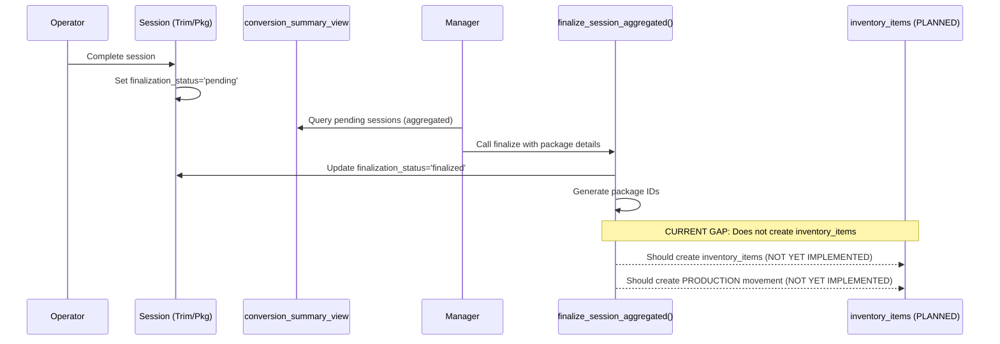
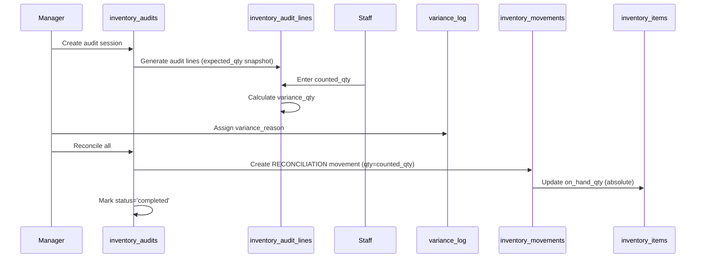

# INVENTORY-TRACKING - Event-Driven Inventory Management

> **Status:** Production Ready (Phase 6 Complete - Triggers Enabled)
> **Purpose:** Defines inventory tracking from receipt through fulfillment using an immutable event-driven ledger with automatic database triggers
> **Foundation:** All inventory items trace to batches - batch_id is the primary traceability key
> **Critical:** Ledger immutability ensures batch traceability cannot be corrupted
> **New:** Database triggers automatically update quantities (2025-01-24)
> **Architecture:** Hybrid VIEW-based finalization system (January 2026)
> **Reference:** See [DATABASE-TRIGGERS.md](./DATABASE-TRIGGERS.md) for trigger documentation

---

## TABLE OF CONTENTS

1. [Purpose](#purpose)
2. [Batch-Inventory Relationship](#batch-inventory-relationship) ⭐ **IMPORTANT**
3. [Architecture Overview](#architecture-overview)
4. [Inputs](#inputs)
5. [Outputs](#outputs)
6. [Key Rules](#key-rules)
7. [Event-Driven Ledger](#event-driven-ledger)
8. [Conversions & Stage Transitions](#conversions--stage-transitions)
9. [Audits & Reconciliation](#audits--reconciliation)
10. [Workflow Diagrams](#workflow-diagrams)
11. [Implementation Status](#implementation-status)
12. [Database Dependencies](#database-dependencies)
13. [Related Modules](#related-modules)

---

## Purpose

The Inventory Tracking module manages all inventory quantity changes using an **event-driven ledger architecture** where:
- `inventory_movements` is the **source of truth** (immutable log)
- `inventory_items.on_hand_qty` is a **materialized view** (calculated, not source of truth)
- Every quantity change flows through the ledger
- **Batch traceability maintained from cultivation through fulfillment**
- Stage-based workflow with validated transitions

**Critical Principle:** Every `inventory_items` row MUST have a `batch_id` linking it back to its harvest batch. This is the foundation of seed-to-sale traceability.

---

## Batch-Inventory Relationship

> **Why This Matters:** The inventory system is worthless without batch linkage. Every inventory item must trace back to a harvest batch for compliance.

### Inventory Items Are Batch-Scoped

```
┌─────────────────────────────────────────────────────────────────────┐
│                    INVENTORY ← ALWAYS LINKED TO BATCH                │
├─────────────────────────────────────────────────────────────────────┤
│                                                                       │
│  batch_registry (id: uuid)                                           │
│       ├─── inventory_items (batch_id FK - NOT NULL)                  │
│       │    ├─── package_id: "250106-GSC-BF-001"                      │
│       │    ├─── on_hand_qty: Materialized from movements             │
│       │    └─── parent_item_id: Lineage chain (inherits batch_id)    │
│       │                                                               │
│       └─── inventory_movements (source_item_id FK)                   │
│            ├─── movement_kind: RECEIPT, CONSUME, PRODUCE, etc.       │
│            ├─── qty: Quantity change                                 │
│            └─── IMMUTABLE: Cannot UPDATE or DELETE                   │
│                                                                       │
│  TRACEABILITY GUARANTEE:                                             │
│  ─────────────────────────────────────────────────────────────────  │
│  • Every inventory_items row has batch_id                            │
│  • Every movement references item with batch_id                      │
│  • Lineage preserved: parent.batch_id → child.batch_id              │
│  • Ledger immutability prevents batch linkage corruption            │
│                                                                       │
└─────────────────────────────────────────────────────────────────────┘
```

### Why Batch Linkage Is Critical

**Batch_id enables:**
- ✅ **COA Traceability:** Every package links to batch → batch links to COA
- ✅ **Recall Execution:** Contaminated batch → all items with that batch_id
- ✅ **Yield Calculation:** Sum movements per batch → harvest to sale yield
- ✅ **Compliance Reporting:** Regulators audit batch_id on manifests/invoices

**Current Gaps:**
- **GAP-001:** `inventory_items.batch_id` allows NULL
  - **Impact:** CRITICAL - Orphaned inventory breaks traceability chain
  - **Resolution:** ✅ Migration Batch 1 adds NOT NULL constraint + backfills NULLs

- **GAP-002:** `batch_id` not immutable
  - **Impact:** CRITICAL - Historical batch assignments can be changed, corrupting audit trail
  - **Resolution:** ✅ Migration Batch 1 adds trigger blocking updates

- **GAP-003:** `inventory_movements` allows UPDATE/DELETE
  - **Impact:** CRITICAL - Ledger corruption possible, breaking quantity calculations
  - **Resolution:** ✅ Migration Batch 1 adds RLS policies blocking modification

See: [BATCHES.md](./BATCHES.md) for complete batch architecture, [DOCS-INTEGRATION-PROGRESS.md](./DOCS-INTEGRATION-PROGRESS.md#implementation-gaps-dashboard) for gap tracking.

---

## Architecture Overview

```
┌─────────────────────┐
│ inventory_movements │  (Source of Truth - IMMUTABLE)
│ ─────────────────── │
│ - RECEIPT           │  Initial inventory receipt
│ - CONSUME           │  Session input consumed
│ - PRODUCE           │  Session output produced
│ - FULFILLMENT       │  Order fulfillment
│ - RETURN            │  Customer return
│ - RESERVE/RELEASE   │  Soft allocation
│ - ADJUSTMENT        │  Manual correction
│ - RECONCILIATION    │  Physical count
└─────────────────────┘
          │
          │ Trigger: Update on_hand_qty
          ▼
┌─────────────────────┐
│ inventory_items     │  (Materialized View)
│ ─────────────────── │
│ on_hand_qty         │  = SUM(movements)
│ (Calculated, NOT    │
│  source of truth)   │
└─────────────────────┘
```

**Key Principle:** Direct updates to `inventory_items.on_hand_qty` are **BLOCKED**. All changes must flow through `inventory_movements`.

> **⚠️ IMPLEMENTATION STATUS (2025-11-12):** The event-driven ledger architecture is being implemented in phases. See [Current vs Planned Implementation](#current-vs-planned-implementation) for details.

---

## Architecture: Dual-Purpose Movement Table

> **Last Updated:** 2025-11-27
> **Status:** 🟢 CLARIFIED - Dual Schema Design
> **Critical:** Understanding this design prevents errors in session/inventory operations

### The `inventory_movements` Table Design

The `inventory_movements` table serves **two distinct purposes**:

#### 1. Session Lifecycle Tracking (Legacy Fields)
**Purpose:** Records WHEN production sessions happen
**Fields:** `movement_type` + text identifiers
**Values:** `'trim_start'`, `'packaging_complete'`, `'trim_cancelled'`, etc.
**Used by:** Session management workflows

#### 2. Inventory Operations (Event-Driven Fields)
**Purpose:** Records WHAT happens to inventory quantities
**Fields:** `movement_kind` + UUID FKs + qty/unit
**Values:** `'RESERVE'`, `'RELEASE'`, `'CONSUME'`, `'PRODUCE'`, etc.
**Used by:** Inventory ledger system

### Key Principle: Not Every Row Uses Both

| Operation Type | movement_kind | movement_type | Example |
|----------------|---------------|---------------|---------|
| Session starts | NULL | `'trim_start'` | Trim session begins |
| Inventory reserved | `'RESERVE'` | **NULL** | Session reserves inventory |
| Session completes with output | `'PRODUCE'` | `'trim_complete'` | Trim session outputs product |
| Inventory released | `'RELEASE'` | **NULL** | Cancelled session releases inventory |

**Critical:** Inventory operations (RESERVE, RELEASE, etc.) set `movement_type = NULL` because they are NOT session lifecycle events.

**See:** CHANGELOG 2025-11-27 for full architectural explanation and constraint relaxation.

---

## Current vs Planned Implementation

> **Last Updated:** 2025-11-12
> **Status:** 🟡 HYBRID ARCHITECTURE (Phased Implementation)
> **Approach:** Option C - Maintain both current and planned documentation

### Current Implementation (As of 2025-11-12)

**Infrastructure Status:**
- ✅ `inventory_movements` table exists with all fields (Oct 21, 2025)
- ✅ Event-driven schema complete (7 migrations applied)
- ✅ `movement_kind` enum defined (9 types)
- ⏸️ Triggers pending implementation (0 of 10 documented triggers exist)

**Application Layer:**
```typescript
// Most services currently use direct updates:
await supabase
  .from('inventory_items')
  .update({ on_hand_qty: newQty })
  .eq('id', itemId);
```

**Services Using Direct Updates:**
- `audit.service.ts` - Physical audits bypass ledger
- `conversions.service.ts` - Stage transitions bypass ledger
- Session finalization - Awaits inventory_items creation (hybrid architecture, Jan 2026)
- Order fulfillment - Uses deprecated inventory_transactions

**Partial Ledger Usage:**
- ✅ `adjustment.service.ts` creates ADJUSTMENT movements (50% complete)
- ⚠️ No trigger updates on_hand_qty yet (Migration 4 deferred)

### Planned Architecture (Target: Q1-Q2 2026)

**Full Event-Driven Ledger:**
```typescript
// All services will use movements:
await supabase
  .from('inventory_movements')
  .insert({
    movement_kind: 'ADJUSTMENT',
    dest_item_id: itemId,
    qty: newQty,
    unit: 'g',
    reason_code: 'manual_adjustment'
  });
// Trigger auto-updates inventory_items.on_hand_qty
```

**Phased Implementation Plan:**

**Phase 2.1: Adjustments (IN PROGRESS - 50% Complete)**
- ✅ adjustment.service.ts creates movements
- ⏸️ Trigger to update on_hand_qty (Migration 4 deferred until refactoring complete)
- **Target:** Q1 2026

**Phase 2.2: Reconciliations (PLANNED)**
- Convert audit.service.ts to RECONCILIATION movements
- Replace direct updates with ledger entries
- **Target:** Q1 2026
- **Estimated:** 2 weeks development

**Phase 2.3: Session Completions (PLANNED)**
- Add triggers for CONSUME/PRODUCE on session completion
- Refactor session services to use movements
- **Target:** Q1 2026
- **Estimated:** 3-4 weeks development

**Phase 2.4: Order Fulfillment (PLANNED)**
- Convert order fulfillment to FULFILLMENT movements
- Replace deprecated inventory_transactions table
- **Target:** Q2 2026
- **Estimated:** 2 weeks development

### Migration Status

**Applied:**
- ✅ Migration 1: Backfill inventory batch_ids (Nov 10, 2025)
- ✅ Migration 2: Add batch_id NOT NULL constraint (Nov 10, 2025)
- ✅ Migration 3: Fix lifecycle state timing (Nov 12, 2025)
- ✅ Migration 4: Enforce ledger-only quantity changes (Nov 10, 2025) - **FUNCTIONALITY DEFERRED**
- ✅ Migration 5: Enforce quarantine gate (Nov 10, 2025)
- ✅ Migration 6: Add critical constraints (Nov 10, 2025)

**Note on Migration 4:** While the migration is applied, the RLS policies blocking direct updates are not yet enforced to allow gradual service refactoring.

### Gap Status Updates

- **GAP-001:** ✅ RESOLVED (batch_id NOT NULL enforced, Nov 10, 2025)
- **GAP-002:** ✅ RESOLVED (batch_id immutable enforced, Nov 10, 2025)
- **GAP-003:** ⏸️ DEFERRED to Phase 2.4 (inventory_movements immutability)
- **GAP-019:** 🟡 IN PROGRESS (Event-driven ledger phased implementation)

### Reading This Document

- **Current behavior** is documented in service-specific sections below
- **Planned behavior** is shown in workflow diagrams and trigger descriptions
- **Phase annotations** indicate when features move from planned to current

---

## Test Mode Integration

> **Last Updated:** 2025-11-20
> **Status:** 🟡 IN PROGRESS (Phase 2)
> **See Also:** [TEST-MODE.md](./TEST-MODE.md) for complete test mode documentation

### Test Mode Inventory Behavior

Test mode provides a **bypass layer** for inventory validations, enabling facility testing without strict inventory tracking requirements. This allows validation of workflows before committing to production use.

### Bypassed Validations in Test Mode

When test mode is enabled (`app_settings.test_mode_enabled = true`), the following inventory validations are bypassed:

```
┌─────────────────────────────────────────────────────────────────────┐
│ INVENTORY VALIDATIONS - TEST MODE BEHAVIOR                          │
├─────────────────────────────────────────────────────────────────────┤
│                                                                       │
│ ✅ BYPASSED IN TEST MODE:                                           │
│   • On-hand quantity checks (can order with 0 inventory)            │
│   • Available-to-Promise calculations (ignores allocations)         │
│   • Negative inventory prevention (can go below zero)               │
│   • Inventory movement logging requirements (optional)              │
│   • Batch allocation requirements for fulfillment                   │
│   • Stage transition validations (can skip stages for testing)      │
│                                                                       │
│ ⚠️ STILL ENFORCED IN TEST MODE:                                     │
│   • Batch ID immutability (cannot change batch_id)                  │
│   • Parent lineage tracking (parent_item_id inheritance)            │
│   • Database constraints (NOT NULL, UNIQUE, FOREIGN KEY)            │
│   • RLS policies (security maintained)                              │
│   • Data type validations (numbers, dates, UUIDs)                   │
│                                                                       │
│ 📋 TEST MODE AUDIT TRAIL:                                           │
│   • Every bypassed validation logged to test_mode_audit_log         │
│   • Includes context: user, action, validation type, timestamp      │
│   • Enables review of test actions and bypassed rules               │
│                                                                       │
└─────────────────────────────────────────────────────────────────────┘
```

### Impact on Event-Driven Ledger

**Test Mode + Current Direct-Update Architecture:**
- Services using direct updates continue to work normally
- No inventory movements logged (since not yet implemented)
- Test mode bypass has minimal effect (already lenient)

**Test Mode + Future Event-Driven Architecture:**
- Inventory movement logging becomes optional in test mode
- Movements can be created without triggering quantity updates
- Trigger-based on_hand_qty updates can be bypassed
- Allows testing ledger architecture without strict enforcement

### Test Mode Implementation Strategy

```typescript
// Example: Inventory validation with test mode bypass
async function validateInventoryAvailable(
  productId: string,
  requestedQty: number,
  isTestMode: boolean
): Promise<ValidationResult> {
  // Always get current inventory for context
  const inventory = await getInventoryItem(productId);

  if (isTestMode) {
    // Log bypass for audit trail
    await logTestModeBypass({
      validation: 'inventory_availability',
      context: {
        product_id: productId,
        requested_qty: requestedQty,
        available_qty: inventory.on_hand_qty,
        message: 'Test mode: Bypassed inventory check'
      }
    });

    // Return success regardless of actual inventory
    return { valid: true, bypassed: true };
  }

  // Normal validation in production mode
  if (inventory.on_hand_qty < requestedQty) {
    return {
      valid: false,
      error: `Insufficient inventory: ${inventory.on_hand_qty}g available, ${requestedQty}g requested`
    };
  }

  return { valid: true };
}
```

### Test Mode Visual Indicators

**Inventory Screens:**
- Test mode banner: "⚠️ TEST MODE ACTIVE - Inventory Validations Bypassed"
- Badge on inventory table: "Test Mode: Negative qty allowed"
- Warning on adjustment form: "Test mode: No movement logging"

**Order Fulfillment:**
- Badge on fulfillment screen: "Test Mode: Allocation optional"
- Visual indicator when fulfilling without sufficient inventory
- Test mode watermark on generated documents

### Audit Trail Integration

All bypassed inventory validations are logged:

```sql
-- Example audit entries
INSERT INTO test_mode_audit_log (
  user_id,
  action,
  validation_bypassed,
  context
) VALUES
  (auth.uid(), 'create_order', 'on_hand_quantity_check',
   '{"product": "GSC 3.5g", "requested": 100, "available": 10}'::jsonb),
  (auth.uid(), 'mark_ready', 'batch_allocation_required',
   '{"order_id": "uuid", "message": "Fulfilled without allocation"}'::jsonb);
```

### Transitioning from Test Mode to Production

**Pre-Production Checklist:**
1. ✅ Complete all workflow testing
2. ✅ Review test mode audit log for bypassed validations
3. ✅ Reconcile inventory quantities
4. ✅ Clean up test orders and allocations
5. ✅ Disable test mode in settings
6. ✅ Verify normal validations enforced
7. ✅ Create first production order to confirm

**Data Cleanup:**
- Test orders can be deleted via Settings → Test Mode → Clean Up Test Data
- Test mode audit log can be archived or cleared
- Inventory adjustments made in test mode remain (manual reconciliation needed)

**See:** [TEST-MODE.md - Transitioning to Production](./TEST-MODE.md#transitioning-to-production)

---

## Inputs

### 1. Session Completions
- **Trim Sessions** (`trim_sessions` status: 'active' → 'completed')
  - Input: Binned or Bucked packages
  - Output: Bucked Flower, Bucked Smalls, Bulk Flower, Bulk Smalls, Trim, Waste
  - Trigger: `trg_trim_session_complete` creates CONSUME + PRODUCE movements

- **Packaging Sessions** (`packaging_sessions` status: 'active' → 'completed')
  - Input: Bulk packages (grams)
  - Output: Packaged units (e.g., 3.5g, 14g)
  - Trigger: `trg_packaging_session_complete` creates CONSUME + PRODUCE movements

- **Bucking Sessions** (`bucking_sessions` status: 'active' → 'completed')
  - Input: Binned whole plant material
  - Output: Separated flower and smalls
  - Trigger: `trg_bucking_session_complete` creates CONSUME + PRODUCE movements

### 2. Manager-Initiated Conversions
- **Session Finalization** (Hybrid VIEW-based architecture, January 2026)
  - Sessions complete with `finalization_status = 'pending'`
  - Manager reviews via `conversion_summary_view` (aggregated by batch+product)
  - Manager calls `finalize_session_aggregated()` RPC to create packages with package IDs
  - Status flow: finalization_status: 'pending' → 'finalized'
  - **Current Gap:** RPC does not create `inventory_items` records yet

### 3. Physical Inventory Adjustments
- **Manual Adjustments** (via inventory management UI)
  - Reason codes: breakage, spillage, quality_loss, measurement_error
  - Creates ADJUSTMENT movement (absolute, sets on_hand_qty to new value)
  - Requires manager approval

### 4. Audit Reconciliations
- **Cycle Counts** (`inventory_audits` table)
  - Physical count vs. system on_hand_qty
  - Variance logged with reason
  - Creates RECONCILIATION movement if variance exists
  - See [Audits & Reconciliation](#audits--reconciliation) section

### 5. Order Fulfillments
- **Order Ready for Delivery** (orders.status → 'ready_for_delivery')
  - Creates RELEASE movement (removes soft reserve)
  - Creates FULFILLMENT movement (hard deduction from on_hand_qty)
  - Links to `order_fulfillment_items` for traceability

---

## Outputs

### 1. Inventory Movements (Immutable Ledger)
- **Table:** `inventory_movements`
- **Purpose:** Serves **dual purposes** (session lifecycle + inventory operations)
- **Records:** All quantity changes with:
  - **Event-Driven Fields (inventory operations):**
    - movement_kind (RECEIPT, CONSUME, PRODUCE, RESERVE, RELEASE, etc.)
    - source_item_id / dest_item_id (directional UUID FKs)
    - qty (always positive, direction implied by movement_kind)
    - unit ('g' or 'unit')
    - reason_code (for adjustments/reconciliations)
  - **Legacy Fields (session lifecycle tracking):**
    - movement_type (trim_start, packaging_complete, etc.) - NULL for inventory operations
    - source_identifier / destination_identifier (text package IDs)
    - source_weight_change / destination_weight_change (signed numerics)
  - **Metadata:**
    - session_id, order_id (traceability)
    - created_at (timestamp)

**Important:** Not every row populates both field sets. Inventory operations (RESERVE, RELEASE) use movement_kind with movement_type = NULL. Session lifecycle events may use movement_type. See CHANGELOG 2025-11-27 for full explanation.

### 2. Inventory Items (Current State)
- **Table:** `inventory_items`
- **Updated Fields:**
  - on_hand_qty (materialized from movements ledger)
  - updated_at (last change timestamp)
- **Lineage:** parent_item_id chains conversions (child inherits batch_id)

### 3. Session Finalization (Manager Review Queue)
- **Architecture:** Hybrid VIEW-based system (January 2026)
- **Session Fields:**
  - `finalization_status` enum: 'pending', 'finalized', 'cancelled'
  - Output weights/units stored directly in session tables
- **Query VIEWs:**
  - `conversion_summary_view` - Aggregated pending sessions by batch+product
  - `conversion_history_view` - Detailed session history with finalization status
- **Workflow:** Manager reviews VIEWs, calls `finalize_session_aggregated()` RPC, packages created

### 4. Finalized Packages (Awaiting Inventory Integration)
- **Current State:** Package metadata stored in session finalization records
- **Missing:** `inventory_items` records not yet created by finalization RPC
- **Impact:** Finalized packages tracked but not available in inventory
- **Required:** Update RPC to INSERT into `inventory_items` + `inventory_movements`

### 5. Daily Snapshots (Reporting)
- **Table:** `inventory_daily_snapshots`
- **Purpose:** Point-in-time inventory for fast reporting and historical trending
- **Fields:**
  - snapshot_date, item_id, on_hand_qty, atp_qty, unit, batch_id
- **Generation:** Daily scheduled job (planned, not yet automated)

---

## Key Rules

### Immutable Ledger Rules
1. **All quantity changes MUST flow through `inventory_movements`**
   - Direct updates to `on_hand_qty` are BLOCKED (enforced by RLS policy)
   - `on_hand_qty` is calculated, not source of truth

2. **Batch ID is IMMUTABLE after creation**
   - Trigger: `trg_prevent_batch_id_change` blocks updates
   - Child items inherit parent's batch_id through `parent_item_id` lineage

3. **Movement records are IMMUTABLE**
   - No UPDATE or DELETE allowed (RLS policy blocks both)
   - Corrections create new ADJUSTMENT movements

### Stage Transition Rules
4. **Stage transitions follow defined graph**
   - Valid path: Binned → Bucked → Bulk → Packaged
   - Validation: `is_valid_stage_transition(from_stage, to_stage)` function
   - Skipping stages is BLOCKED

5. **Product stage ID is required**
   - All inventory_items must have `product_stage_id` set
   - NULL only allowed for legacy imports

### Allocation Rules
6. **ATP (Available to Promise) = on_hand - soft_reserves**
   - RESERVE movements create soft allocation (decrements ATP only)
   - RELEASE movements restore ATP (increments ATP only)
   - FULFILLMENT movements create hard deduction (decrements on_hand_qty)

7. **Package ID at reservation scope (no FIFO requirement)**
   - Specific packages allocated to orders via `order_fulfillment_items`
   - Manager selects packages from allocated batch
   - No strict FIFO (first-in-first-out) enforcement

### Quarantine Rules
8. **Quarantine gate blocks ALL production and fulfillment**
   - `batch_registry.is_quarantined = true` blocks:
     - Session starts (trim, packaging, bucking)
     - Batch allocations to orders
     - RESERVE movements
     - FULFILLMENT movements
   - Quarantine lifted when QC approves (`is_quarantined = false`)

### Variance Rules
9. **Variance >5% OR >50g requires manager approval** (PLANNED - NOT YET ENFORCED)
   - Applies to session variance and audit variance
   - `variance_log.approved_by` field tracks approval
   - Large variances without approval should be flagged

### Compliance Rules
10. **Session completion sets finalization_status for manager review** (HYBRID ARCHITECTURE)
    - Session automatically sets `finalization_status = 'pending'` on completion
    - Managers query via `conversion_summary_view` and `conversion_history_view`
    - Finalization via `finalize_session_aggregated()` RPC function
    - Current Gap: RPC does not create inventory_items records yet

---

## Event-Driven Ledger

### Movement Types (Detailed)

#### DELTA Movements (Relative Changes)
These movements adjust on_hand_qty **relative** to current value:

| Movement Kind | Direction | Formula | Use Case |
|---------------|-----------|---------|----------|
| **PRODUCE** | Increases on_hand | `on_hand_qty += qty` | Session creates output package |
| **RETURN** | Increases on_hand | `on_hand_qty += qty` | Customer returns product |
| **CONSUME** | Decreases on_hand | `on_hand_qty -= qty` | Session consumes input package |
| **FULFILLMENT** | Decreases on_hand | `on_hand_qty -= qty` | Order fulfillment (hard deduction) |

#### SOFT RESERVE Movements (ATP Only)
These movements affect ATP calculation but NOT on_hand_qty:

| Movement Kind | Effect on ATP | Use Case |
|---------------|---------------|----------|
| **RESERVE** | Decrements ATP | Batch allocated to order (soft hold) |
| **RELEASE** | Increments ATP | Allocation cancelled or converted to fulfillment |

**ATP Calculation:**
```sql
SELECT
  item_id,
  on_hand_qty,
  on_hand_qty - COALESCE(SUM(
    CASE
      WHEN movement_kind = 'RESERVE' THEN qty
      WHEN movement_kind = 'RELEASE' THEN -qty
      ELSE 0
    END
  ), 0) AS atp_qty
FROM inventory_items
LEFT JOIN inventory_movements USING (item_id)
GROUP BY item_id, on_hand_qty;
```

#### ABSOLUTE Movements (Set Quantity)
These movements SET on_hand_qty to absolute value (ignoring current value):

| Movement Kind | Formula | Use Case |
|---------------|---------|----------|
| **ADJUSTMENT** | `on_hand_qty = qty` | Manual correction by manager |
| **RECONCILIATION** | `on_hand_qty = qty` | Physical count differs from system |

### Trigger Logic (Implementation)

```sql
CREATE TRIGGER trg_update_on_hand_qty_after_movement
AFTER INSERT ON inventory_movements
FOR EACH ROW
EXECUTE FUNCTION fn_update_inventory_on_hand();

-- Function: fn_update_inventory_on_hand()
-- For DELTA movements:
UPDATE inventory_items
SET on_hand_qty = on_hand_qty + (
  CASE NEW.movement_kind
    WHEN 'PRODUCE' THEN NEW.qty
    WHEN 'RETURN' THEN NEW.qty
    WHEN 'CONSUME' THEN -NEW.qty
    WHEN 'FULFILLMENT' THEN -NEW.qty
    ELSE 0
  END
)
WHERE id = NEW.dest_item_id OR id = NEW.source_item_id;

-- For ABSOLUTE movements:
UPDATE inventory_items
SET on_hand_qty = NEW.qty
WHERE id = NEW.dest_item_id;

-- RESERVE/RELEASE affect ATP calculation view, NOT on_hand_qty
```

### Immutability Enforcement (CRITICAL GAP)

**Status:** 🔴 NOT YET IMPLEMENTED

**Issue:** No RLS policy blocks UPDATE/DELETE on `inventory_movements`

**Risk:** Retroactive ledger changes corrupt balances, audit trail lost

**Planned Fix:**
```sql
-- Block all updates to movements (immutable ledger)
CREATE POLICY "inventory_movements are immutable"
ON inventory_movements
FOR UPDATE
TO authenticated
USING (false);

-- Block all deletes (only INSERT/SELECT allowed)
CREATE POLICY "inventory_movements cannot be deleted"
ON inventory_movements
FOR DELETE
TO authenticated
USING (false);
```

**Priority:** CRITICAL
**Target Date:** Sprint 2025-11-2

---

## Conversions & Stage Transitions

### Stage Graph (Valid Transitions)

```
Binned
  ↓
Bucked (Flower / Smalls)
  ↓
Bulk (Flower / Smalls)
  ↓
Packaged (3.5g / 14g / etc.)

Byproducts (Trim, Waste) can originate from any stage
```

### Validation Function

**Function:** `is_valid_stage_transition(from_stage TEXT, to_stage TEXT) RETURNS BOOLEAN`

**Logic:**
```sql
-- Example valid transitions
('Binned', 'BuckedFlower') → TRUE
('Binned', 'BuckedSmalls') → TRUE
('BuckedFlower', 'BulkFlower') → TRUE
('BuckedSmalls', 'BulkSmalls') → TRUE
('BulkFlower', 'Packaged_3_5g') → TRUE
('BulkSmalls', 'Packaged_14gSmalls') → TRUE

-- Invalid transitions (blocked)
('Binned', 'Packaged_3_5g') → FALSE (skips bucked/bulk)
('BuckedSmalls', 'BulkFlower') → FALSE (wrong lineage)
```

**Enforcement Status:** 🟡 PARTIAL
- Function exists but NOT called by session triggers
- UI limits dropdown options (manual validation only)
- Planned: Add validation to trim/packaging session triggers
- Priority: HIGH
- Target: Sprint 2025-11-3

### Conversion Workflow (Manager-Only)

**Purpose:** Managers finalize completed session outputs into inventory packages with assigned package IDs

> **Architecture Note:** As of January 2026, this system uses a **hybrid VIEW-based architecture**. Sessions store their finalization status directly, and managers query pending sessions through database VIEWs rather than separate conversion tables.

**Key Features:**
- **Bulk Bag Creation:** For bulk products (Bucked Flower, Bucked Smalls, Bulk Flower, Bulk Smalls), managers can create multiple individual bags from session outputs
- **Partial Finalization:** Managers can create some packages now and leave remaining weight for later finalization
- **Package ID Format:** `YYMMDD-STRAIN-NNN` using strain abbreviations from the strains table
- **VIEW-Based Queries:** Pending sessions queried through `conversion_summary_view` and `conversion_history_view`

**Workflow Steps:**

#### Step 1: Session Completion (Operator)
When a session completes (bucking, trim, or packaging):
```sql
-- Session record updated automatically
UPDATE bucking_sessions  -- or trim_sessions, packaging_sessions
SET
  status = 'completed',
  finalization_status = 'pending',  -- Ready for manager review
  completed_at = now()
WHERE id = session_id;
```

**Inventory Movements:**
- Session completion triggers create `inventory_movements` entries for consumption and production
- Output quantities recorded in session table fields
- Session awaits manager finalization

#### Step 2: Manager Reviews Pending Sessions (VIEW-Based Query)
Managers query pending sessions through database VIEWs:
```sql
-- Aggregated pending sessions by batch + product + date
SELECT
  batch_number,
  strain_name,
  product_name,
  session_type,
  session_count,
  total_output_weight,
  total_output_units,
  lot_date
FROM conversion_summary_view
WHERE finalization_status = 'pending'
ORDER BY lot_date DESC;
```

**UI Display:**
- Manager navigates to Conversions UI
- System displays aggregated conversions (e.g., "Dog Walker - Bucked Flower - 500g from 3 sessions")
- Manager can drill into individual sessions via `conversion_history_view`

#### Step 3: Manager Creates Packages

**For Bulk Products (Weight-Based):**
1. Manager selects aggregated conversion (e.g., "Dog Walker - Bucked Flower - 500g")
2. Clicks "Create Bulk Bags" button
3. Bulk Bag Creation Modal opens showing:
   - Available weight (from aggregated sessions)
   - Source sessions list
   - Dynamic bag creation interface
4. Manager adds bags with individual weights:
   - Example: 200g + 200g + 100g = 500g
   - Or partial: 200g + 200g = 400g (leaving 100g for later)
5. System validates:
   - Sum of bags ≤ available weight
   - All bag weights > 0
6. Manager clicks "Create X Bags"
7. System calls `finalize_session_aggregated()` RPC function:
   - Generates sequential package IDs: `260113-DOG-001`, `260113-DOG-002`
   - Updates session `finalization_status` → 'finalized'
   - Records package details (weight, batch, strain)
   - **CURRENT GAP:** Should create `inventory_items` records (not yet implemented)

**For Unit Products (Count-Based):**
1. Manager views packaged product conversions
2. Clicks "Finalize Session" for standard single-package flow
3. System creates one package with all units via same RPC function

**Usage Note:** Initial conversion rates stored in the `conversions` table are rough estimates. The Sales Analytics system uses these for near-term projections (Bulk→Packaged) only. Multi-stage projections (e.g., Binned→Bucked→Bulk→Packaged) require 3-6 months of historical data for accuracy and are not shown until sufficient data exists.

**Preconditions:**
- User role IN ('manager', 'admin') — **ONLY managers/admins finalize sessions**
- Session `finalization_status = 'pending'`
- SUM(package weights) <= session.output_weight + 5% tolerance

#### Step 4: Inventory Integration (PLANNED - NOT YET IMPLEMENTED)

**Current Implementation Gap:**
The `finalize_session_aggregated()` RPC function does NOT create `inventory_items` records. This means:
- ❌ Finalized packages tracked but never appear in inventory
- ❌ No `inventory_movements` ledger entry for package creation
- ❌ Orders cannot allocate finalized packages

**Required Implementation:**
```sql
-- Must be added to finalize_session_aggregated() function
INSERT INTO inventory_items (
  package_id,
  batch_id,          -- From session.batch_registry_id
  strain_id,         -- From batch.strain_id
  product_stage_id,  -- Based on session output type
  on_hand_qty,       -- Package weight/units
  parent_item_id,    -- Link to source package
  unit               -- 'g' or 'unit'
)
VALUES (generated_package_id, batch_id, strain_id, stage_id, qty, parent_id, unit);

-- Create inventory movement ledger entry
INSERT INTO inventory_movements (
  movement_kind,           -- 'PRODUCTION'
  destination_item_id,     -- New inventory_item.id
  qty,                     -- Package weight/units
  session_reference_id,    -- Source session ID
  reason_code             -- 'session_finalization'
)
VALUES ('PRODUCTION', new_item_id, qty, session_id, 'session_finalization');
```

**Priority:** HIGH - Without this, the finalization workflow is incomplete
**See:** Plan B in AI-BUILD-SESSION-CHECKLIST.md for detailed fix plan

### ⚠️ CRITICAL: Common Pitfall - Double-Counting in Conversions

**Issue:** When creating inventory items from conversions, it's critical to follow the event-driven ledger pattern correctly.

**Anti-Pattern (WRONG):**
```typescript
// ❌ Sets on_hand_qty directly, then records movement that adds to it again
await supabase.from('inventory_items').insert({
  package_id: 'PKG-001',
  on_hand_qty: 300,      // ❌ Sets to 300g
  available_qty: 300     // ✅ Correct
});

await recordMovement({
  movement_kind: 'PRODUCE',
  qty: 300               // ❌ Trigger adds ANOTHER 300g to on_hand_qty
});

// Result: on_hand_qty = 600g (doubled!), available_qty = 300g
```

**Correct Pattern:**
```typescript
// ✅ Let movement be the source of truth
await supabase.from('inventory_items').insert({
  package_id: 'PKG-001',
  on_hand_qty: 0,        // ✅ Start at zero - let trigger set this
  available_qty: 300     // ✅ ATP field set directly per architecture
});

await recordMovement({
  movement_kind: 'PRODUCE',
  qty: 300               // ✅ Trigger sets on_hand_qty = 0 + 300 = 300
});

// Result: on_hand_qty = 300g (correct!), available_qty = 300g
```

**Why This Matters:**
- **Architectural Principle:** Movements are the source of truth for `on_hand_qty` (immutable ledger pattern)
- **ATP Separation:** `available_qty` is managed separately by session triggers (ATP tracking)
- **Trigger Behavior:** PRODUCE movements ADD to `on_hand_qty`, not SET it
- **Consequence:** Setting `on_hand_qty` directly before recording movement causes double-counting

**Fixed:** 2026-01-20 - See CONV-FIX-001-SUMMARY.md and CHANGELOG.md for details

### Stage-Specific Conversion Flows

Each processing stage follows the same three-step pattern but with different inputs/outputs:

#### Bucking Conversion (Binned → Bucked)

> **📦 BUCKING CONVERSION PATTERN**
>
> ```
> INPUT:  Binned material (whole plants)
> OUTPUT: Bucked Flower + Bucked Smalls + Waste
>
> LEDGER FLOW:
> 1. RESERVE → locks binned inventory (movement_kind='SESSION_RESERVE')
> 2. CONSUME → removes binned material (movement_kind='SESSION_INPUT')
> 3. PRODUCE → creates bucked outputs (movement_kind='SESSION_OUTPUT')
> 4. FINALIZE → manager creates inventory_items with package IDs
>
> FINALIZATION:
> - Manager splits total bucked flower/smalls into multiple bags
> - Each bag gets unique package_id: YYMMDD-STRAIN-NNN
> - Example: 500g bucked flower → 200g + 200g + 100g (3 bags)
> - Partial finalization allowed (create some bags now, rest later)
> ```
>
> **Database Views:**
> - Query: `conversion_summary_view` WHERE `product_name` IN ('Bucked Flower', 'Bucked Smalls')
> - Aggregates: Total weight from all completed bucking sessions awaiting finalization

#### Trim Conversion (Bucked → Bulk)

> **🌿 TRIM CONVERSION PATTERN**
>
> ```
> INPUT:  Bucked Flower OR Bucked Smalls
> OUTPUT: Bulk Flower OR Bulk Smalls + Trim + Waste
>
> STAGE RULES:
> - BuckedFlower → BulkFlower ✅
> - BuckedSmalls → BulkSmalls ✅
> - BuckedSmalls → BulkFlower ❌ (wrong lineage)
> - BuckedFlower → BulkSmalls ❌ (quality downgrade)
>
> LEDGER FLOW:
> 1. RESERVE → locks bucked inventory (movement_kind='SESSION_RESERVE')
> 2. CONSUME → removes bucked material (movement_kind='SESSION_INPUT')
> 3. PRODUCE → creates bulk outputs (movement_kind='SESSION_OUTPUT')
> 4. FINALIZE → manager creates inventory_items with package IDs
>
> FINALIZATION:
> - Manager splits total bulk flower/smalls into multiple bags
> - Each bag gets unique package_id: YYMMDD-STRAIN-NNN
> - Example: 400g bulk flower → 200g + 100g + 100g (3 bags)
> - Trim byproduct handled separately (typically single package)
> ```
>
> **Database Views:**
> - Query: `conversion_summary_view` WHERE `product_name` IN ('Bulk Flower', 'Bulk Smalls', 'Trim')
> - Aggregates: Total weight from all completed trim sessions awaiting finalization

#### Packaging Conversion (Bulk → Packaged)

> **📦 PACKAGING CONVERSION PATTERN**
>
> ```
> INPUT:  Bulk Flower OR Bulk Smalls
> OUTPUT: Packaged units (3.5g, 14g, 28g, etc.)
>
> STAGE RULES:
> - BulkFlower → Packaged_3_5g / _14g / _28g ✅
> - BulkSmalls → Packaged_3_5gSmalls / _14gSmalls ✅
> - BulkSmalls → Packaged_3_5g ❌ (must use smalls products)
>
> LEDGER FLOW:
> 1. RESERVE → locks bulk inventory (movement_kind='SESSION_RESERVE')
> 2. CONSUME → removes bulk material (movement_kind='SESSION_INPUT')
> 3. PRODUCE → creates packaged units (movement_kind='SESSION_OUTPUT')
> 4. FINALIZE → manager creates inventory_items with package IDs
>
> FINALIZATION:
> - Manager finalizes entire session output (all units at once)
> - Each unit gets unique package_id: YYMMDD-STRAIN-NNN
> - Example: 10 units → 10 individual packages with sequential IDs
> - Package format: "3.5g Dog Walker OG" (weight + strain name)
> - Unit tracking: on_hand_qty = 1 per package, unit = 'unit'
> ```
>
> **Database Views:**
> - Query: `conversion_summary_view` WHERE `product_name` LIKE 'Packaged_%'
> - Aggregates: Total units from all completed packaging sessions awaiting finalization
>
> **Package ID Generation:**
> - Function: `fn_generate_next_package_id(batch_id, strain_code, date)`
> - Format: `YYMMDD-STRAIN-NNN` (e.g., `260113-DOG-001`)
> - Sequence: Auto-increments per batch per day
> - Uniqueness: Guaranteed by batch + strain + date + sequence

### Conversion Lock System

> **⚠️ CURRENT STATUS: NOT IMPLEMENTED**
>
> The conversion lock system was designed to prevent concurrent finalization but is not yet enabled:
>
> ```
> PLANNED WORKFLOW:
> 1. Manager starts finalization → fn_acquire_conversion_lock()
> 2. Other managers see "🔒 Processing by [Username]"
> 3. Manager completes or abandons → fn_release_conversion_lock()
> 4. Lock auto-expires after 10 minutes (pg_cron job)
> ```
>
> **Current Behavior:** No locking; multiple managers could finalize same session
> **Workaround:** Process discipline (one manager per shift)
> **Priority:** MEDIUM - Race condition unlikely in practice

---

## Audits & Reconciliation

### Audit Workflow

```
┌──────────┐     ┌─────────────┐     ┌──────────────┐     ┌───────────────┐
│ Start    │────▶│ Physical    │────▶│ Variance     │────▶│ Reconciliation│
│ Audit    │     │ Count       │     │ Identified   │     │ Movement      │
└──────────┘     └─────────────┘     └──────────────┘     └───────────────┘
```

### Step 1: Create Audit Session
1. Manager creates `inventory_audits`:
   - audit_date: Scheduled date
   - audit_type: 'cycle_count' OR 'full_audit'
   - stage_filter: Optional (e.g., 'Packaged_3_5g')
   - status: 'in_progress'
2. System generates `inventory_audit_lines`:
   - For each inventory_item matching filter:
     - item_id, expected_qty (snapshot of current on_hand_qty), counted_qty (NULL)

### Step 2: Perform Count
1. Staff physically counts inventory
2. Enter counted_qty for each audit_line
3. System calculates: `variance_qty = counted_qty - expected_qty` (GENERATED column)

### Step 3: Variance Review
1. Manager reviews variances where variance_qty != 0
2. For each variance:
   - Assign variance_reason (ENUM: moisture_loss, spillage, measurement_error, waste, theft_loss, other)
   - Enter reason_notes (details)
3. **If |variance_qty| > threshold (5% OR 50g), require approval**
   - Status: 🔴 NOT YET ENFORCED
   - Planned: CHECK constraint requiring `approved_by IS NOT NULL` for large variances
   - Priority: MEDIUM
   - Target: Sprint 2025-12-1

### Step 4: Reconcile Inventory
1. Manager clicks "Reconcile All"
2. For each audit_line with variance:
   - Insert `inventory_movements`:
     - movement_kind: 'RECONCILIATION'
     - dest_item_id: Audited item
     - qty: counted_qty (ABSOLUTE, sets on_hand to this value)
     - reason_code: variance_reason from audit_line
   - Insert `variance_log`:
     - audit_id, item_id, expected_qty, counted_qty, variance_qty, variance_reason
3. Update `inventory_audits`:
   - status: 'completed'
   - completed_at: now()

### Variance Analysis (Reporting)

```sql
-- Variance by reason (last 30 days)
SELECT
  variance_reason,
  COUNT(*) as occurrence_count,
  SUM(ABS(variance_qty)) as total_variance_grams,
  AVG(ABS(variance_qty)) as avg_variance_grams
FROM variance_log
WHERE created_at >= CURRENT_DATE - INTERVAL '30 days'
GROUP BY variance_reason
ORDER BY total_variance_grams DESC;
```

---

## Workflow Diagrams

### Session → Manager Finalization → Inventory (Hybrid Architecture)



### Audit → Variance → Reconciliation



---

## Implementation Status

### Fully Implemented ✅
- ✅ Event-driven ledger architecture (inventory_movements + inventory_items)
- ✅ Session completion creates inventory_movements
- ✅ Batch ID immutability (trg_prevent_batch_id_change)
- ✅ Parent lineage tracking (parent_item_id inheritance)
- ✅ Stage definitions (product_stages table seeded)
- ✅ Hybrid architecture conversion VIEWs (conversion_summary_view, conversion_history_view)
- ✅ Session finalization_status field (bucking, trim, packaging)
- ✅ Manager finalization RPC function (finalize_session_aggregated)
- ✅ Manager conversion workflow UI
- ✅ Audit session creation and variance tracking
- ✅ Reconciliation movements
- ✅ Inventory adjustments with variance tracking

### Partial / Manual Only ⚠️
- ⚠️ Stage transition validation (function exists, NOT called by triggers)
  - Priority: HIGH | Target: Sprint 2025-11-3
  - Current: UI dropdown limits, no database enforcement

- ⚠️ ATP calculation (no materialized view, calculated on-demand)
  - Priority: HIGH | Target: Sprint 2025-11-2
  - Current: Frontend calculates, risk of over-allocation

- ⚠️ Variance approval threshold (5% / 50g rule documented, NOT enforced)
  - Priority: MEDIUM | Target: Sprint 2025-12-1
  - Current: Manual manager review, no CHECK constraint

### Missing / Planned ❌
- ❌ **Session finalization inventory integration** (Hybrid Architecture Gap)
  - **Priority: HIGH** | Status: NOT IMPLEMENTED
  - Issue: `finalize_session_aggregated()` RPC does not create `inventory_items` records
  - Impact: Finalized packages tracked but never appear in inventory
  - Required: Update RPC to INSERT into inventory_items + inventory_movements
  - See: Plan B in AI-BUILD-SESSION-CHECKLIST.md for fix plan

- ❌ Immutability enforcement on inventory_movements (no RLS policy)
  - **Priority: CRITICAL** | Target: Sprint 2025-11-2
  - Risk: Ledger corruption, audit failure

- ❌ Daily snapshot scheduled job
  - Priority: MEDIUM | Target: Sprint 2025-12-1
  - Risk: Manual execution required, prone to gaps

- ❌ Package ID auto-generation DEFAULT constraint
  - Priority: MEDIUM | Target: Sprint 2025-12-1
  - Risk: Manual entry bypass, duplicates possible
    - Types: `src/features/inventory/types/conversions.types.ts`
      - `ConsolidatedPackageInput`, `FinalizeConversionResult`, `ConversionPackageOptions`
    - Integration: Uses `inventoryMovementService` for PRODUCE movements
  - **Frontend Status:** ⏸️ IN PROGRESS
    - Components needed:
      1. Consolidation toggle in ConversionModal
      2. ConsolidatedPackageForm component
      3. Finalization step UI
      4. PackagesSummary component
  - **Purpose:** Support real-world workflow where trim outputs are consolidated before packaging
  - **Real-World Example:**
    ```
    3 Trim Sessions: 180g + 180g + 180g = 540g total
    → Manager consolidates physically
    → Creates 1 package (not 3)
    → Finalizes to live inventory
    ```
  - **Documentation:** See SYSTEM-WORKFLOW.md Section 2.4 Step 3 & 4 for complete workflow
  - **CHANGELOG Entry:** 2025-12-02 - Phase 7.3: Enhanced Conversions with Consolidation & Finalization

- ⏸️ Combine Packages Feature
  - Priority: MEDIUM | Target: Sprint 2025-11-3
  - **Backend Status:** ✅ COMPLETE (2025-11-10)
    - Migration: `20251110030000_add_combine_packages_feature.sql`
    - Database function: `fn_combine_inventory_packages()`
    - Service: `src/features/inventory/services/combine.service.ts` (370 lines)
    - Types: `src/features/inventory/types/combine.types.ts` (12 interfaces)
  - **Frontend Status:** ⏸️ PENDING (estimated 5-6 hours)
    - Components needed:
      1. `CombinePackagesModal.tsx` - Multi-step wizard (package selection → ID generation → variance → confirm)
      2. Inventory table checkbox integration - Multi-select for packages
      3. "Combine Selected" button - Validates compatibility, opens modal
    - Hook needed: `useCombineWorkflow.ts` - State management for combine flow
  - **Purpose:** Consolidate multiple packages of same batch/product/stage into single package
  - **Use Cases:**
    - Reducing package count before fulfillment
    - Combining remnants from multiple sessions
    - Streamlining warehouse operations
  - **Documentation:** See SYSTEM-WORKFLOW.md Section 4.4.2 for complete workflow specification
  - **UI Documentation:** See [UI Workflows section below](#ui-workflows) for complete UI specification

---

## UI Workflows

### Combine Packages UI Workflow

> **Status:** Backend complete ✅ | UI pending ⏸️
> **References:**
> - Backend: SYSTEM-WORKFLOW.md Section 4.4.2
> - UI Patterns: UI-PATTERNS.md Section 2.2 (Wizard Modal)
> - Components: UI-COMPONENTS-REFERENCE.md (BaseModal, BaseForm, FormField)

**Purpose:** Consolidate multiple packages of same batch/product/stage into single package

#### Screen Flow Diagram

```
Inventory Table View
       │
       ├─→ User selects 2+ packages via checkboxes
       │
       ├─→ "Combine Selected" button appears (enabled if compatible)
       │
       ├─→ Click "Combine Selected"
       │
       ▼
╔══════════════════════════════════════╗
║  CombinePackagesModal (Wizard)       ║
╠══════════════════════════════════════╣
║  [● Step 1] [○ Step 2] [○ 3] [○ 4]  ║ ← Step Indicator
╠══════════════════════════════════════╣
║  Step 1: Review Selection            ║
║  • Display selected packages table    ║
║  • Show compatibility check ✓         ║
║  • Allow deselection                  ║
║  • Show expected total quantity       ║
║                                      ║
║              [Cancel] [Next →]       ║
╠══════════════════════════════════════╣
║  Step 2: Generate Package ID          ║
║  • Auto-generate: {batch}-COMBINED-N  ║
║  • Real-time uniqueness validation    ║
║  • Allow manual override              ║
║  • Show format guidance               ║
║                                      ║
║            [← Back] [Next →]         ║
╠══════════════════════════════════════╣
║  Step 3: Handle Variance (Optional)   ║
║  • Show expected: SUM(packages.qty)  ║
║  • Input actual combined quantity     ║
║  • If variance detected:              ║
║    - Select variance reason ▼         ║
║    - Enter variance notes             ║
║                                      ║
║            [← Back] [Next →]         ║
╠══════════════════════════════════════╣
║  Step 4: Confirm & Execute            ║
║  • Summary:                           ║
║    - N source packages                ║
║    - New package ID                   ║
║    - Combined quantity                ║
║    - Variance (if any)                ║
║  • "What happens next" info box       ║
║                                      ║
║         [← Back] [🔄 Combine]        ║
╚══════════════════════════════════════╝
       │
       ├─→ Execute combine operation
       │
       ├─→ On success:
       │   ├── Close modal
       │   ├── Show toast: "Successfully combined N packages"
       │   ├── Clear selection
       │   └── Refresh inventory table
       │
       └─→ On error:
           └── Show inline error, keep modal open
```

#### Component Structure

```tsx
// Main view component
<InventoryManagementView>
  <InventoryTable
    enableCheckboxes={true}
    selectedIds={selectedPackageIds}
    onSelectionChange={setSelectedPackageIds}
  />

  {/* Sticky action bar appears when items selected */}
  {selectedPackageIds.size >= 2 && (
    <div className="sticky bottom-0 bg-cult-near-black border-t p-4">
      <span>{selectedPackageIds.size} selected</span>
      <button
        onClick={() => setShowCombineModal(true)}
        disabled={!arePackagesCompatible()}
      >
        Combine Selected
      </button>
      <button onClick={clearSelection}>Clear</button>
    </div>
  )}

  {showCombineModal && (
    <CombinePackagesModal
      packages={getSelectedPackages()}
      onClose={() => setShowCombineModal(false)}
      onSuccess={handleCombineSuccess}
    />
  )}
</InventoryManagementView>
```

#### State Management Hook

**File:** `src/features/inventory/hooks/useCombineWorkflow.ts`

```typescript
interface CombineWorkflowState {
  currentStep: 1 | 2 | 3 | 4;
  selectedPackages: InventoryItem[];
  newPackageId: string;
  isCheckingUniqueness: boolean;
  isPackageIdUnique: boolean | null;
  actualQuantity: number | null;
  varianceReason: VarianceReason | null;
  varianceNotes: string;
  isSubmitting: boolean;
  error: string | null;
}

export function useCombineWorkflow(packages: InventoryItem[]) {
  const [state, setState] = useState<CombineWorkflowState>({ /* ... */ });

  const nextStep = () => { /* advance if valid */ };
  const previousStep = () => { /* go back */ };
  const canProceed = () => { /* step validation */ };
  const checkUniqueness = debounce(async (id) => { /* API call */ }, 500);
  const executeCombine = async () => { /* call service */ };

  return { state, nextStep, previousStep, canProceed, executeCombine };
}
```

#### Step Validation Rules

| Step | Required | Validation |
|------|----------|------------|
| 1 | ≥ 2 packages | All same batch_id, product_id, stage_id, unit |
| 2 | Package ID | Non-empty, unique (real-time check) |
| 3 | Variance reason | Required if variance > 5% OR > 50g |
| 4 | None | Summary only |

#### Backend Integration

**Service:** `src/features/inventory/services/combine.service.ts`
**Function:** `combinePackages(params: CombinePackagesParams)`
**Database:** `fn_combine_inventory_packages()` (Postgres function)

**Request:**
```typescript
{
  sourcePackageIds: string[];     // Selected package IDs
  newPackageId: string;            // Generated or custom ID
  actualQuantity: number;          // Combined quantity
  varianceReason?: VarianceReason; // If variance exists
  varianceNotes?: string;          // Variance explanation
}
```

**Response:**
- Success: void (operation complete)
- Error: throws with message

**Events Created:**
- `inventory_movements` (CONSUME) × N source packages
- `inventory_items` (INSERT) × 1 combined package
- `inventory_movements` (PRODUCE) × 1 combined package
- `variance_log` (INSERT) if variance exists

#### UI Components Needed

**1. CombinePackagesModal.tsx** (Wizard Container)
- Props: `packages`, `onClose`, `onSuccess`
- Uses: `BaseModal` (maxWidth="xl")
- Renders: Step indicator + current step content + navigation buttons

**2. Step Components (Internal to Modal)**
- `ReviewSelectionStep` - Table of selected packages + compatibility check
- `GeneratePackageIdStep` - Input with real-time validation + format help
- `HandleVarianceStep` - Conditional, variance input + reason dropdown
- `ConfirmExecuteStep` - Summary + "what happens" info box

**3. Inventory Table Enhancement**
- Add checkbox column (first column)
- Add "Select All" checkbox in header
- Track selected IDs in parent state
- Pass selection to action bar

#### Example Implementation Snippets

**Step 2: Package ID with Uniqueness Check**

```tsx
<FormField
  label="New Package ID"
  required
  helpText="Format: {batch}-COMBINED-{sequence}"
  error={isPackageIdUnique === false ? 'ID already exists' : undefined}
>
  <div className="relative">
    <input
      value={newPackageId}
      onChange={(e) => {
        setNewPackageId(e.target.value);
        checkUniqueness(e.target.value);
      }}
      className="w-full px-4 py-2 bg-cult-black border text-cult-white"
    />
    <div className="absolute right-3 top-1/2 -translate-y-1/2">
      {isChecking && <Loader2 className="animate-spin w-4 h-4" />}
      {isUnique === true && <Check className="text-green-400 w-4 h-4" />}
      {isUnique === false && <X className="text-red-400 w-4 h-4" />}
    </div>
  </div>
</FormField>
```

**Step 4: Summary Display**

```tsx
<div className="bg-cult-black border p-4 space-y-2">
  <div className="flex justify-between">
    <span className="text-cult-lighter-gray">Source Packages:</span>
    <span className="text-cult-white font-bold">{count} packages</span>
  </div>
  <div className="flex justify-between">
    <span className="text-cult-lighter-gray">New Package ID:</span>
    <span className="text-cult-white font-bold">{newPackageId}</span>
  </div>
  <div className="flex justify-between">
    <span className="text-cult-lighter-gray">Combined Quantity:</span>
    <span className="text-cult-white font-bold">{qty} g</span>
  </div>
  {hasVariance && (
    <div className="flex justify-between text-yellow-400">
      <span>Variance:</span>
      <span className="font-bold">{variance} g ({percent}%)</span>
    </div>
  )}
</div>
```

#### Estimated Implementation Time

- **CombinePackagesModal.tsx:** 2-3 hours (wizard structure + 4 steps)
- **useCombineWorkflow.ts:** 1 hour (state management + validation)
- **Inventory table checkboxes:** 1 hour (multi-select functionality)
- **Testing & polish:** 1-2 hours (edge cases, error handling)

**Total:** 5-7 hours

#### Success Metrics

**User Experience:**
- Modal completes in < 30 seconds for typical case
- Validation errors clear and actionable
- Success feedback immediate and obvious

**Technical:**
- All 4 steps functional with proper validation
- Real-time uniqueness check < 500ms
- Error handling for all failure modes
- Accessibility: keyboard navigation works

#### Related Documentation

- **Backend Workflow:** SYSTEM-WORKFLOW.md Section 4.4.2
- **Wizard Pattern:** UI-PATTERNS.md Section 2.2
- **Modal Component:** UI-COMPONENTS-REFERENCE.md (BaseModal)
- **Form Components:** UI-COMPONENTS-REFERENCE.md (BaseForm, FormField)
- **Service Layer:** `src/features/inventory/services/combine.service.ts`
- **Types:** `src/features/inventory/types/combine.types.ts`

---

## Database Dependencies

### Core Tables
- **`inventory_items`** - Current inventory state (materialized view)
  - Fields: id, package_id, batch_id, product_stage_id, parent_item_id, on_hand_qty, unit, **category** (required for UI)
  - **category field:** REQUIRED for inventory UI visibility
    - Values: 'Binned', 'Bucked', 'Bulk', 'Packaged'
    - Purpose: UI filters inventory views by category to display items in stage-specific tabs
    - Missing category → package invisible in UI (filters by `category` field)
    - Mapping: Derived from product_name or product_stage during creation
  - Indexes: package_id (UNIQUE), batch_id, product_stage_id, parent_item_id

- **`inventory_movements`** - Immutable ledger (source of truth)
  - Fields: id, movement_kind, source_item_id, dest_item_id, qty, unit, reason_code, session_id, order_id, created_at
  - Indexes: source_item_id, dest_item_id, movement_kind, created_at DESC

- **`batch_registry`** - Batch lifecycle tracking
  - Fields: id, batch_number, lifecycle_state, is_quarantined, coa_id
  - Foreign Keys: coa_id → certificates_of_analysis.id

- **`product_stages`** - Stage definitions
  - Seeded Values: Binned, BuckedFlower, BuckedSmalls, BulkFlower, BulkSmalls, Packaged_3_5g, Packaged_14gSmalls, Trim, Waste

### Session Tables
- **`trim_sessions`** - Trim/bucking workflow
  - Status: 'active' → 'completed' → 'cancelled'
  - Trigger: `trg_trim_session_complete` creates movements

- **`packaging_sessions`** - Packaging workflow
  - Status: 'active' → 'completed' → 'cancelled'
  - Trigger: `trg_packaging_session_complete` creates movements

- **`bucking_sessions`** - Bucking workflow
  - Status: 'active' → 'completed' → 'cancelled'
  - Trigger: `trg_bucking_session_complete` creates movements

### Conversion System (Hybrid Architecture - January 2026)
- **Session finalization_status field** - Tracks finalization state
  - Enum: 'pending' → 'finalized' → 'cancelled'
  - Added to bucking_sessions, trim_sessions, packaging_sessions

- **`conversion_summary_view`** (VIEW) - Aggregated pending sessions
  - Groups by batch + product + date
  - Shows session_count, total_output_weight, total_output_units

- **`conversion_history_view`** (VIEW) - Detailed session history
  - Shows individual sessions with finalization status
  - Filterable by batch, strain, product, date range

- **`finalize_session_aggregated()`** (RPC Function) - Finalizes sessions
  - Generates package IDs
  - Updates finalization_status
  - **Current Gap:** Does not create inventory_items records yet

### Audit Tables
- **`inventory_audits`** - Audit sessions
  - Status: 'in_progress' → 'completed'

- **`inventory_audit_lines`** - Individual item counts
  - Fields: audit_id, item_id, expected_qty, counted_qty, variance_qty (GENERATED)

- **`variance_log`** - Immutable variance trail
  - Fields: audit_id, item_id, expected_qty, counted_qty, variance_qty, variance_reason, approved_by

### Snapshot Tables
- **`inventory_daily_snapshots`** - Point-in-time reporting
  - Primary Key: (snapshot_date, item_id)
  - Fields: on_hand_qty, atp_qty, batch_id

---

## Related Modules

### Upstream Dependencies
- **[SESSIONS.md](./SESSIONS.md)** - Trim/packaging/bucking workflows
  - Sessions create inventory_movements
  - Sessions set finalization_status for manager review (Hybrid Architecture)

- **[BATCHES.md](./BATCHES.md)** (TO BE CREATED) - Batch lifecycle management
  - batch_registry.lifecycle_state transitions
  - Batch quarantine blocks inventory operations

### Downstream Consumers
- **[ORDERS.md](./ORDERS.md)** - Order fulfillment
  - RESERVE movements (soft allocation)
  - RELEASE movements (cancel allocation)
  - FULFILLMENT movements (hard deduction)
  - See [Order Fulfillment Workflow](./ORDERS.md#fulfillment-workflow)

- **[RECONCILIATION.md](./RECONCILIATION.md)** - Audits and variance tracking
  - RECONCILIATION movements (physical count)
  - variance_log immutable trail
  - See [Audit Workflow](./RECONCILIATION.md#audit-workflow)

- **[COA-HANDLING.md](./COA-HANDLING.md)** - COA validation
  - Quarantine blocks packaging if no active COA (PLANNED)
  - Labels require active COA for batch

- **[ANALYTICS.md](./ANALYTICS.md)** - Reporting
  - inventory_daily_snapshots for trending
  - variance_log for loss analysis
  - Session yield calculations

### Peer Modules
- **[DATASETS.md](./DATASETS.md)** - Complete schema reference
  - See [Section 2: Inventory & Ledger](./DATASETS.md#2-inventory--ledger)
  - See [Tech-Debt Register](./DATASETS.md#9-tech-debt-register)

- **[SYSTEM-WORKFLOW.md](./SYSTEM-WORKFLOW.md)** - End-to-end process map
  - See [Section 4: Inventory Management](./SYSTEM-WORKFLOW.md#4-inventory-management)
  - See [Known Gaps](./SYSTEM-WORKFLOW.md#81-known-gaps-implementation-incomplete)

---

## REFERENCES

- **SYSTEM-WORKFLOW.md Section 4** - Source of this document
- **DATASETS.md Section 2** - Database schema details
- **DOCS-INTEGRATION-PROGRESS.md** - Implementation status tracker
- **Migration Files:**
  - `20251021000000_event_driven_inventory_schema_enhancements.sql`
  - `20251024210000_create_conversions_system_foundation.sql` (DEPRECATED - Oct 2025)
  - `20251026000000_create_inventory_audit_system.sql`
  - `20260112233251_create_conversion_views_hybrid_architecture_v2.sql` (Hybrid VIEWs)
  - `20260113023946_add_manual_finalization_workflow.sql` (RPC functions)
  - `20260113160112_drop_obsolete_conversion_triggers_and_functions.sql` (Cleanup)
- **Type Definitions:** `src/types/product.types.ts`, `src/features/inventory/types/*.ts`
- **Hooks:** `src/features/inventory/hooks/useConversionWorkflow.ts`
- **Services:** `src/features/inventory/services/inventory.service.ts`

---

## Version History

### v2.1 (2026-01-13) - Hybrid Architecture Documentation Update
- **Updated Conversion Workflow section** (lines 730-820) to reflect VIEW-based hybrid architecture
- Removed 15+ references to deleted tables: pending_conversions, conversion_lots, conversion_locks
- Rewrote Step 1-4 workflow with hybrid architecture process flow
- Updated "Manager-Initiated Conversions" output section with finalization_status
- Updated "Session Finalization" outputs section
- Updated Compliance Rule #10 to reflect hybrid architecture
- Replaced workflow diagram with hybrid architecture sequence
- Updated Implementation Status section with hybrid architecture items
- Updated Database Dependencies "Conversion System" section
- Added implementation gap documentation for inventory_items creation
- Updated migration files list with v2 migrations
- Version metadata: 2.0 → 2.1, date: 2025-01-24 → 2026-01-13

### v2.0 (2025-01-24) - Database Triggers Enabled
- Added automatic quantity updates via database triggers
- Event-driven ledger now fully operational
- Updated status to "Production Ready"

### v1.1 (2025-11-06) - Initial Evidence-Based Documentation
- Comprehensive event-driven ledger documentation
- Stage-based workflow and conversions
- Audit and reconciliation workflows
- Implementation status tracking

---

**Last Updated:** 2026-01-13
**Version:** 2.1 (Hybrid Architecture)
**Maintainer:** System Architect
**Review Cycle:** Monthly or post-inventory-migration
