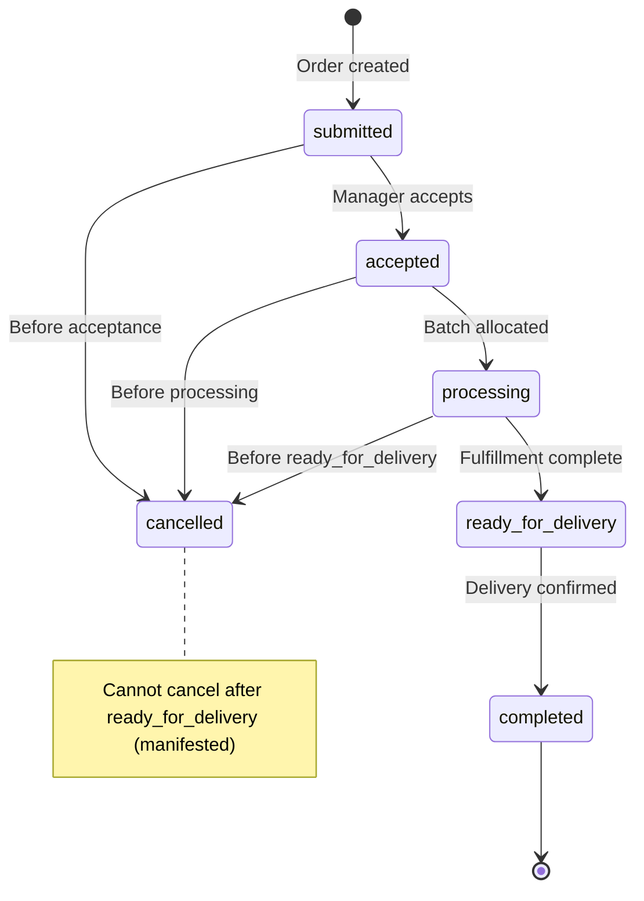

# ORDERS - Sales & Fulfillment Workflow

> **Status:** Documented (Evidence-Based)
> **Purpose:** Defines order creation through fulfillment including batch allocation, packaging, and compliance documentation
> **Foundation:** Orders link to batches via allocation - critical for traceability and compliance
> **Critical:** Batch allocation ensures strain-aware fulfillment and maintains seed-to-sale chain
> **Reference:** Extracted from [SYSTEM-WORKFLOW.md Section 3](./SYSTEM-WORKFLOW.md#3-sales--fulfillment)

---

## TABLE OF CONTENTS

1. [Purpose](#purpose)
2. [Batch-Order Relationship](#batch-order-relationship) ⭐ **IMPORTANT**
3. [Architecture Overview](#architecture-overview)
4. [Inputs](#inputs)
5. [Outputs](#outputs)
6. [Key Rules](#key-rules)
7. [Order Creation Workflow](#order-creation-workflow)
8. [Batch Allocation Workflow](#batch-allocation-workflow)
9. [Fulfillment & Ready for Delivery](#fulfillment--ready-for-delivery)
10. [Manifest & Delivery](#manifest--delivery)
11. [Order Status State Machine](#order-status-state-machine)
12. [Implementation Status](#implementation-status)
13. [Database Dependencies](#database-dependencies)
14. [Related Modules](#related-modules)

---

## Purpose

The Orders module manages the complete sales workflow from customer order submission through delivery confirmation:
- Order creation (internal UI or public form)
- Manager acceptance and validation
- **Strain-aware batch allocation** (links orders to harvest batches)
- Fulfillment preparation and inventory deduction
- Compliance documentation (coversheets with batch traceability)
- Manifest generation and delivery tracking

**Critical Principle:** Orders MUST be allocated to specific batches. This creates the final link in the seed-to-sale traceability chain: Harvest Batch → Processing Sessions → Packaged Inventory → Order → Customer.

---

## Batch-Order Relationship

> **Why This Matters:** Batch allocation is how we prove which lab test (COA) applies to products shipped to customers. Without batch allocation, compliance documentation is impossible.

### Orders Complete the Traceability Chain

```
┌─────────────────────────────────────────────────────────────────────┐
│              ORDERS ← COMPLETE THE TRACEABILITY CHAIN                │
├─────────────────────────────────────────────────────────────────────┤
│                                                                       │
│  batch_registry (harvest batch)                                      │
│       ├─── Harvest Date: 2025-01-06                                  │
│       ├─── Strain: Girl Scout Cookies                                │
│       ├─── COA: THC 25.4%, CBD 0.2%                                  │
│       │                                                               │
│       └─── inventory_items (packaged units)                          │
│            ├─── package_id: "250106-GSC-PK-001"                      │
│            ├─── batch_id: links to harvest batch                     │
│            │                                                          │
│            └─── batch_allocations (order linkage)                    │
│                 ├─── order_id: links to customer order               │
│                 ├─── order_item_id: specific line item               │
│                 ├─── allocated_qty: 14g                              │
│                 │                                                     │
│                 └─── order_fulfillment_items                         │
│                      ├─── Pulls from allocated batch inventory       │
│                      ├─── Creates inventory_movement (FULFILLMENT)   │
│                      └─── Deducts inventory from batch               │
│                                                                       │
│  RESULT: Customer invoice shows:                                     │
│  ───────────────────────────────────────────────────────────────   │
│  • Product: GSC 14g                                                  │
│  • Batch: 250106-GSC                                                 │
│  • Package: 250106-GSC-PK-001                                        │
│  • COA: THC 25.4% (attached to batch)                                │
│  • Harvest Date: 2025-01-06                                          │
│                                                                       │
└─────────────────────────────────────────────────────────────────────┘
```

### Why Batch-Order Linkage Is Critical

**Batch allocation enables:**
- ✅ **COA on Compliance Docs:** Coversheet/invoice shows which lab test applies
- ✅ **Strain Accuracy:** Customer ordered GSC, gets GSC (not different strain)
- ✅ **Recall Traceability:** Contaminated batch → find all customers who received it
- ✅ **Regulatory Compliance:** Manifests require batch numbers per state law

**Without batch allocation:**
- ❌ Cannot generate valid compliance documents (manifests, coversheets)
- ❌ Cannot prove strain accuracy (customer could receive wrong strain)
- ❌ Cannot execute recalls (no way to identify affected customers)
- ❌ Cannot pass state audits (regulators require batch-to-customer traceability)

**Current Gaps:**
- **GAP-010:** No strain validation trigger on `batch_allocations`
  - **Impact:** HIGH - Wrong strain batch could be allocated to order
  - **Resolution:** 🟡 Migration Batch 2 planned

See: [BATCHES.md](./BATCHES.md) for complete batch architecture, [DOCS-INTEGRATION-PROGRESS.md](./DOCS-INTEGRATION-PROGRESS.md#implementation-gaps-dashboard) for gap tracking.

---

## Architecture Overview

```
┌─────────────┐     ┌─────────────┐     ┌─────────────┐     ┌─────────────┐     ┌─────────────┐
│  Customer   │────▶│   Order     │────▶│   Batch     │────▶│ Fulfillment │────▶│  Manifest   │
│  Submits    │     │  Accepted   │     │  Allocated  │     │  Complete   │     │  & Delivery │
│             │     │             │     │             │     │             │     │             │
│ submitted   │     │  accepted   │     │ processing  │     │ready_for_   │     │ completed   │
│             │     │             │     │             │     │  delivery   │     │             │
└─────────────┘     └─────────────┘     └─────────────┘     └─────────────┘     └─────────────┘
```

**Key Principles:**
- Orders can be created via internal UI or public customer form
- Manager acceptance required before processing
- Strain-aware batch allocation with ATP validation
- Soft reserves converted to hard deductions at fulfillment
- One coversheet per order (compliance)
- Multi-stop manifests supported

---

## Inputs

### 1. Order Submissions
- **Internal Orders** (created by staff)
  - Source: Internal UI (staff creates on behalf of customer)
  - order_source: 'internal'
  - Full customer selection and product catalog access
  - Immediate access to all product types

- **Public Order Form** (customer self-service)
  - Source: Public-facing web form
  - order_source: 'public_form'
  - Customer selects from available products
  - Anonymous access (no authentication required)
  - Auto-generation of order_number

### 2. Manager Actions
- **Order Acceptance**
  - Manager reviews submitted orders
  - Validates customer status (active, not suspended)
  - Checks product availability (ATP)
  - Sets scheduled_delivery_date
  - Status transition: 'submitted' → 'accepted'

- **Batch Allocation**
  - Manager selects batches for each order_item
  - Strain-aware batch selection (product.strain_id match)
  - Allocation creates soft reserve (RESERVE movement)
  - Status transition: 'accepted' → 'processing'

- **Fulfillment Confirmation**
  - Manager assigns specific packages to order_items
  - Creates order_fulfillment_items records
  - Converts RESERVE to FULFILLMENT movements
  - Status transition: 'processing' → 'ready_for_delivery'

### 3. Driver Actions
- **Manifest Loading**
  - Driver marks manifest as loaded
  - Status: 'generated' → 'in_transit'
  - Departure time recorded

- **Delivery Confirmation**
  - Driver confirms delivery at customer location
  - Optional: signature/photo capture
  - Status: 'in_transit' → 'delivered'
  - Order status: 'ready_for_delivery' → 'completed'

---

## Outputs

### 1. Order Records
- **Table:** `orders`
- **Fields:**
  - order_number: Unique identifier (format: YYMMDD-CUST-NN)
  - customer_id: FK to customers table
  - status: Workflow state (submitted → completed)
  - order_date: Submission timestamp
  - scheduled_delivery_date: Manager-set delivery date
  - total_amount: Auto-calculated from order_items subtotals
  - order_source: 'internal' OR 'public_form'
  - archived: Soft delete flag

### 2. Order Line Items
- **Table:** `order_items`
- **Fields:**
  - order_id: Parent order FK
  - product_id: Requested product FK
  - quantity: Requested amount
  - unit_price: Price at time of order
  - subtotal: GENERATED (quantity * unit_price)
  - demand_unit: 'unit' OR 'g' (fulfillment requirement)
  - status: Item-level workflow state

### 3. Batch Allocations
- **Table:** `batch_allocations`
- **Fields:**
  - batch_id: Allocated batch FK
  - order_id, order_item_id: Order references
  - allocated_weight_grams OR allocated_units: Quantity reserved
  - status: 'pending' → 'fulfilled'
  - created_at: Allocation timestamp

### 4. Fulfillment Items
- **Table:** `order_fulfillment_items`
- **Fields:**
  - order_id, order_item_id: Parent references
  - item_id: Specific inventory_item FK (package assigned)
  - batch_id: For traceability (COA lookup)
  - qty: Quantity from this package
  - unit: 'unit' OR 'g'
  - manifest_id: Links to delivery manifest
  - fulfilled_at: Completion timestamp

### 5. Coversheets (Compliance)
- **Table:** `coversheets`
- **Fields:**
  - order_id: ONE per order (UNIQUE constraint)
  - batch_compliance_data: JSONB array of batch details
  - qr_code_data: Public URL for compliance verification
  - total_packages, total_weight_grams: Aggregated stats
  - generated_at: Auto-generated when status → 'ready_for_delivery'

### 6. Manifests
- **Table:** `manifests`
- **Fields:**
  - manifest_number: Unique identifier (MAN-YYMMDD-NN)
  - driver_id, vehicle_id: Assignment references
  - route_sequence: JSONB array of order_ids in delivery order
  - status: 'generated' → 'in_transit' → 'delivered'
  - scheduled_date: Delivery date

### 7. Inventory Movements
- **RESERVE** movements (soft allocation)
  - Created when batch allocated to order
  - Decrements ATP (Available to Promise) only
  - Does NOT decrement on_hand_qty

- **RELEASE** movements (cancel reservation)
  - Created when allocation cancelled
  - Restores ATP
  - Occurs before FULFILLMENT

- **FULFILLMENT** movements (hard deduction)
  - Created when order → 'ready_for_delivery'
  - Decrements on_hand_qty (permanent inventory reduction)
  - Links to order_id for traceability

---

## Key Rules

### Order Creation Rules
1. **Order number format: YYMMDD-CUSTCODE-NN**
   - Status: 🔴 NOT AUTO-GENERATED
   - Current: Frontend generates manually
   - Risk: Format inconsistencies, potential duplicates
   - Mitigation: UNIQUE constraint catches duplicates
   - Target: Create `fn_generate_order_number()` - Sprint 2025-12-2

2. **Total amount auto-calculated from line items**
   - Formula: `total_amount = SUM(order_items.subtotal)`
   - Status: 🟡 MANUAL CALCULATION
   - Current: Frontend calculates, not enforced by trigger
   - Risk: Manual edits cause mismatch
   - Target: Add `trg_calculate_order_total` - Sprint 2025-11-2

3. **At least one order_item required**
   - Enforced: Frontend validation only
   - Risk: Empty orders if validation bypassed
   - Target: Add CHECK constraint - Sprint 2025-12-2

### Allocation Rules
4. **Strain matching validation** (MANUAL ONLY)
   - Status: 🟡 NO DATABASE ENFORCEMENT
   - Current: UI displays strain, manager must verify visually
   - Risk: Wrong strain allocated (e.g., GSC order fulfilled with GDP batch)
   - Fix: Add trigger validating `batch.strain_id = product.strain_id`
   - Priority: HIGH
   - Target: Sprint 2025-12-1

5. **ATP (Available to Promise) validation**
   - Status: 🔴 CRITICAL GAP - No ATP view exists
   - Formula: `ATP = on_hand_qty - SUM(RESERVE movements)`
   - Current: Frontend calculates ad-hoc
   - Risk: Over-allocation if reserves ignored
   - Fix: Create `v_inventory_atp` materialized view
   - Priority: CRITICAL
   - Target: Sprint 2025-11-2

6. **Allocation quantity <= batch ATP**
   - Depends on ATP view (see Rule 5)
   - Validation: `allocation_qty <= batch.atp_qty`
   - Current: Manual manager verification

### Fulfillment Rules
7. **Auto-create FULFILLMENT movements** (NOT YET IMPLEMENTED)
   - Status: 🔴 CRITICAL GAP
   - Current: Manual inventory_movements entries required
   - Risk: Inventory not deducted, phantom stock
   - Fix: Add `trg_create_fulfillment_movement` on order_fulfillment_items INSERT
   - Priority: CRITICAL
   - Target: Sprint 2025-11-2

8. **SUM(fulfillment_items.qty) = order_item.quantity**
   - Validation: Each order_item fully satisfied by fulfillment_items
   - Current: Frontend validation only
   - Risk: Partial fulfillments without oversight
   - Target: Add CHECK constraint or validation trigger

9. **All batches must have active COAs before fulfillment**
   - Status: 🔴 NOT ENFORCED
   - Current: Manual manager verification
   - Risk: Orders shipped without valid COAs (compliance violation)
   - Fix: Add validation function checking `certificates_of_analysis.is_active = true`
   - Priority: CRITICAL
   - Target: Sprint 2025-11-2

### Status Transition Rules
10. **Status transitions follow workflow sequence**
    - Valid: submitted → accepted → processing → ready_for_delivery → completed
    - Cancellation: Any state (except ready_for_delivery) → cancelled
    - Status: 🟡 NO TRIGGER ENFORCEMENT
    - Current: Frontend enforces, no database validation
    - Risk: Manual status updates skip workflow stages
    - Fix: Add `trg_validate_order_status_transition`
    - Priority: HIGH
    - Target: Sprint 2025-11-3

---

## Order Creation Workflow

### Step 1: Customer Submits Order

**Internal UI Flow:**
```
Staff → Select Customer → Add Products → Set Delivery Date → Submit
```

**Public Form Flow:**
```
Customer → Select Dispensary → Add Products → Request Delivery Date → Submit
```

**Database Operations:**
```sql
-- Insert order
INSERT INTO orders (
  order_number, customer_id, status, order_date,
  requested_delivery_date, order_source, created_by
)
VALUES (
  generate_order_number(customer_id, order_date),  -- Function does NOT exist yet
  customer_id,
  'submitted',
  now(),
  requested_delivery_date,
  'public_form',  -- OR 'internal'
  auth.uid()  -- NULL for public form
);

-- Insert line items
INSERT INTO order_items (
  order_id, product_id, quantity, unit_price, demand_unit
)
SELECT
  new_order_id,
  product_id,
  quantity,
  products.price_per_unit,
  CASE
    WHEN products.type = 'packaged' THEN 'unit'
    WHEN products.type = 'bulk' THEN 'g'
  END
FROM order_cart_items;
```

**Validation:**
- ✅ customer_id exists in `customers` table
- ✅ All product_ids exist in `products` table
- ✅ quantity > 0 for all line items
- ✅ UNIQUE constraint on order_number

**Side Effects:**
- order_items.status = 'pending'
- order_items.subtotal = quantity * unit_price (GENERATED column)
- orders.total_amount calculated (🟡 MANUAL - should be trigger)

---

### Step 2: Manager Accepts Order

**UI Flow:**
```
Manager → Orders Dashboard → Review Order → Validate Customer/Availability → Accept
```

**Database Operations:**
```sql
-- Update order status
UPDATE orders
SET
  status = 'accepted',
  scheduled_delivery_date = manager_selected_date
WHERE id = order_id;

-- Log production history
INSERT INTO batch_production_history (
  event_type, notes, event_timestamp
)
VALUES (
  'allocation_created',
  'Order accepted, pending allocation',
  now()
);
```

**Validation:**
- ✅ Customer is active (not suspended)
- 🟡 Products available (ATP check manual - should be automated)
- ✅ Delivery date feasible

**Preconditions:**
- orders.status = 'submitted'

**Events Emitted:**
- Orders UI notification
- Optional: Customer notification (email/SMS)

---

## Batch Allocation Workflow

### Strain-Aware Batch Selection

**View:** `v_batch_selection_for_strain`

**Purpose:** Display available batches filtered by product's strain

**SQL:**
```sql
SELECT
  br.id AS batch_id,
  br.batch_number,
  br.strain,
  br.lifecycle_state,
  br.is_quarantined,
  coa.is_active AS coa_active,
  ii.product_stage_id,
  SUM(ii.on_hand_qty) AS available_weight,
  -- ATP = on_hand - reserves (🔴 MISSING VIEW)
  SUM(ii.on_hand_qty) - COALESCE(SUM(reserves.qty), 0) AS atp_qty
FROM batch_registry br
JOIN inventory_items ii ON ii.batch_id = br.id
LEFT JOIN certificates_of_analysis coa ON coa.id = br.coa_id
LEFT JOIN (
  SELECT source_item_id, SUM(qty) AS qty
  FROM inventory_movements
  WHERE movement_kind = 'RESERVE'
  GROUP BY source_item_id
) reserves ON reserves.source_item_id = ii.id
WHERE
  br.is_quarantined = false
  AND br.lifecycle_state IN ('bulk_available', 'packaged')
  AND br.strain = :product_strain  -- Strain filter
GROUP BY br.id, br.batch_number, coa.is_active, ii.product_stage_id
HAVING SUM(ii.on_hand_qty) > 0
ORDER BY br.harvest_date ASC;  -- FIFO optional
```

### Allocation Process

**Step 1: Manager Selects Batch**
```
Manager → Order Details → Order Item → "Allocate" → Select Batch → Enter Quantity
```

**Step 2: Create Allocation & Reserve**

**Database Operations:**
```sql
-- Insert batch allocation
INSERT INTO batch_allocations (
  batch_id, order_id, order_item_id,
  allocated_weight_grams,  -- OR allocated_units
  status, created_at
)
VALUES (
  selected_batch_id,
  order_id,
  order_item_id,
  allocation_qty,
  'pending',
  now()
);

-- Create soft reservation (decrements ATP, NOT on_hand_qty)
INSERT INTO inventory_movements (
  movement_kind, source_item_id, qty, unit,
  order_id, reason_code, created_at
)
VALUES (
  'RESERVE',
  batch_inventory_item_id,
  allocation_qty,
  'g',  -- OR 'unit'
  order_id,
  'order_allocation',
  now()
);
```

**Validation:**
- 🟡 allocation_qty <= batch ATP (manual validation - should be CHECK constraint)
- 🟡 Strain match: batch.strain_id = product.strain_id (manual - should be trigger)
- ✅ Batch not quarantined
- 🟡 Batch has active COA if packaged (manual - should be validation function)

**Step 3: Update Order Item Status**

```sql
-- Mark item as allocated
UPDATE order_items
SET status = 'allocated'
WHERE id = order_item_id;

-- Check if all items allocated
UPDATE orders
SET status = 'processing'
WHERE id = order_id
  AND NOT EXISTS (
    SELECT 1 FROM order_items
    WHERE order_id = orders.id
      AND status != 'allocated'
  );
```

**Side Effects:**
- Batch ATP decremented (soft reserve)
- order_items.status → 'allocated'
- orders.status → 'processing' (when all items allocated)
- batch_lifecycle_events logged

---

## Fulfillment & Ready for Delivery

### Assign Fulfillment Items

**Step 1: Manager Selects Packages**

**UI Flow:**
```
Manager → Order Details → "Prepare for Delivery" → Select Packages for Each Item
```

**Database Operations:**
```sql
-- Insert fulfillment items
INSERT INTO order_fulfillment_items (
  order_id, order_item_id, item_id, batch_id,
  qty, unit, fulfilled_by, fulfilled_at
)
VALUES (
  order_id,
  order_item_id,
  selected_package_id,  -- Specific inventory_item
  package_batch_id,     -- For COA traceability
  fulfillment_qty,
  'unit',  -- OR 'g'
  auth.uid(),
  now()
);
```

### Convert Reserve to Fulfillment (CRITICAL GAP)

**Status:** 🔴 NOT YET IMPLEMENTED - No trigger exists

**Planned Logic:**
```sql
-- Trigger: trg_create_fulfillment_movement
-- ON: order_fulfillment_items INSERT

-- Step 1: Release soft reservation
INSERT INTO inventory_movements (
  movement_kind, dest_item_id, qty, unit,
  order_id, reason_code
)
VALUES (
  'RELEASE',
  assigned_package_id,
  fulfillment_qty,
  'unit',
  order_id,
  'convert_reserve_to_fulfillment'
);

-- Step 2: Create hard deduction
INSERT INTO inventory_movements (
  movement_kind, source_item_id, qty, unit,
  order_id, reason_code
)
VALUES (
  'FULFILLMENT',
  assigned_package_id,
  fulfillment_qty,
  'unit',
  order_id,
  'order_fulfillment'
);

-- Step 3: Update inventory_items.on_hand_qty
-- (Handled by trg_update_on_hand_qty_after_movement)
```

**Current Workaround:** Manual inventory_movements entries

**Risk:** Inventory not automatically deducted, phantom stock

**Priority:** CRITICAL | Target: Sprint 2025-11-2

### Generate Coversheet (Compliance)

**Trigger:** `trg_generate_coversheet_on_ready_for_delivery` (PLANNED - NOT YET IMPLEMENTED)

**Logic:**
```sql
-- Aggregate batch compliance data
WITH batch_data AS (
  SELECT
    ofi.order_id,
    br.batch_number,
    s.name AS strain,
    coa.file_path AS coa_url,
    coa.thc_percent,
    coa.cbd_percent
  FROM order_fulfillment_items ofi
  JOIN batch_registry br ON br.id = ofi.batch_id
  JOIN strains s ON s.id = br.strain_id
  JOIN certificates_of_analysis coa ON coa.id = br.coa_id
  WHERE ofi.order_id = :order_id
    AND coa.is_active = true
)
INSERT INTO coversheets (
  order_id, customer_name, order_number, delivery_address,
  delivery_date, total_packages, total_weight_grams,
  batch_compliance_data, qr_code_data, generated_at
)
SELECT
  o.id,
  c.company_name,
  o.order_number,
  c.delivery_address,
  o.scheduled_delivery_date,
  COUNT(ofi.id),
  SUM(ofi.qty),
  jsonb_agg(jsonb_build_object(
    'batch_id', bd.batch_number,
    'strain', bd.strain,
    'coa_url', bd.coa_url,
    'thc', bd.thc_percent,
    'cbd', bd.cbd_percent
  )),
  '/coversheet/' || o.id,  -- Public URL
  now()
FROM orders o
JOIN customers c ON c.id = o.customer_id
JOIN order_fulfillment_items ofi ON ofi.order_id = o.id
JOIN batch_data bd ON bd.order_id = o.id
WHERE o.id = :order_id
GROUP BY o.id, c.company_name, c.delivery_address;
```

**Status:** 🟡 MANUAL GENERATION
- Current: Frontend generates on demand
- Risk: Coversheet not created if manual step skipped
- Target: Add auto-generation trigger - Sprint 2025-11-3

### Update Order Status

```sql
-- Mark order ready for delivery
UPDATE orders
SET status = 'ready_for_delivery'
WHERE id = order_id;

-- Update batch allocations
UPDATE batch_allocations
SET status = 'fulfilled'
WHERE order_id = order_id;
```

**Validation:**
- ✅ All order_items have fulfillment_items assigned
- 🔴 All batches have active COAs (should be validated before status change)
- ✅ SUM(fulfillment_items.qty per order_item) = order_item.quantity

**Side Effects:**
- inventory_items.on_hand_qty decremented (via FULFILLMENT movements)
- ATP restored (RELEASE) then decremented (FULFILLMENT)
- Coversheet auto-generated
- orders.status → 'ready_for_delivery'

---

## Manifest & Delivery

### Generate Manifest

**Step 1: Create Manifest**

**UI Flow:**
```
Manager → Delivery Schedule → Select Orders → Assign Driver & Vehicle → Generate Manifest
```

**Database Operations:**
```sql
INSERT INTO manifests (
  manifest_number, driver_id, vehicle_id,
  scheduled_date, route_sequence, status
)
VALUES (
  generate_manifest_number(scheduled_date),  -- Function exists
  driver_id,
  vehicle_id,
  scheduled_date,
  jsonb_build_array(order_id_1, order_id_2, ...),  -- Delivery order
  'generated'
);

-- Link fulfillment items to manifest
UPDATE order_fulfillment_items
SET manifest_id = new_manifest_id
WHERE order_id IN (manifest_order_ids);
```

**Manifest PDF Contents:**
- Driver info (name, license)
- Vehicle info (plate, registration)
- Order list (customer, address, items, weights)
- Batch traceability (batch numbers, COA links)
- Signatures section (driver, recipient)

### In Transit

```sql
UPDATE manifests
SET
  status = 'in_transit',
  departed_at = now()
WHERE id = manifest_id;
```

**Side Effects:**
- Notifications sent to customers (optional)

### Delivery Complete

```sql
-- Update manifest
UPDATE manifests
SET
  status = 'delivered',
  delivered_at = now()
WHERE id = manifest_id;

-- Update orders
UPDATE orders
SET status = 'completed'
WHERE id IN (
  SELECT UNNEST(route_sequence::text[])::uuid
  FROM manifests
  WHERE id = manifest_id
);
```

**Side Effects:**
- orders.status → 'completed'
- Orders eligible for archiving after retention period

---

## Order Status State Machine



**Valid Transitions:**
- `submitted` → `accepted` (manager approval)
- `accepted` → `processing` (batch allocation)
- `processing` → `ready_for_delivery` (fulfillment + coversheet)
- `ready_for_delivery` → `completed` (delivery confirmed)
- `submitted` | `accepted` | `processing` → `cancelled` (cancellation allowed)

**Blocked Transitions:**
- Cannot cancel after `ready_for_delivery` (already manifested)
- Cannot regress status (e.g., `completed` → `processing`)
- 🟡 No trigger enforcement (frontend only)

---

## Implementation Status

### Fully Implemented ✅
- ✅ Order creation (internal + public form)
- ✅ Order items with subtotal calculation (GENERATED column)
- ✅ Manager acceptance workflow
- ✅ Batch allocation UI with strain filtering
- ✅ Fulfillment items assignment
- ✅ Coversheet generation UI
- ✅ Manifest generation and multi-stop routing
- ✅ Delivery status tracking

### Partial / Manual Only ⚠️
- ⚠️ Order number generation (manual, should be function)
  - Priority: MEDIUM | Target: Sprint 2025-12-2

- ⚠️ Total amount calculation (frontend, should be trigger)
  - Priority: MEDIUM | Target: Sprint 2025-11-2

- ⚠️ Strain matching validation (UI only, no database enforcement)
  - Priority: HIGH | Target: Sprint 2025-12-1

- ⚠️ Coversheet auto-generation (manual, should be trigger)
  - Priority: MEDIUM | Target: Sprint 2025-11-3

- ⚠️ Status transition validation (frontend, no trigger)
  - Priority: HIGH | Target: Sprint 2025-11-3

### Missing / Planned ❌
- ❌ ATP view (on_hand - reserves)
  - **Priority: CRITICAL** | Target: Sprint 2025-11-2
  - Risk: Over-allocation

- ❌ Auto-create FULFILLMENT movements
  - **Priority: CRITICAL** | Target: Sprint 2025-11-2
  - Risk: Inventory not deducted

- ❌ COA validation before fulfillment
  - **Priority: CRITICAL** | Target: Sprint 2025-11-2
  - Risk: Compliance violations

- ❌ Allocation quantity validation (CHECK constraint)
  - Priority: HIGH | Target: Sprint 2025-12-1
  - Risk: Over-allocation

- ❌ Fulfillment quantity validation (CHECK constraint)
  - Priority: MEDIUM | Target: Sprint 2025-12-1
  - Risk: Partial fulfillments

---

## Database Dependencies

### Core Tables
- **`orders`** - Order master records
  - Indexes: order_number (UNIQUE), customer_id, status, archived
  - Status: submitted → accepted → processing → ready_for_delivery → completed

- **`order_items`** - Line items
  - Indexes: order_id, product_id
  - Subtotal: GENERATED (quantity * unit_price)

- **`customers`** - Dispensaries
  - Fields: company_name, license_number, delivery_address, ato_number, dispensary_code
  - Status: active/inactive

- **`products`** - Product catalog
  - Fields: name, strain_id, type, category, unit_weight, price_per_unit
  - Links to strains for allocation matching

### Allocation Tables
- **`batch_allocations`** - Batch reservations
  - Links: batch_id, order_id, order_item_id
  - Status: pending → fulfilled

- **`order_fulfillment_items`** - Package assignments
  - Links: order_id, order_item_id, item_id (inventory), batch_id, manifest_id
  - One-to-many: order_item can have multiple fulfillment_items

### Compliance Tables
- **`coversheets`** - Compliance documentation
  - Unique: ONE per order_id
  - batch_compliance_data: JSONB array of batch details

- **`manifests`** - Delivery documentation
  - route_sequence: JSONB array of order_ids
  - Status: generated → in_transit → delivered

### Inventory Integration
- **`inventory_movements`** - Ledger entries
  - RESERVE: Soft allocation (decrements ATP)
  - RELEASE: Cancel allocation (restores ATP)
  - FULFILLMENT: Hard deduction (decrements on_hand_qty)

- **`batch_registry`** - Batch traceability
  - Links: strain_id, coa_id
  - Quarantine blocks allocation

- **`certificates_of_analysis`** - COA validation
  - is_active: Must be true for fulfillment
  - expiration_date: Monitored

---

## Related Modules

### Upstream Dependencies
- **[INVENTORY-TRACKING.md](./INVENTORY-TRACKING.md)** - Inventory movements
  - RESERVE movements created on allocation
  - RELEASE movements on cancellation
  - FULFILLMENT movements on ready_for_delivery
  - See [Event-Driven Ledger](./INVENTORY-TRACKING.md#event-driven-ledger)

- **[BATCHES.md](./BATCHES.md)** (TO BE CREATED) - Batch lifecycle
  - batch_registry.lifecycle_state affects allocation
  - Quarantine blocks allocation
  - COA required for fulfillment

- **[PRODUCTS.md](./PRODUCTS.md)** (TO BE CREATED) - Product catalog
  - product.strain_id for batch matching
  - product.price_per_unit for subtotal
  - product.type determines demand_unit

### Downstream Consumers
- **[INVOICING-&-MANIFESTING.md](./INVOICING-&-MANIFESTING.md)** - Invoices & delivery
  - Manifest generation from ready_for_delivery orders
  - Invoice generation with order totals
  - See [Manifest System](./INVOICING-&-MANIFESTING.md#manifest-system)

- **[COVER-SHEETS.md](./COVER-SHEETS.md)** - Compliance documents
  - Coversheet per order with batch details
  - QR code for public COA access
  - See [Coversheet Generation](./COVER-SHEETS.md#generation-workflow)

- **[ANALYTICS.md](./ANALYTICS.md)** - Sales reporting & forecasting
  - Order volume by customer
  - Revenue by product
  - Delivery performance
  - **Sales Analytics Dashboard (v2.0):**
    - Order demand calculation (unfulfilled orders)
    - Order status funnel metrics
    - Sales velocity and fulfillment rates
    - Supply vs demand gap analysis
  - See [Sales Analytics Section](./ANALYTICS.md#sales-analytics)

### Peer Modules
- **[CUSTOMERS.md](./CUSTOMERS.md)** (TO BE CREATED) - Customer management
  - Customer selection for orders
  - License validation
  - Delivery address management

- **[DATASETS.md](./DATASETS.md)** - Complete schema
  - See [Section 4: Sales & Fulfillment](./DATASETS.md#4-sales--fulfillment)
  - See [Tech-Debt Register](./DATASETS.md#9-tech-debt-register)

- **[SYSTEM-WORKFLOW.md](./SYSTEM-WORKFLOW.md)** - End-to-end process
  - See [Section 3: Sales & Fulfillment](./SYSTEM-WORKFLOW.md#3-sales--fulfillment)
  - See [Order Status Workflow](./SYSTEM-WORKFLOW.md#72-order-status-workflow)

---

## REFERENCES

- **SYSTEM-WORKFLOW.md Section 3** - Source of this document
- **DATASETS.md Section 4** - Database schema details
- **DOCS-INTEGRATION-PROGRESS.md** - Implementation status tracker
- **Migration Files:**
  - `20251010031618_create_post_production_schema.sql` (orders, order_items)
  - `20251010140830_add_order_status_and_archive.sql` (status workflow)
  - `20251012153719_create_order_item_allocations_system.sql` (fulfillment items)
  - `20251017010000_create_manifest_system.sql` (manifests)
  - `20251024000000_add_order_source_tracking.sql` (internal vs public)
- **Type Definitions:** `src/types/order.types.ts`, `src/features/orders/types/*.ts`
- **Hooks:** `src/features/orders/hooks/useOrders.ts`
- **Services:** `src/features/orders/services/ordersService.ts`

---

**Last Updated:** 2025-11-12
**Version:** 1.3 (Sales Analytics Integration)
**Maintainer:** System Architect
**Review Cycle:** Monthly or post-order-workflow-changes

**Version History:**
- **v1.0 (2025-11-06):** Initial documentation
- **v1.1 (2025-11-06):** Evidence-based updates
- **v1.3 (2025-11-12):** Added Sales Analytics integration references
