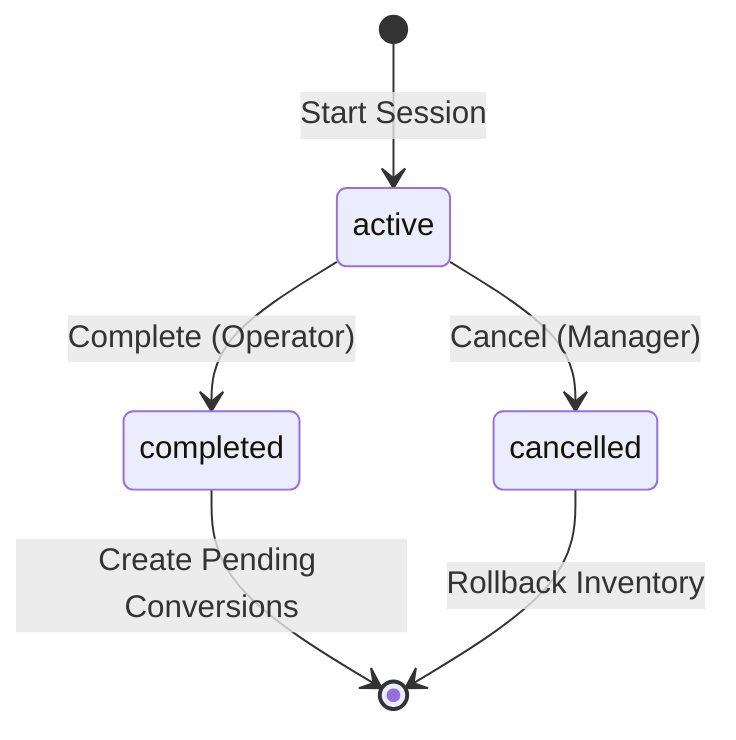

---

# SESSIONS - Post-Production Processing Workflows

> **Status:** Comprehensive Reference Documentation (v2.0)
> **Purpose:** Complete specification of Bucking, Trim, and Packaging session workflows with hybrid architecture finalization process
> **Foundation:** Sessions drive batch lifecycle transitions and preserve batch traceability
> **Critical:** Sessions are batch-scoped - all inputs/outputs inherit batch_id
> **Architecture:** Hybrid VIEW-based system (January 2026 migration)
> **Cross-References:** [BATCHES](./BATCHES.md), [INVENTORY-TRACKING](./INVENTORY-TRACKING.md), [SYSTEM-WORKFLOW](./SYSTEM-WORKFLOW.md)

---

## TABLE OF CONTENTS

1. [Overview](#overview)
2. [Batch-Session Relationship](#batch-session-relationship) ⭐ **IMPORTANT**
3. [Session Architecture](#session-architecture)
4. [Bucking Sessions](#bucking-sessions)
5. [Trim Sessions](#trim-sessions)
6. [Packaging Sessions](#packaging-sessions)
7. [Conversion Workflow](#conversion-workflow)
8. [Session Cancellation](#session-cancellation)
9. [Undoing Completed Sessions](#undoing-completed-sessions)
10. [Variance Handling](#variance-handling)
11. [Implementation Status](#implementation-status)
12. [SQL Reference](#sql-reference)

---

## Overview

The post-production processing system manages the transformation of harvested cannabis through multiple processing stages using a **session-based workflow**. Each session represents a discrete production activity that consumes input inventory and produces output inventory, with full traceability through the inventory ledger.

**Critical Principle:** Sessions are **batch-scoped operations**. Every session operates on a single batch, and all inventory produced by a session inherits that batch's `batch_id`. This ensures complete seed-to-sale traceability.

---

## Batch-Session Relationship

> **Why This Matters:** Sessions are the mechanism by which batches transition through lifecycle states. Understanding this relationship is essential to understanding the entire system.

### Sessions Drive Batch Lifecycle

```
┌─────────────────────────────────────────────────────────────────────┐
│                   BATCH LIFECYCLE ← DRIVEN BY SESSIONS               │
├─────────────────────────────────────────────────────────────────────┤
│                                                                       │
│  BATCH STATE: created                                                │
│       ↓                                                              │
│  BUCKING SESSION COMPLETES                                           │
│       ↓                                                              │
│  BATCH STATE: bucked                                                 │
│       ↓                                                              │
│  TRIM SESSION STARTS                                                 │
│       ↓                                                              │
│  BATCH STATE: in_trim                                                │
│       ↓                                                              │
│  TRIM SESSION COMPLETES                                              │
│       ↓                                                              │
│  BATCH STATE: bulk_available                                         │
│       ↓                                                              │
│  PACKAGING SESSION STARTS                                            │
│       ↓                                                              │
│  BATCH STATE: in_packaging                                           │
│       ↓                                                              │
│  PACKAGING SESSION COMPLETES                                         │
│       ↓                                                              │
│  BATCH STATE: packaged                                               │
│                                                                       │
└─────────────────────────────────────────────────────────────────────┘
```

### Batch Traceability Preservation

**Every session preserves batch lineage:**

1. **Session Creation:**
   - Session linked to batch via `batch_registry_id` FK
   - Cannot start session on quarantined batch (GAP-005 - will be enforced by Migration Batch 1)

2. **Inventory Consumption:**
   - Input items have `batch_id`
   - Ledger entry: `movement_kind = 'SESSION_INPUT'`

3. **Inventory Production:**
   - Output items **inherit parent's batch_id** via `parent_item_id` chain
   - Ledger entry: `movement_kind = 'SESSION_OUTPUT'`
   - batch_id propagates: input.batch_id → output.batch_id

4. **Batch State Update:**
   - Trigger updates `batch_registry.lifecycle_state` on session completion
   - Currently updates on START (GAP-004 - will be fixed by Migration Batch 1)

### Why Batch-Session Linkage Is Critical

**Without proper batch linkage:**
- ❌ Cannot track which lab test (COA) applies to packaged units
- ❌ Cannot calculate batch yield (harvest weight → final packaged weight)
- ❌ Cannot execute recalls (contaminated batch → all affected products)
- ❌ Cannot prove compliance (regulators require batch-to-customer traceability)

**Current Gaps:**
- **GAP-004:** Batch lifecycle state updates on session START instead of COMPLETION
  - **Impact:** Batch appears processed before work finishes
  - **Resolution:** ✅ Migration Batch 1 fixes this

See: [BATCHES.md](./BATCHES.md) for complete batch architecture, [DOCS-INTEGRATION-PROGRESS.md](./DOCS-INTEGRATION-PROGRESS.md#implementation-gaps-dashboard) for gap tracking.

### Session Types

```
┌─────────────────────────────────────────────────────────────────────┐
│ POST-PRODUCTION SESSION PIPELINE                                    │
├─────────────────────────────────────────────────────────────────────┤
│                                                                      │
│  BUCKING SESSION (Binned → Bucked)                                  │
│  ├─ Input: Binned material (whole plant)                            │
│  ├─ Output: Bucked Flower + Bucked Smalls + Waste                   │
│  └─ Status: active → completed                                      │
│                                                                      │
│  TRIM SESSION (Bucked → Bulk)                                       │
│  ├─ Input: Bucked Flower OR Bucked Smalls                           │
│  ├─ Output: Bulk Flower + Bulk Smalls + Trim + Waste                │
│  └─ Status: active → completed                                      │
│                                                                      │
│  PACKAGING SESSION (Bulk → Packaged)                                │
│  ├─ Input: Bulk Flower OR Bulk Smalls                               │
│  ├─ Output: Packaged Units (3.5g, 14g, 28g, etc.)                   │
│  └─ Status: active → completed                                      │
│                                                                      │
│  CONVERSION WORKFLOW (Manager Approval)                             │
│  ├─ Input: Sessions with finalization_status='pending'              │
│  ├─ Output: Finalized inventory packages with IDs                   │
│  └─ Status: finalization_status: pending → finalized                │
│                                                                      │
└─────────────────────────────────────────────────────────────────────┘
```

### Key Design Principles

1. **Session Isolation**: Each session is independent and atomic
2. **Manager Oversight**: Conversion workflow requires manager approval to finalize inventory
3. **Inventory Ledger**: All quantity changes flow through `inventory_movements`
4. **Batch Lineage**: All output inherits `batch_id` from input
5. **Variance Tracking**: Deviations >5% or >50g require explanation
6. **Cancellation Safety**: Sessions can be cancelled with full rollback

---

## Session Architecture

### Session State Machine

All sessions follow this lifecycle:



### Database Schema

**Core Tables:**
- `trim_sessions` - Handles both Bucking and Trim workflows
- `packaging_sessions` - Handles Packaging workflow
- `pending_conversions` - Auto-created on session completion
- `conversion_lots` - Aggregated conversions per batch/product/date
- `conversion_packages` - Manager-created packages from conversion lots
- `inventory_movements` - All quantity changes (source of truth)

**Evidence:**
- `supabase/migrations/20251010160000_create_inventory_and_trim_workflow.sql`
- `supabase/migrations/20251010210858_create_packaging_sessions.sql`
- `supabase/migrations/20251024210000_create_conversions_system_foundation.sql`

---

## Bucking Sessions

> **📦 THREE-STEP PATTERN: BUCKING**
>
> ```
> 1️⃣ RESERVE → fn_reserve_inventory_on_session_start()
>    └─ Lock binned inventory via inventory_movements
>
> 2️⃣ PROCESS → Operator completes bucking work
>    └─ Enter bucked flower, bucked smalls, waste weights
>
> 3️⃣ FINALIZE → Manager approves conversion
>    └─ Creates inventory_items with package IDs
> ```
>
> **Database Tables:**
> - `trim_sessions` (session_status: active → completed)
> - `inventory_movements` (ledger entries)
> - `pending_conversions` → `conversion_summary_view` (awaiting finalization)
>
> **Movement Types Created:**
> - RESERVE: `SESSION_RESERVE` (locks binned inventory)
> - CONSUME: `SESSION_INPUT` (consumes binned material)
> - PRODUCE: `SESSION_OUTPUT` (produces bucked flower + smalls)

### Purpose

Bucking is the first processing stage where binned material (whole plants) is separated into bucked flower, bucked smalls, and waste.

### Process Flow

```
┌──────────────────────────────────────────────────────────────────────┐
│ BUCKING SESSION WORKFLOW                                             │
├──────────────────────────────────────────────────────────────────────┤
│                                                                       │
│  1. START SESSION                                                    │
│     ├─ Manager selects batch (lifecycle_state = 'created')           │
│     ├─ System validates: batch not quarantined                       │
│     ├─ Create trim_sessions row:                                     │
│     │  ├─ session_number: BUCK-YYMMDD-NN                             │
│     │  ├─ batch_registry_id: Selected batch FK                       │
│     │  ├─ input_weight_lbs: Weight in pounds                         │
│     │  ├─ session_status: 'active'                                   │
│     │  └─ started_at: now()                                          │
│     └─ Update batch_registry.bucking_started_at                      │
│                                                                       │
│  2. COMPLETE SESSION (Operator)                                      │
│     ├─ Enter output weights:                                         │
│     │  ├─ bucked_flower_weight (grams)                               │
│     │  ├─ bucked_smalls_weight (grams)                               │
│     │  └─ waste_weight (grams)                                       │
│     ├─ System calculates variance:                                   │
│     │  └─ variance = input_lbs*453.592 - (flower+smalls+waste)       │
│     ├─ If |variance| > 50g OR >5%: require variance_reason           │
│     ├─ Update session_status: 'completed'                            │
│     └─ Trigger trg_trim_session_complete:                            │
│        ├─ Create pending_conversions (flower + smalls)               │
│        ├─ Create inventory_movements:                                │
│        │  ├─ CONSUME_SESSION_INPUT (input package)                   │
│        │  ├─ PRODUCE_SESSION_OUTPUT (bucked flower)                  │
│        │  └─ PRODUCE_SESSION_OUTPUT (bucked smalls)                  │
│        ├─ Log batch_production_history (event: bucking_completed)    │
│        └─ Update batch_registry.lifecycle_state: 'bucked'            │
│                                                                       │
└──────────────────────────────────────────────────────────────────────┘
```

### Validation Rules

**Preconditions:**
- `batch_registry.lifecycle_state = 'created'`
- `batch_registry.is_quarantined = false`
- Input package exists in `inventory_items`
- No active bucking session for this batch

**Output Validation:**
- `bucked_flower_weight + bucked_smalls_weight + waste_weight ≈ input_weight_lbs * 453.592`
- Tolerance: ±5% or ±50g (whichever is greater)
- `variance_reason` REQUIRED if outside tolerance

**Events Emitted:**
- `inventory_movements` (3x): CONSUME (input) + PRODUCE (flower + smalls)
- `bucking_sessions.finalization_status` set to 'pending' (awaiting manager finalization)
- `batch_production_history`: bucking_completed event
- `batch_lifecycle_events`: state_transition (created → bucked)

### Side Effects

- `inventory_items` (input): `on_hand_qty` decremented by `input_weight_lbs * 453.592`
- `inventory_items` (new): Two packages created:
  - Bucked Flower package (product_stage_id = BuckedFlower)
  - Bucked Smalls package (product_stage_id = BuckedSmalls)
  - Both with `parent_item_id = input_package_id`
- `batch_registry.lifecycle_state` → `'bucked'`

### Known Issues

**GAP #1: Premature Lifecycle State Update**
- **Status:** ⚠️ WRONG IMPLEMENTATION
- **Issue:** `lifecycle_state` updated to 'bucked' at session START instead of COMPLETION
- **Risk:** Batch appears bucked before work completes, blocking proper workflow
- **Fix Required:** Move `lifecycle_state` update to session completion trigger
- **Priority:** HIGH
- **Owner:** Backend

**GAP #2: Missing Input Package Lock**
- **Status:** 🔴 NOT IMPLEMENTED
- **Issue:** No constraint preventing concurrent sessions on same package
- **Risk:** Multiple operators could start sessions on same input, causing inventory corruption
- **Fix Required:** Add CHECK constraint or trigger blocking duplicate active sessions
- **Priority:** MEDIUM
- **Owner:** Backend

---

## Trim Sessions

> **🌿 THREE-STEP PATTERN: TRIM**
>
> ```
> 1️⃣ RESERVE → fn_reserve_inventory_on_session_start()
>    └─ Lock bucked inventory via inventory_movements
>
> 2️⃣ PROCESS → Operator completes trimming work
>    └─ Enter bulk flower, bulk smalls, trim, waste weights
>
> 3️⃣ FINALIZE → Manager approves conversion
>    └─ Creates inventory_items with package IDs
> ```
>
> **Database Tables:**
> - `trim_sessions` (session_status: active → completed)
> - `inventory_movements` (ledger entries)
> - `pending_conversions` → `conversion_summary_view` (awaiting finalization)
>
> **Movement Types Created:**
> - RESERVE: `SESSION_RESERVE` (locks bucked inventory)
> - CONSUME: `SESSION_INPUT` (consumes bucked material)
> - PRODUCE: `SESSION_OUTPUT` (produces bulk flower + smalls + trim)
>
> **Stage Transitions:**
> - `BuckedFlower` → `BulkFlower` + `Trim` ✅
> - `BuckedSmalls` → `BulkSmalls` + `Trim` ✅
> - `BuckedSmalls` → `BulkFlower` ❌ (invalid)
> - `BuckedFlower` → `BulkSmalls` ❌ (invalid)

### Purpose

Trim sessions convert bucked material (flower or smalls) into bulk material ready for packaging. This is the second stage of the 2-step workflow.

### Process Flow

```
┌──────────────────────────────────────────────────────────────────────┐
│ TRIM SESSION WORKFLOW                                                │
├──────────────────────────────────────────────────────────────────────┤
│                                                                       │
│  1. START SESSION                                                    │
│     ├─ Operator selects bucked package:                              │
│     │  └─ product_stage_id IN (BuckedFlower, BuckedSmalls)           │
│     ├─ System validates:                                             │
│     │  ├─ Batch not quarantined                                      │
│     │  └─ Package on_hand_qty > 0                                    │
│     ├─ Create trim_sessions row:                                     │
│     │  ├─ session_number: TRIM-YYMMDD-NN                             │
│     │  ├─ batch_registry_id: Package batch FK                        │
│     │  ├─ input_package_id: Bucked package ID                        │
│     │  ├─ source_stage: 'bucked_flower' OR 'bucked_smalls'           │
│     │  ├─ session_status: 'active'                                   │
│     │  └─ started_at: now()                                          │
│     └─ Update batch_registry:                                        │
│        ├─ trimming_started_at: now()                                 │
│        └─ lifecycle_state: 'in_trim'                                 │
│                                                                       │
│  2. COMPLETE SESSION (Operator)                                      │
│     ├─ Enter output weights:                                         │
│     │  ├─ bulk_flower_weight (if source was BuckedFlower)            │
│     │  ├─ bulk_smalls_weight (if source was BuckedSmalls)            │
│     │  ├─ bulk_trim_weight (trim byproduct)                          │
│     │  └─ waste_weight (unusable material)                           │
│     ├─ System calculates variance:                                   │
│     │  └─ variance = input - (flower+smalls+trim+waste)              │
│     ├─ Update session_status: 'completed'                            │
│     └─ Trigger trg_trim_session_complete:                            │
│        ├─ Create pending_conversions (3x: flower/smalls/trim)        │
│        ├─ Create inventory_movements:                                │
│        │  ├─ CONSUME_SESSION_INPUT (bucked package)                  │
│        │  ├─ PRODUCE_SESSION_OUTPUT (bulk flower)                    │
│        │  ├─ PRODUCE_SESSION_OUTPUT (bulk smalls)                    │
│        │  └─ PRODUCE_SESSION_OUTPUT (trim)                           │
│        ├─ Log batch_production_history (event: trim_completed)       │
│        └─ Update batch_registry.lifecycle_state: 'bulk_available'    │
│                                                                       │
└──────────────────────────────────────────────────────────────────────┘
```

### Stage Transition Rules

**Valid Transitions:**
- `BuckedFlower` → `BulkFlower` + `Trim`
- `BuckedSmalls` → `BulkSmalls` + `Trim`

**Invalid Transitions (Must Block):**
- ❌ `BuckedSmalls` → `BulkFlower` (wrong product path)
- ❌ `BuckedFlower` → `BulkSmalls` (downgrading quality)

### Stage Naming Clarification

> **IMPORTANT:** Understanding the difference between product names and stage names

**Product Stage Progression:**
```
Binned → Bucked → Trimmed → Packaged
```

**Product Naming vs. Stage Mapping:**

| Product Name Pattern | Product Stage | Net Weight | Notes |
|---------------------|---------------|------------|-------|
| "Binned - [Strain] - Flower" | **Binned** | varies | Raw harvest, wet weight |
| "Bulk Flower (Bucked)" | **Bucked** | varies | Temporary session output name |
| "Bucked - [Strain] - Flower" | **Bucked** | varies | Stems removed, ready for trimming |
| "Bulk - [Strain] - Flower" | **Trimmed** | 0g | Ready for packaging or bulk sale |
| "Bulk - [Strain] - Smalls" | **Trimmed** | 0g | Ready for packaging or bulk sale |
| "Bulk - [Strain] - Trim" | **Trimmed** | 0g | Trim byproduct |
| "Bulk - [Strain] - Flower" | **Packaged** | 454g | 1lb bulk package (consumer-ready) |
| "1lb Flower - [Strain]" | **Packaged** | 454g | 1lb bulk package (consumer-ready) |
| "Packaged - [Strain] - 3.5g Flower" | **Packaged** | 3.5g | Consumer unit |
| "Packaged - [Strain] - 14g Smalls" | **Packaged** | 14g | Consumer unit |

**Key Points:**

1. **"Bulk" in product names means Trimmed stage** (except for 454g/1lb packages which are Packaged)
   - "Bulk - Magic Marker - Flower" with net_weight=0 → **Trimmed** stage
   - "Bulk - Magic Marker - Flower" with net_weight=454 → **Packaged** stage

2. **Trim session outputs go to Trimmed stage:**
   - Product names: "Bulk - [Strain] - Flower/Smalls/Trim"
   - Stage: **Trimmed** (ready for packaging or bulk sale)

3. **1lb/454g bulk packages are Packaged stage:**
   - These are consumer-ready bulk packages, not intermediate processing stage
   - Different from zero-weight "Bulk" products which are in Trimmed stage

### Validation Rules

**Preconditions:**
- Source package `product_stage_id` IN (BuckedFlower, BuckedSmalls)
- `batch_registry.is_quarantined = false`
- Source package `on_hand_qty > 0`

**Output Validation:**
- Output weights sum to input_weight ± 5% tolerance
- Stage transition valid via `is_valid_stage_transition()` function
- Rounding precision: 0.1g

**Events Emitted:**
- `inventory_movements` (4x): CONSUME (input) + PRODUCE (flower/smalls/trim)
- `trim_sessions.finalization_status` set to 'pending' (awaiting manager finalization)
- `batch_production_history`: trim_completed event
- `batch_lifecycle_events`: state_transition (in_trim → bulk_available)

### Side Effects

- `inventory_items` (input): `on_hand_qty` decremented
- `inventory_items` (new): 3 packages created:
  - Bulk Flower package (product_stage_id = BulkFlower)
  - Bulk Smalls package (product_stage_id = BulkSmalls)
  - Trim package (product_stage_id = Trim)
- `batch_registry.lifecycle_state` → `'bulk_available'`

### Known Issues

**GAP #1: Missing Stage Transition Validation**
- **Status:** 🔴 NOT IMPLEMENTED
- **Issue:** No automated enforcement of valid stage transitions
- **Risk:** BuckedSmalls → BulkFlower (invalid path) could occur
- **Fix Required:** Add trigger calling `is_valid_stage_transition()` before session completion
- **Priority:** HIGH
- **Owner:** Backend

---

## Packaging Sessions

> **📦 THREE-STEP PATTERN: PACKAGING**
>
> ```
> 1️⃣ RESERVE → fn_reserve_inventory_on_session_start()
>    └─ Lock bulk inventory via inventory_movements
>
> 2️⃣ PROCESS → Operator completes packaging work
>    └─ Enter output units (e.g., 10× 3.5g packages) + waste
>
> 3️⃣ FINALIZE → Manager approves conversion
>    └─ Creates inventory_items with unique package IDs
> ```
>
> **Database Tables:**
> - `packaging_sessions` (session_status: active → completed)
> - `inventory_movements` (ledger entries)
> - `pending_conversions` → `conversion_summary_view` (awaiting finalization)
>
> **Movement Types Created:**
> - RESERVE: `SESSION_RESERVE` (locks bulk inventory)
> - CONSUME: `SESSION_INPUT` (consumes bulk material)
> - PRODUCE: `SESSION_OUTPUT` (produces packaged units)
>
> **Stage Transitions:**
> - `BulkFlower` → `Packaged_3_5g` / `Packaged_14g` / `Packaged_28g` ✅
> - `BulkSmalls` → `Packaged_3_5gSmalls` / `Packaged_14gSmalls` ✅
> - `BulkSmalls` → `Packaged_3_5g` ❌ (invalid - must use smalls products)
>
> **Package ID Format:** `YYMMDD-STR-NN` (e.g., `250106-GSC-01`)

### Purpose

Packaging sessions convert bulk material into individual packaged units (3.5g, 14g, 28g, etc.) ready for sale.

### Process Flow

```
┌──────────────────────────────────────────────────────────────────────┐
│ PACKAGING SESSION WORKFLOW                                           │
├──────────────────────────────────────────────────────────────────────┤
│                                                                       │
│  1. START SESSION                                                    │
│     ├─ Operator selects bulk package:                                │
│     │  └─ product_stage_id IN (BulkFlower, BulkSmalls)               │
│     ├─ Operator selects target product:                              │
│     │  └─ e.g., Packaged_3_5g, Packaged_14gSmalls                    │
│     ├─ System validates:                                             │
│     │  ├─ Batch not quarantined                                      │
│     │  ├─ Package on_hand_qty >= target_product.unit_weight          │
│     │  └─ Stage transition valid (BulkFlower → Packaged_3_5g)        │
│     ├─ Create packaging_sessions row:                                │
│     │  ├─ session_number: PKG-YYMMDD-NN                              │
│     │  ├─ batch_registry_id: Package batch FK                        │
│     │  ├─ source_stage: 'bulk_flower' OR 'bulk_smalls'               │
│     │  ├─ target_product_id: Selected product FK                     │
│     │  ├─ session_status: 'active'                                   │
│     │  └─ started_at: now()                                          │
│     └─ Update batch_registry:                                        │
│        ├─ packaging_started_at: now()                                │
│        └─ lifecycle_state: 'in_packaging'                            │
│                                                                       │
│  2. COMPLETE SESSION (Operator)                                      │
│     ├─ Enter:                                                        │
│     │  ├─ input_weight: Grams of bulk used                           │
│     │  ├─ output_units: Number of packages created                   │
│     │  └─ waste_weight: Spillage/unusable material                   │
│     ├─ System calculates:                                            │
│     │  ├─ expected_weight = output_units * unit_weight               │
│     │  └─ variance = input - expected - waste                        │
│     ├─ If |variance| > threshold: require variance_reason            │
│     ├─ Update session_status: 'completed'                            │
│     └─ Trigger trg_packaging_session_complete:                       │
│        ├─ Create pending_conversions for packaged output             │
│        ├─ Create inventory_movements:                                │
│        │  ├─ CONSUME_SESSION_INPUT (bulk package)                    │
│        │  └─ PRODUCE_SESSION_OUTPUT (packaged units)                 │
│        ├─ Generate package IDs via fn_generate_next_package_id()     │
│        ├─ Log batch_production_history (event: packaging_completed)  │
│        └─ Update batch_registry.lifecycle_state: 'packaged'          │
│                                                                       │
└──────────────────────────────────────────────────────────────────────┘
```

### Package ID Generation

**Format:** `YYMMDD-STR-NN`

**Example:** `250106-GSC` (2025-01-06, Girl Scout Cookies strain)

**Function:** `fn_generate_next_package_id(batch_id, strain_code)`

**Uniqueness:** Ensured by sequence counter per batch per day

### Validation Rules

**Preconditions:**
- Source package `product_stage_id` IN (BulkFlower, BulkSmalls)
- `batch_registry.is_quarantined = false`
- **PLANNED:** `batch_registry.coa_id IS NOT NULL AND certificates_of_analysis.is_active = true`

**Output Validation:**
- `input_weight >= (output_units * unit_weight) - tolerance`
- Package ID format: `YYMMDD-STR-NN` (auto-generated)
- Rounding: 0.1g precision

**Events Emitted:**
- `inventory_movements` (2x): CONSUME (bulk) + PRODUCE (packaged units)
- `packaging_sessions.finalization_status` set to 'pending' (awaiting manager finalization)
- `batch_production_history`: packaging_completed event
- `batch_lifecycle_events`: state_transition (in_packaging → packaged)

### Side Effects

- `inventory_items` (input): `on_hand_qty` decremented by `input_weight`
- `inventory_items` (new): `output_units` packages created, each with:
  - Unique `package_id` (auto-generated)
  - `unit = 'unit'`
  - `on_hand_qty = 1`
  - `product_stage_id` = target stage (Packaged_3_5g, Packaged_14gSmalls)
  - `parent_item_id` = input package ID
  - `batch_id` = inherited from parent
- `batch_registry.lifecycle_state` → `'packaged'`

### Known Issues

**GAP #1: COA Validation Before Packaging**
- **Status:** 🟡 PLANNED BUT NOT IMPLEMENTED
- **Issue:** Packaged units created without active COA validation
- **Risk:** Compliance violation - packaged products without COA
- **Fix Required:** Add trigger checking `certificates_of_analysis.is_active = true` before session start
- **Priority:** CRITICAL
- **Owner:** Backend

**GAP #2: Package ID Auto-Generation**
- **Status:** 🔴 NOT IMPLEMENTED
- **Issue:** Manual IDs cause duplicates
- **Risk:** Inventory items with duplicate package_ids
- **Fix Required:** Enforce `fn_generate_next_package_id()` as DEFAULT on `inventory_items.package_id`
- **Priority:** HIGH
- **Owner:** Backend

---

## Conversion Workflow

The conversion workflow is a **manager-only approval process** that finalizes completed session outputs into inventory packages with assigned package IDs. This ensures oversight on package creation, variance acknowledgment, and final weight validation.

> **Architecture Note:** As of January 2026, this system uses a **hybrid VIEW-based architecture**. Sessions store their finalization status directly, and managers query pending sessions through database VIEWs rather than separate conversion tables.

### Why Manager Approval?

Regular operators complete sessions (bucking/trim/packaging), but **only managers finalize session outputs into inventory**. This ensures oversight on:
- Package ID assignment
- Variance acknowledgment
- Final weight/unit validation
- Inventory accuracy
- **Bulk bag splitting and consolidation decisions**

### Bulk Bag Creation Feature

**Purpose:** Allows managers to split bulk product outputs into multiple individual bags for flexible inventory management.

**Use Cases:**
- Creating multiple bags of varying sizes from bucked flower/smalls
- Splitting bulk material for different downstream processing needs
- Partial finalization (create some bags now, rest later)

**Key Features:**
- Dynamic bag creation UI with add/remove functionality
- Real-time remaining weight calculation
- Validation prevents over-allocation
- Sequential package ID generation using strain abbreviations
- Supports partial finalization workflow

### Process Flow (Hybrid Architecture)

```
┌──────────────────────────────────────────────────────────────────────┐
│ CONVERSION WORKFLOW (Manager-Only) - Hybrid Architecture            │
├──────────────────────────────────────────────────────────────────────┤
│                                                                       │
│  1. SESSION COMPLETION (Operator)                                    │
│     └─ When session completes (bucking/trim/packaging):              │
│        ├─ Session record updated: status='completed'                 │
│        ├─ finalization_status set to 'pending'                       │
│        ├─ Output weights/units recorded in session table             │
│        └─ Inventory movements logged (consumption/production)        │
│                                                                       │
│  2. MANAGER REVIEWS PENDING SESSIONS (UI)                            │
│     ├─ Manager navigates to Conversions UI                           │
│     ├─ System queries conversion_summary_view (VIEW):                │
│     │  ├─ Aggregates pending sessions by batch+product+date          │
│     │  ├─ Calculates total output weights/units                      │
│     │  └─ Shows contributing session count                           │
│     ├─ Manager selects aggregated conversion to process              │
│     └─ System loads individual sessions via conversion_history_view  │
│                                                                       │
│  3. MANAGER CREATES PACKAGES (Finalization)                          │
│     ├─ Manager enters package details:                               │
│     │  ├─ num_packages: How many packages to create                  │
│     │  ├─ weight_per_package OR units_per_package                    │
│     │  └─ variance_reason: If total ≠ session output                 │
│     ├─ System validates:                                             │
│     │  ├─ SUM(packages.weight) <= session.output_weight + tolerance  │
│     │  └─ Session finalization_status = 'pending'                    │
│     ├─ Manager clicks "Finalize Conversion"                          │
│     └─ System calls finalize_session_aggregated() RPC:               │
│        ├─ Generates package_id via fn_generate_next_package_id()     │
│        ├─ **CURRENT GAP:** Should create inventory_items record      │
│        │  (Not yet implemented - packages created but not in inv)    │
│        ├─ **PLANNED:** Create inventory_movements ledger entry       │
│        ├─ Updates session.finalization_status → 'finalized'          │
│        ├─ Records package details (weight, batch, strain)            │
│        └─ Returns success confirmation                               │
│                                                                       │
│  4. INVENTORY INTEGRATION (PLANNED - NOT YET IMPLEMENTED)            │
│     ├─ Create inventory_items record:                                │
│     │  ├─ package_id: Generated unique ID                            │
│     │  ├─ batch_id: From session's batch_registry_id                 │
│     │  ├─ strain_id: From batch's strain                             │
│     │  ├─ product_stage_id: Based on session output type             │
│     │  ├─ on_hand_qty: Package weight/units                          │
│     │  └─ parent_item_id: Link to source package                     │
│     ├─ Create inventory_movements:                                   │
│     │  ├─ movement_kind: 'PRODUCTION'                                │
│     │  ├─ destination_item_id: New inventory_item                    │
│     │  ├─ qty: Package weight/units                                  │
│     │  ├─ session_reference_id: Source session                       │
│     │  └─ reason_code: 'session_finalization'                        │
│     └─ Update batch lifecycle state if needed                        │
│                                                                       │
└──────────────────────────────────────────────────────────────────────┘
```

### Hybrid Architecture Details

**Query VIEWs (Read-Only):**
- `conversion_summary_view` - Aggregates pending sessions by batch+product+date
- `conversion_history_view` - Shows detailed session history with finalization status

**Finalization RPC Function:**
- `finalize_session_aggregated(session_ids[], package_details)` - Processes finalization

**Session State Field:**
- `finalization_status` enum: `'pending'`, `'finalized'`, `'cancelled'`
- Stored directly on bucking_sessions, trim_sessions, packaging_sessions tables

**Migration Evidence:**
- `20260112233251_create_conversion_views_hybrid_architecture_v2.sql` - Created VIEWs
- `20260113023946_add_manual_finalization_workflow.sql` - Added RPC functions
- `20260113160112_drop_obsolete_conversion_triggers_and_functions.sql` - Removed old triggers

### Variance Handling

**Tolerance:** ±5% or ±50g (whichever is greater)

**Approval Workflow:**
- Small variance (<threshold): Manager acknowledges with reason
- Large variance (>threshold): Requires approval from senior manager (PLANNED)

**Variance Log:** Currently logged in session notes field (dedicated variance table PLANNED)

### Current Implementation Status

**✅ Implemented:**
- Session finalization_status field on all session types
- VIEW-based queries for pending sessions
- Aggregated conversion summary by batch+product
- Manual finalization RPC function
- Package ID generation
- UI components for manager workflow

**🔴 Implementation Gap:**
- **Missing:** finalize_session_aggregated does NOT create inventory_items records
- **Impact:** Packages are tracked but never moved to inventory
- **Current State:** Finalized sessions have package data, but no inventory_items exist
- **Required:** Update RPC function to INSERT into inventory_items + inventory_movements
- **Priority:** HIGH
- **See:** Plan B in AI-BUILD-SESSION-CHECKLIST.md for detailed fix plan

**🟡 Future Enhancements:**
- Dedicated variance_log table with approval workflow
- Senior manager approval for variances > 5%
- Batch job cleanup for stale conversion sessions

---

## Session Cancellation

### Purpose

Sessions can be cancelled to rollback inventory changes, typically when:
- Operator discovers equipment failure mid-session
- Input material contaminated or defective
- Session started with incorrect batch or parameters

### Cancellation Flow

```
┌──────────────────────────────────────────────────────────────────────┐
│ SESSION CANCELLATION WORKFLOW                                        │
├──────────────────────────────────────────────────────────────────────┤
│                                                                       │
│  1. MANAGER CANCELS SESSION (UI)                                     │
│     ├─ Manager clicks "Cancel Session" on active session             │
│     ├─ System prompts for cancellation_reason (required)             │
│     └─ Manager confirms cancellation                                 │
│                                                                       │
│  2. SYSTEM ROLLS BACK INVENTORY (Trigger)                            │
│     ├─ Update session status: 'cancelled'                            │
│     ├─ Set cancelled_at: now()                                       │
│     ├─ Set cancellation_reason: Manager input                        │
│     └─ Trigger trg_session_cancellation:                             │
│        ├─ Create compensating inventory_movements:                   │
│        │  ├─ CANCEL_CONSUME: Restore input package qty               │
│        │  └─ CANCEL_PRODUCE: Remove output packages                  │
│        ├─ Log batch_production_history: session_cancelled            │
│        └─ Revert batch_registry.lifecycle_state if needed            │
│                                                                       │
└──────────────────────────────────────────────────────────────────────┘
```

### Cancellation Movement Types

**Evidence:** `supabase/migrations/20251013172853_add_cancellation_movement_types.sql`

**Movement Kinds:**
- `CANCEL_CONSUME` - Restore input package quantity
- `CANCEL_PRODUCE` - Remove output package quantity

**Ledger Entries:**
```sql
-- Example: Cancel a trim session that consumed 100g bucked flower
-- and produced 85g bulk flower

-- Original movements (at session completion):
INSERT INTO inventory_movements (movement_kind, source_item_id, qty)
VALUES ('CONSUME_SESSION_INPUT', bucked_pkg_id, 100);

INSERT INTO inventory_movements (movement_kind, dest_item_id, qty)
VALUES ('PRODUCE_SESSION_OUTPUT', bulk_pkg_id, 85);

-- Cancellation movements (rollback):
INSERT INTO inventory_movements (movement_kind, dest_item_id, qty)
VALUES ('CANCEL_CONSUME', bucked_pkg_id, 100);  -- Restore input

INSERT INTO inventory_movements (movement_kind, source_item_id, qty)
VALUES ('CANCEL_PRODUCE', bulk_pkg_id, 85);     -- Remove output
```

### Cancellation Rules

**Who Can Cancel:**
- Only managers can cancel sessions
- Operators cannot cancel their own sessions

**When Sessions Can Be Cancelled:**
- Active sessions: Anytime before completion
- Completed sessions: Only if finalization_status = 'pending' (not yet finalized)

**What Gets Rolled Back:**
- Inventory movements (compensating entries)
- Batch lifecycle state (if appropriate)
- Session finalization_status reset to 'cancelled'

**What Is Preserved:**
- Session record (status = 'cancelled')
- Cancellation reason and timestamp
- Audit trail of all movements

---

## Undoing Completed Sessions

### Purpose

Managers can undo recently completed sessions to restore them to active state. This allows correction of mistakes immediately after completing a session, such as:
- Incorrect output weights entered
- Wrong session completed
- Need to modify session data before finalization

### Undo Flow

```
┌──────────────────────────────────────────────────────────────────────┐
│ SESSION UNDO WORKFLOW (Manager-Only)                                 │
├──────────────────────────────────────────────────────────────────────┤
│                                                                       │
│  1. MANAGER UNDOES COMPLETED SESSION (UI)                            │
│     ├─ Manager clicks "Undo" button on completed session             │
│     ├─ System validates session can be undone:                       │
│     │  └─ Session completed_at IS NOT NULL                           │
│     └─ Manager confirms undo action                                  │
│                                                                       │
│  2. SYSTEM RESTORES SESSION TO ACTIVE (Service)                      │
│     ├─ Call undoCompletedSession(sessionId, sessionType)             │
│     ├─ Update session:                                               │
│     │  ├─ completed_at: NULL                                         │
│     │  └─ updated_at: now()                                          │
│     └─ Session appears in "Active Sessions" table                    │
│                                                                       │
│  3. OPERATOR RE-COMPLETES SESSION                                    │
│     └─ Session can now be completed with corrected data              │
│                                                                       │
└──────────────────────────────────────────────────────────────────────┘
```

### Undo Rules

**Who Can Undo:**
- Only managers can undo completed sessions
- Operators cannot undo their own sessions

**When Sessions Can Be Undone:**
- Completed sessions only (completed_at IS NOT NULL)
- Before pending_conversions are processed (RECOMMENDED but not enforced)

**What Gets Restored:**
- Session status returns to active state
- Session completion timestamp cleared (completed_at = NULL)
- Session data preserved for re-completion

**What Is Not Changed:**
- Session record preserved
- Original session data (weights, notes) preserved
- Audit trail maintained

### UI Feedback

**Visual States:**
- **Default State:** Blue undo button with hover effect
- **Loading State:** Disabled button showing "Undoing..."
- **Success State:** Green button with checkmark showing "Restored to Active" (3 seconds)
- **Duplicate Prevention:** Button disabled during undo operation

### Implementation

**Service Function:**
```typescript
undoCompletedSession(sessionId: string, sessionType: 'trim' | 'bucking' | 'packaging')
```

**Location:** `src/features/sessions/services/sessions.service.ts:380`

**Evidence:** Implementation complete in all three session types:
- CompletedSessionsTable (Trim)
- CompletedBuckingSessionsTable
- CompletedPackagingSessionsTable

### User Experience Improvements

**Enter Key Prevention:**
All session complete modals prevent accidental form submission when pressing Enter while filling in numeric fields. Enter only submits when the submit button is focused.

**Location:** Complete modals for all session types:
- TrimSessionCompleteModal.tsx:83
- BuckingSessionCompleteModal.tsx:53
- PackagingSessionCompleteModal.tsx:83

---

## Variance Handling

### Variance Calculation

**Bucking Session:**
```
variance = (input_weight_lbs * 453.592) - (bucked_flower + bucked_smalls + waste)
```

**Trim Session:**
```
variance = input_weight - (bulk_flower + bulk_smalls + trim + waste)
```

**Packaging Session:**
```
expected_weight = output_units * unit_weight
variance = input_weight - expected_weight - waste_weight
```

### Variance Thresholds

**Tolerance:**
- Absolute: ±50g
- Relative: ±5%
- Threshold = MAX(50g, input_weight * 0.05)

**Approval Requirements:**

| Variance | Requirement |
|----------|-------------|
| Within tolerance | No action required |
| Outside tolerance | `variance_reason` REQUIRED |
| >10% or >200g | Manager approval REQUIRED (PLANNED) |

### Variance Reasons

**Common Reasons:**
- `moisture_loss` - Natural moisture evaporation during processing
- `equipment_calibration` - Scale calibration drift
- `spillage` - Material spilled during processing
- `material_quality` - Input material denser/lighter than expected
- `operator_error` - Measurement or recording error

**Validation:**
- `variance_reason` must be non-empty string if outside tolerance
- Stored in session record and variance log

---

## Session Management Policies

### Session Timeout Policy

**Problem:** Sessions left in pending state create orphaned inventory reservations that hide available inventory from production workflow.

**Policy:** Sessions pending finalization for >24 hours should be reviewed and voided if appropriate.

**Rationale:**
- Pending sessions create RESERVE movements that decrement `available_qty`
- Reserved inventory cannot be used for other production activities
- Stale reservations cause ATP (Available-to-Promise) violations
- Long-pending sessions indicate workflow blockage or abandoned work

**Detection:**
```sql
-- Find sessions pending > 24 hours
SELECT
  session_type,
  id,
  batch_registry_id,
  completed_at,
  NOW() - completed_at as pending_duration
FROM (
  SELECT 'trim' as session_type, id, batch_registry_id, completed_at
  FROM trim_sessions
  WHERE session_status = 'completed' AND finalization_status = 'pending'

  UNION ALL

  SELECT 'packaging' as session_type, id, batch_registry_id, completed_at
  FROM packaging_sessions
  WHERE session_status = 'completed' AND finalization_status = 'pending'

  UNION ALL

  SELECT 'bucking' as session_type, id, batch_registry_id, completed_at
  FROM bucking_sessions
  WHERE session_status = 'completed' AND finalization_status = 'pending'
) sessions
WHERE NOW() - completed_at > INTERVAL '24 hours'
ORDER BY pending_duration DESC;
```

**Resolution Workflow:**

1. **Investigate Why Session Is Pending**
   - Check with production manager
   - Review session data for errors
   - Verify if work was actually completed

2. **Void Stale Session (if appropriate)**
   ```sql
   -- Example: Void stale trim session
   UPDATE trim_sessions
   SET
     finalization_status = 'voided',
     void_reason = 'Stale session cleanup - Session exceeded 24hr pending threshold'
   WHERE id = 'session-uuid';
   ```

3. **Release Reserved Inventory**
   - Voiding session should trigger automatic RELEASE movements (see Session Cancellation)
   - If trigger doesn't exist, manually create RELEASE movements:
   ```sql
   INSERT INTO inventory_movements (
     movement_kind,
     dest_item_id,
     qty,
     unit,
     reason_code,
     reference_type,
     reference_id,
     notes
   ) VALUES (
     'RELEASE',
     'inventory-item-uuid',
     reserved_qty,
     'g',
     'session_voided',
     'trim_session',
     'session-uuid',
     'Released from stale session void'
   );
   ```

4. **Update Inventory Items**
   ```sql
   -- Restore available_qty after RELEASE movement
   UPDATE inventory_items
   SET
     available_qty = on_hand_qty - COALESCE(reserved_qty, 0),
     reserved_qty = 0,
     last_updated = NOW()
   WHERE package_id IN ('affected-packages');
   ```

**Monitoring:**
- Run detection query daily
- Alert production manager if sessions pending > 24 hours
- Include in daily production reports
- Track void reasons to identify systemic issues

**Exceptions:**
- Sessions pending due to COA wait: Acceptable if COA expected soon
- Sessions pending due to manager approval: Acceptable if manager notified
- Sessions pending due to equipment issues: Document in notes

**Related:**
- See INVENTORY-TRACKING.md Troubleshooting section for ATP violations
- See Session Cancellation section for trigger behavior
- Session fix history: AVAIL-QTY-FIX-001 (2026-01-21)

---

## Implementation Status

### Completed Features ✅

1. **Bucking Session Workflow**
   - Status: IMPLEMENTED
   - Evidence: `trim_sessions` table, `trg_trim_session_complete` trigger
   - Notes: Fully functional for binned → bucked conversion

2. **Trim Session Workflow**
   - Status: IMPLEMENTED
   - Evidence: `trim_sessions` table (2-step workflow)
   - Notes: Handles bucked → bulk conversion with multiple outputs

3. **Packaging Session Workflow**
   - Status: IMPLEMENTED
   - Evidence: `packaging_sessions` table, triggers
   - Notes: Bulk → packaged unit conversion working

4. **Session Cancellation**
   - Status: IMPLEMENTED
   - Evidence: `20251013070000_add_session_cancellation_support.sql`
   - Notes: Rollback via CANCEL_CONSUME/CANCEL_PRODUCE movements

5. **Variance Tracking**
   - Status: IMPLEMENTED
   - Evidence: `variance_reason` fields in session tables
   - Notes: Calculated automatically, reason required if outside tolerance

### Critical Gaps 🔴

**GAP #1: Auto-Create Pending Conversions**
- **Status:** NOT IMPLEMENTED
- **Impact:** HIGH - Conversion workflow incomplete
- **Required:** Trigger to auto-create `pending_conversions` on session completion
- **Workaround:** Manual creation via API/SQL
- **Priority:** CRITICAL

**GAP #2: COA Validation Before Packaging**
- **Status:** PLANNED BUT NOT IMPLEMENTED
- **Impact:** CRITICAL - Compliance violation risk
- **Required:** Trigger checking `certificates_of_analysis.is_active = true` before packaging
- **Workaround:** Manual validation in UI
- **Priority:** CRITICAL

**GAP #3: Package ID Auto-Generation**
- **Status:** NOT IMPLEMENTED
- **Impact:** HIGH - Duplicate package IDs possible
- **Required:** Enforce `fn_generate_next_package_id()` as DEFAULT
- **Workaround:** Manual package ID entry
- **Priority:** HIGH

### Planned Features 🟡

**FEATURE #1: Lock Expiration Job**
- **Status:** PLANNED
- **Impact:** MEDIUM - Stale locks block conversion lots
- **Required:** pg_cron job to clean expired locks
- **Priority:** MEDIUM

**FEATURE #2: Variance Approval Workflow**
- **Status:** PLANNED
- **Impact:** MEDIUM - Large variances not escalated
- **Required:** Approval workflow for variances >10%
- **Priority:** MEDIUM

**FEATURE #3: Stage Transition Validation**
- **Status:** PLANNED
- **Impact:** HIGH - Invalid transitions possible
- **Required:** Trigger calling `is_valid_stage_transition()`
- **Priority:** HIGH

---

## SQL Reference

### Query All Active Sessions

```sql
-- All active bucking sessions
SELECT
  ts.id,
  ts.session_number,
  ts.session_status,
  br.batch_number,
  br.lifecycle_state,
  s.name as strain,
  ts.input_weight_lbs,
  ts.started_at
FROM trim_sessions ts
JOIN batch_registry br ON br.id = ts.batch_registry_id
JOIN strains s ON s.id = br.strain_id
WHERE ts.session_status = 'active'
  AND ts.source_stage IS NULL  -- Bucking sessions have no source_stage
ORDER BY ts.started_at DESC;

-- All active trim sessions
SELECT
  ts.id,
  ts.session_number,
  ts.session_status,
  br.batch_number,
  ts.source_stage,
  ii.package_id as input_package,
  ii.on_hand_qty as input_qty,
  ts.started_at
FROM trim_sessions ts
JOIN batch_registry br ON br.id = ts.batch_registry_id
JOIN inventory_items ii ON ii.id = ts.input_package_id
WHERE ts.session_status = 'active'
  AND ts.source_stage IS NOT NULL  -- Trim sessions have source_stage
ORDER BY ts.started_at DESC;

-- All active packaging sessions
SELECT
  ps.id,
  ps.session_number,
  ps.session_status,
  br.batch_number,
  ps.source_stage,
  p.name as target_product,
  ii.package_id as input_package,
  ii.on_hand_qty as input_qty,
  ps.started_at
FROM packaging_sessions ps
JOIN batch_registry br ON br.id = ps.batch_registry_id
JOIN products p ON p.id = ps.target_product_id
JOIN inventory_items ii ON ii.id = ps.input_package_id
WHERE ps.session_status = 'active'
ORDER BY ps.started_at DESC;
```

### Query Pending Conversions

```sql
-- All pending sessions awaiting finalization (Hybrid Architecture)
SELECT
  batch_number,
  strain_name,
  product_name,
  session_type,
  session_count,
  total_output_weight,
  total_output_units,
  lot_date,
  earliest_session_date,
  latest_session_date
FROM conversion_summary_view
WHERE finalization_status = 'pending'
ORDER BY lot_date DESC, batch_number;
```

### Query Conversion History

```sql
-- Detailed session history with finalization status (Hybrid Architecture)
SELECT
  session_id,
  session_type,
  session_number,
  batch_number,
  strain_name,
  product_name,
  output_weight,
  output_units,
  finalization_status,
  completed_at,
  finalized_at
FROM conversion_history_view
WHERE batch_number = 'BATCH-001'  -- Filter by specific batch
ORDER BY completed_at DESC;
```

### Query Session History with Variance

```sql
-- Completed sessions with variance details
SELECT
  ts.session_number,
  ts.session_status,
  br.batch_number,
  ts.input_weight_lbs * 453.592 as input_grams,
  ts.bucked_flower_weight,
  ts.bucked_smalls_weight,
  ts.waste_weight,
  (ts.input_weight_lbs * 453.592) -
    (COALESCE(ts.bucked_flower_weight, 0) +
     COALESCE(ts.bucked_smalls_weight, 0) +
     COALESCE(ts.waste_weight, 0)) as calculated_variance,
  ts.variance_reason,
  ts.started_at,
  ts.completed_at,
  EXTRACT(EPOCH FROM (ts.completed_at - ts.started_at))/3600 as session_hours
FROM trim_sessions ts
JOIN batch_registry br ON br.id = ts.batch_registry_id
WHERE ts.session_status IN ('completed', 'cancelled')
ORDER BY ts.completed_at DESC
LIMIT 100;
```

### Query Inventory Movements for Session

```sql
-- All inventory movements for a specific session
SELECT
  im.id,
  im.movement_kind,
  im.qty,
  im.unit,
  im.created_at,
  im.reason_code,
  src.package_id as source_package,
  dest.package_id as dest_package,
  im.session_id
FROM inventory_movements im
LEFT JOIN inventory_items src ON src.id = im.source_item_id
LEFT JOIN inventory_items dest ON dest.id = im.dest_item_id
WHERE im.session_id = :session_id
ORDER BY im.created_at ASC;
```

### Calculate Session Yield Efficiency

```sql
-- Yield efficiency analysis per strain and session type
WITH session_yields AS (
  SELECT
    br.strain_id,
    s.name as strain_name,
    'bucking' as session_type,
    ts.input_weight_lbs * 453.592 as input_grams,
    ts.bucked_flower_weight + ts.bucked_smalls_weight as usable_output,
    ts.waste_weight,
    (ts.bucked_flower_weight + ts.bucked_smalls_weight) /
      NULLIF(ts.input_weight_lbs * 453.592, 0) * 100 as yield_percentage
  FROM trim_sessions ts
  JOIN batch_registry br ON br.id = ts.batch_registry_id
  JOIN strains s ON s.id = br.strain_id
  WHERE ts.session_status = 'completed'
    AND ts.source_stage IS NULL
    AND ts.completed_at >= now() - INTERVAL '90 days'
)
SELECT
  strain_name,
  session_type,
  COUNT(*) as session_count,
  AVG(yield_percentage) as avg_yield_pct,
  MIN(yield_percentage) as min_yield_pct,
  MAX(yield_percentage) as max_yield_pct,
  STDDEV(yield_percentage) as stddev_yield_pct
FROM session_yields
GROUP BY strain_name, session_type
ORDER BY strain_name, session_type;
```

---

## Cross-Reference Links

**Related Documentation:**
- [INVENTORY-TRACKING.md](./INVENTORY-TRACKING.md) - Event-driven inventory ledger system
- [BATCHES.md](./BATCHES.md) - Batch lifecycle and traceability
- [SYSTEM-WORKFLOW.md](./SYSTEM-WORKFLOW.md) - Complete workflow specification

**Database Migrations:**
- `20251010160000_create_inventory_and_trim_workflow.sql` - Trim sessions foundation
- `20251010210858_create_packaging_sessions.sql` - Packaging sessions
- `20251024210000_create_conversions_system_foundation.sql` - Conversion workflow (DEPRECATED)
- `20251013070000_add_session_cancellation_support.sql` - Session cancellation
- `20251013172853_add_cancellation_movement_types.sql` - Cancellation movements
- `20260112233251_create_conversion_views_hybrid_architecture_v2.sql` - Hybrid architecture VIEWs
- `20260113023946_add_manual_finalization_workflow.sql` - Manual finalization RPC
- `20260113160112_drop_obsolete_conversion_triggers_and_functions.sql` - Cleanup old triggers

**Frontend Components:**
- `src/features/sessions/components/TrimSessionsRefactored.tsx`
- `src/features/sessions/components/PackagingSessionsRefactored.tsx`
- `src/features/sessions/components/BuckingSessionsRefactored.tsx`
- `src/features/inventory/components/ConversionsView.tsx`

---

## Version History

### v2.0 (2026-01-13) - Hybrid Architecture Documentation Update
- **Updated all references from table-based to VIEW-based hybrid architecture**
- Removed 60+ references to deleted tables: pending_conversions, conversion_lots, conversion_locks
- Rewrote "Conversion Workflow" section (lines 500-640) with hybrid architecture process
- Updated "Process Flow" diagram to reflect finalization_status field
- Replaced "Known Issues" with "Current Implementation Status"
- Updated all SQL reference queries to use conversion_summary_view and conversion_history_view
- Added "Hybrid Architecture Details" section with VIEW/RPC documentation
- Updated Events Emitted sections for all session types (bucking, trim, packaging)
- Updated Session Cancellation to use finalization_status instead of pending_conversions
- Added migration evidence links to v2 architecture
- Documented implementation gap: finalize_session_aggregated missing inventory_items creation

### v1.3 (2025-11-10) - Conversion Workflow Addition
- Added comprehensive conversion workflow documentation
- Documented pending_conversions, conversion_lots, conversion_locks tables (REMOVED in v2.0)
- Added bulk bag creation feature documentation
- Added conversion variance handling
- Added manager approval process

### v1.2 (2025-11-07) - Session Cancellation
- Added session cancellation workflow
- Documented cancellation movement types
- Added rollback process documentation

### v1.1 (2025-10-27) - Initial Comprehensive Documentation
- Complete session workflows for bucking, trim, packaging
- Batch-session relationship documentation
- Inventory movements integration
- Known issues and gaps documentation

---

**Document Version:** 2.0
**Last Updated:** 2026-01-13
**Status:** Comprehensive Reference Documentation - Hybrid Architecture
