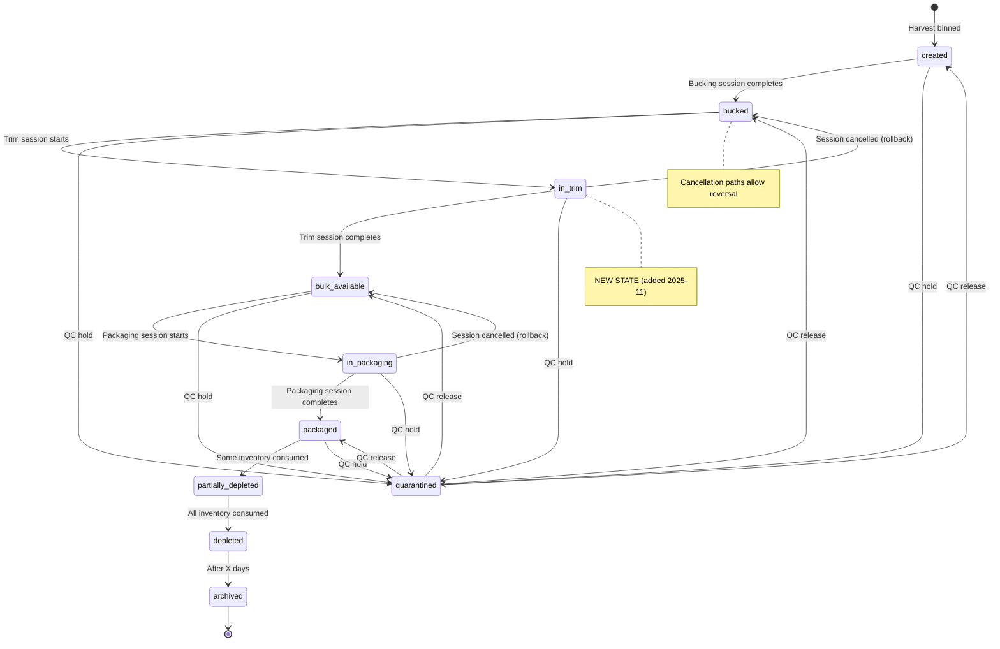
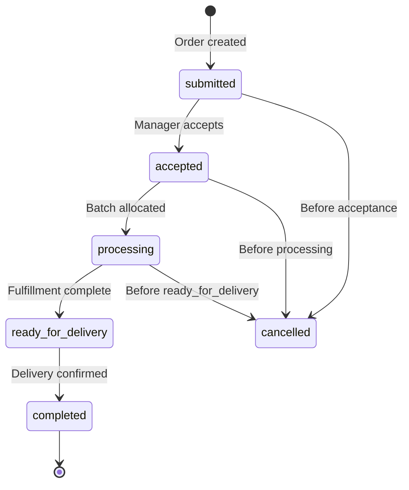
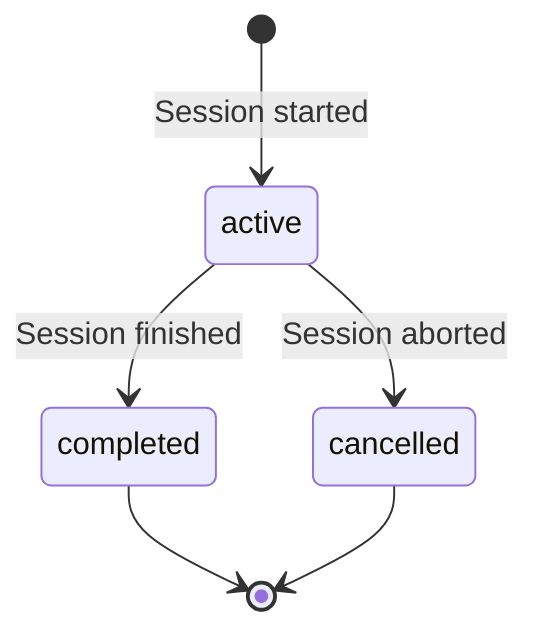

# SYSTEM-WORKFLOW - End-to-End Process Map

> **Status:** Authoritative, Evidence-Based Specification (v2.5)
> **Purpose:** Complete workflow documentation from Cultivation through Fulfillment with state machines, validations, and side effects
> **Foundation:** Batch-centric architecture - all products trace to harvest batch
> **Changelog:** See Section 8.1 for known implementation gaps

---

## INVARIANTS (Workflow Rules)

```
┌───────────────────────────────────────────────────────────────────────┐
│ WORKFLOW RULES (Non-Negotiable)                                       │
├───────────────────────────────────────────────────────────────────────┤
│ 1. Stage transitions MUST follow graph: Binned → Bucked → Bulk → Pkg │
│ 2. All stage changes create inventory_movements                        │
│ 3. Quarantined batches block ALL production/fulfillment               │
│ 4. COA MUST be active before labels/shipments                         │
│ 5. Reservations are soft (no hard deduction until fulfillment)        │
│ 6. Package ID at reservation scope (no FIFO requirement)              │
│ 7. Cancellations MUST rollback inventory_movements                    │
│ 8. Variance >5% OR >50g requires manager approval                     │
│ 9. One coversheet per order (generated at ready_for_delivery)         │
│ 10. Session completion sets finalization_status='pending' for review  │
│ 11. Test mode bypasses inventory validations (NOT compliance rules)   │
└───────────────────────────────────────────────────────────────────────┘
```

### Test Mode Exceptions

> **Status:** 🟡 In Progress (Phase 2)
> **See:** [TEST-MODE.md](./TEST-MODE.md) for complete documentation

When test mode is enabled (`app_settings.test_mode_enabled = true`), certain workflow validations are relaxed for facility testing:

**Bypassed Validations:**
- Rules 2, 5, 8 are conditionally relaxed (inventory tracking optional)
- Order creation without sufficient inventory allowed
- Fulfillment without batch allocation allowed
- Negative inventory quantities permitted

**Always Enforced (Even in Test Mode):**
- Rule 1: Stage transitions still follow proper sequence
- Rule 3: Quarantine rules remain enforced for safety
- Rule 4: COA requirements still enforced for compliance
- All database constraints (NOT NULL, UNIQUE, FK)
- All RLS policies (security maintained)
- Batch immutability (batch_id cannot change)

**Audit Trail:**
- All bypassed validations logged to `test_mode_audit_log`
- Context captured: user, timestamp, validation type, order/item details
- Enables review of test actions before production use

---

## BATCH-CENTRIC ARCHITECTURE

> **Foundation Principle:** Every product in the system MUST be traceable to its harvest batch.

### Why Batches Are Central

**Batches are the architectural foundation** of this seed-to-sale system. Every design decision, workflow, and compliance requirement revolves around maintaining batch integrity:

```
┌─────────────────────────────────────────────────────────────────────┐
│                      BATCH-CENTRIC ARCHITECTURE                      │
├─────────────────────────────────────────────────────────────────────┤
│                                                                       │
│                        batch_registry (source of truth)               │
│                                 │                                     │
│                                 ├── inventory_items (ALL have batch_id)
│                                 │   ├── parent_item_id (lineage chain)
│                                 │   └── on_hand_qty (materialized)    │
│                                 │                                     │
│                                 ├── certificates_of_analysis (COA)   │
│                                 ├── batch_allocations (orders)       │
│                                 ├── order_fulfillment_items          │
│                                 ├── batch_lifecycle_events           │
│                                 ├── batch_production_history         │
│                                 └── trim_sessions / packaging_sessions
│                                                                       │
└─────────────────────────────────────────────────────────────────────┘
```

### Traceability Chain

```
[Cultivation] → Harvest → Batch Created → Processing Stages → Orders → Delivery
    ↓              ↓          ↓                  ↓              ↓          ↓
 Grow Room     Wet Weight  COA Link        All inventory    Batch      Customer
 Plant Count   Captured    (Lab Test)      inherits         Tracking   Receives
 Strain                                   batch_id         on         Product +
 (PLANNED)                                (immutable)      Manifest   COA
```

> **Note:** The [Cultivation] step is currently in SPECIFICATION state (Session C-1). When implemented, harvest sessions auto-create the batch_registry row. Until then, batches are created manually via BatchManagement.tsx.

### Non-Negotiable Batch Rules

1. **Every inventory_items row MUST have a non-null batch_id**
   - **Current State:** ⚠️ NULL allowed (GAP-001 - CRITICAL)
   - **Migration Ready:** ✅ Batch 1 fixes this
   - **Impact:** Without this, COA compliance impossible

2. **batch_id is IMMUTABLE after creation**
   - **Current State:** ⚠️ Can be updated (GAP-002 - CRITICAL)
   - **Migration Ready:** ✅ Batch 1 enforces immutability
   - **Impact:** Historical audit trail corrupted if changed

3. **Batch lifecycle follows strict state machine**
   - States: created → bucked → in_trim → bulk_available → in_packaging → packaged
   - Quarantine can occur at ANY state, blocks all operations
   - See [Section 7.1](#71-batch-lifecycle-states) for complete state machine

4. **All conversions preserve batch lineage**
   - Child items inherit parent's batch_id via parent_item_id chain
   - Bulk flower from bucked flower → same batch_id
   - Packaged units from bulk → same batch_id
   - This enables complete seed-to-sale traceability

5. **COA linkage is batch-scoped**
   - One active COA per batch (not per package)
   - All products from a batch share the same lab test results
   - Labels reference batch COA, not individual package COAs

### Why Batch Gaps Are Critical

The Implementation Gaps Dashboard (see [DOCS-INTEGRATION-PROGRESS.md](DOCS-INTEGRATION-PROGRESS.md#implementation-gaps-dashboard)) identifies **5 CRITICAL batch-related gaps**. Without resolving these:

- ❌ **Cannot prove compliance:** No guarantee every shipped product has a valid COA
- ❌ **Cannot track recalls:** If contamination found, can't identify all affected products
- ❌ **Cannot calculate yields:** Batch lineage broken, yield analytics invalid
- ❌ **Cannot audit inventory:** Items exist with no traceable origin
- ❌ **Cannot pass inspection:** Regulatory audits will fail traceability requirements

### Batch Integrity Enforcement

**Status:** 🟡 Planned (Batch 1 Migration Ready for Deployment)

The `batch1_critical_integrity_fixes` migration batch enforces these principles at the database level:

- ✅ Backfills NULL batch_ids from lineage/sessions
- ✅ Adds NOT NULL constraint on inventory_items.batch_id
- ✅ Adds trigger blocking batch_id updates (immutability)
- ✅ Adds quarantine gate validation
- ✅ Corrects lifecycle state timing

See: [supabase/migrations/batch1_critical_integrity_fixes/README.md](../supabase/migrations/batch1_critical_integrity_fixes/README.md)

For detailed batch architecture, see [BATCHES.md](BATCHES.md).

---

## TABLE OF CONTENTS

0. [Batch-Centric Architecture](#batch-centric-architecture) ⭐ **START HERE**
0.5. [Cultivation Module](#05-cultivation-module) *(SPECIFICATION — not yet implemented; see [CULTIVATION.md](./CULTIVATION.md))*
1. [Cultivation to Post-Production](#1-cultivation-to-post-production)
2. [Post-Production Processing](#2-post-production-processing)
3. [Sales & Fulfillment](#3-sales--fulfillment)
4. [Inventory Management](#4-inventory-management)
5. [Compliance & Quality](#5-compliance--quality)
6. [Analytics & Reporting](#6-analytics--reporting)
7. [State Machines](#7-state-machines)
8. [Known Gaps](#81-known-gaps-implementation-incomplete)
9. [Risks if Unchanged](#8-risks-if-unchanged)

---

## 0.5 CULTIVATION MODULE

> **Status:** SPECIFICATION — database schema and UI are NOT YET BUILT (Session C-1 complete, C-2 = migrations, C-3 = UI).
> **Full spec:** [CULTIVATION.md](./CULTIVATION.md) | [CULTIVATION-ARCHITECTURE.md](./CULTIVATION-ARCHITECTURE.md) | [CULTIVATION-RULES.md](./CULTIVATION-RULES.md)

The Cultivation module adds pre-harvest tracking. When implemented, the full lifecycle becomes:

```
Grow Rooms → Plant Groups → Growth Stages → Harvest Sessions → batch_registry (YYMMDD-STRAIN)
                                                                      ↓
                                                      Existing pipeline: Buck → Trim → Package → Orders → Deliver
```

**What it adds to the workflow:**
- `grow_rooms` — physical rooms; `room_code` appears in `batch_registry.room`
- `plant_groups` — sets of same-strain plants; tracks clone → veg → flower progression
- `harvest_sessions` — captures wet weight; completion trigger auto-creates `batch_registry` row
- Batch number auto-generation via trigger (resolves GAP-017 from BATCHES.md)

**Integration invariant:** The harvest session completion trigger creates the `batch_registry` row. The existing pipeline picks it up at `lifecycle_state = 'created'` with zero changes to existing code.

---

## 1. CULTIVATION TO POST-PRODUCTION

### 1.1 Harvest → Batch Creation

**AS-IS (Evidence):**
- **File:** `supabase/migrations/20251020000000_phase1_batch_centric_foundation.sql`
- **Entry Point:** Manual batch creation via UI or import
- **Schema:** `batch_registry` table with `lifecycle_state = 'created'`

**Process Flow:**
```
┌──────────┐     ┌────────────┐     ┌──────────────┐
│ Harvest  │────▶│   Binning  │────▶│ Batch Record │
│ Complete │     │   Process  │     │   Created    │
└──────────┘     └────────────┘     └──────────────┘
```

**TO-BE (Target):**
1. Harvested material binned per strain/room
2. Operator creates batch via UI:
   - batch_number: `YYMMDD-STRAIN` (e.g., `250106-GSC`)
   - strain: strain_id FK to strains table
   - harvest_date: Actual harvest date
   - room: Cultivation room identifier
   - initial_weight_grams: Wet weight at binning
   - lifecycle_state: `'created'`
   - is_quarantined: `false` (unless QC hold)
3. System generates `batch_registry` row
4. Batch available for Bucking session

**Preconditions:**
- Strain exists in `strains` table
- Room identifier valid (no FK, text field)
- initial_weight_grams > 0

**Events Emitted:**
- `batch_lifecycle_events` INSERT: event_type = `'batch_created'`
- `batch_production_history` INSERT: event_type = `'batch_created'`

**Validation:**
- batch_number format matches `^\d{6}-[A-Z]{3,5}-\d{2}$`
- No duplicate batch_number (UNIQUE constraint)

**Side Effects:**
- lifecycle_state = `'created'`
- bucking_started_at = NULL (not yet started)

**DELTA & ACTIONS:**
1. **MISSING:** Batch number auto-generation function
   - **Risk:** Manual entry errors (typos, duplicates)
   - **Fix:** Create `fn_generate_batch_number(strain_id, harvest_date)` function with sequence counter
   - **Priority:** MEDIUM
   - **Owner:** Backend

2. **MISSING:** Quarantine UI during batch creation
   - **Risk:** Quarantined batches entered as normal
   - **Fix:** Add quarantine checkbox + reason field to batch creation form
   - **Priority:** LOW
   - **Owner:** Frontend

---

## 2. POST-PRODUCTION PROCESSING

> **📊 VISUAL REFERENCE:** For a complete visual diagram of the inventory flow pattern used across all processing stages, see the **three-step pattern** documented in [AI-BUILD-SESSION-CHECKLIST.md](./AI-BUILD-SESSION-CHECKLIST.md#the-three-step-pattern):
>
> ```
> 1️⃣ RESERVE → Lock inventory via fn_reserve_inventory_on_session_start()
> 2️⃣ PROCESS → Operator completes work (bucking/trim/packaging)
> 3️⃣ FINALIZE → Manager approves conversion and creates inventory_items
> ```
>
> **All sessions follow this pattern.** Each subsection below details the specific inputs, outputs, and side effects for each processing stage.

### 2.1 Bucking Session (Binned → Bucked)

**AS-IS (Evidence):**
- **File:** `supabase/migrations/20251010160000_create_inventory_and_trim_workflow.sql`
- **Table:** `trim_sessions` (session_status = 'active' → 'completed')
- **Trigger:** `trg_trim_session_complete` creates inventory_movements

**Process Flow:**
```
┌─────────┐     ┌──────────────┐     ┌─────────────┐     ┌───────────────┐
│ Binned  │────▶│ Bucking      │────▶│ Bucked      │────▶│ Pending       │
│ Material│     │ Session      │     │ Flower/     │     │ Conversion    │
│         │     │ (active)     │     │ Smalls      │     │ (Manager)     │
└─────────┘     └──────────────┘     └─────────────┘     └───────────────┘
```

**TO-BE (Target Workflow):**

**Step 1: Start Bucking Session**
1. Manager selects batch (lifecycle_state = 'created')
2. System validates:
   - Batch not quarantined
   - No active bucking session for this batch
3. Create `trim_sessions` row:
   - session_number: `BUCK-YYMMDD-NN`
   - batch_registry_id: Selected batch FK
   - input_package_id: Binned package ID
   - input_weight_lbs: Weight in pounds
   - session_status: `'active'`
   - started_at: now()
4. Update `batch_registry`:
   - bucking_started_at: now()
   - lifecycle_state: `'bucked'` (PREMATURE, should wait for completion)

**Step 2: Complete Bucking**
1. Operator enters output weights:
   - bucked_flower_weight: Weight of flower separated
   - bucked_smalls_weight: Weight of smalls separated
   - waste_weight: Stems/unusable material
2. System calculates variance:
   - `variance_weight = (input_weight_lbs * 453.592) - (bucked_flower_weight + bucked_smalls_weight + waste_weight)`
3. If |variance_weight| > 50g OR >5%, require variance_reason
4. Update `trim_sessions`:
   - session_status: `'completed'`
   - completed_at: now()
5. Trigger `trg_trim_session_complete`:
   - Set finalization_status='pending' on session
   - Create `inventory_movements`:
     - CONSUME_SESSION_INPUT: Decrement binned package on_hand_qty
     - PRODUCE_SESSION_OUTPUT: Create bucked flower package (product_stage_id = BuckedFlower)
     - PRODUCE_SESSION_OUTPUT: Create bucked smalls package (product_stage_id = BuckedSmalls)
   - Log `batch_production_history`: event_type = `'bucking_completed'`

**Preconditions:**
- batch_registry.lifecycle_state = `'created'`
- batch_registry.is_quarantined = `false`
- Input package exists in inventory_items

**Events Emitted:**
- `inventory_movements` (3x): CONSUME (input) + PRODUCE (flower + smalls)
- `bucking_sessions.finalization_status` set to 'pending' for manager review
- `batch_production_history`: bucking_completed event
- `batch_lifecycle_events`: state_transition (created → bucked)

**Validation:**
- input_weight_lbs > 0
- bucked_flower_weight + bucked_smalls_weight + waste_weight ≈ input_weight (within tolerance)
- variance_reason REQUIRED if |variance| > threshold

**Side Effects (Three-Step Pattern):**

**1️⃣ RESERVE (Session Start):**
- `inventory_movements`: INSERT movement_kind='SESSION_RESERVE'
- Locks binned inventory (prevents concurrent use)
- No quantity change yet (soft lock)

**2️⃣ PROCESS (Session Complete):**
- `inventory_movements`: INSERT movement_kind='SESSION_INPUT' (consume binned)
- `inventory_movements`: INSERT movement_kind='SESSION_OUTPUT' (produce bucked flower)
- `inventory_movements`: INSERT movement_kind='SESSION_OUTPUT' (produce bucked smalls)
- `inventory_items` (input): on_hand_qty decremented by input_weight
- `trim_sessions`: finalization_status='pending' (awaits manager)

**3️⃣ FINALIZE (Manager Action):**
- `inventory_items`: New packages created with unique package_ids (YYMMDD-STRAIN-NNN)
- Two packages: Bucked Flower + Bucked Smalls
- Each inherits batch_id via parent_item_id chain
- `trim_sessions`: finalization_status='finalized'

**Database State Changes:**
- `batch_registry`: lifecycle_state → `'bucked'`
- `batch_production_history`: bucking_completed event logged
- `batch_lifecycle_events`: state_transition recorded

**DELTA & ACTIONS:**
1. **WRONG:** lifecycle_state updated prematurely at session START
   - **Risk:** Batch appears bucked before work completes
   - **Fix:** Move lifecycle_state update to session COMPLETION trigger
   - **Priority:** HIGH
   - **Owner:** Backend

2. **MISSING:** Input package lock during active session
   - **Risk:** Concurrent sessions on same package
   - **Fix:** Add CHECK constraint or trigger blocking duplicate active sessions per package
   - **Priority:** MEDIUM
   - **Owner:** Backend

---

### 2.2 Trim Session (Bucked → Bulk)

**AS-IS (Evidence):**
- **File:** `supabase/migrations/20251010160000_create_inventory_and_trim_workflow.sql`
- **Table:** `trim_sessions` (second stage of 2-step workflow)
- **Trigger:** `trg_trim_session_complete` creates inventory_movements

**Process Flow:**
```
┌─────────────┐     ┌───────────┐     ┌──────────┐     ┌────────────────┐
│ Bucked      │────▶│ Trimming  │────▶│ Bulk     │────▶│ Pending        │
│ Flower/     │     │ Session   │     │ Flower/  │     │ Conversion     │
│ Smalls      │     │ (active)  │     │ Smalls   │     │ (Manager)      │
└─────────────┘     └───────────┘     └──────────┘     └────────────────┘
```

**TO-BE (Target Workflow):**

**Step 1: Start Trim Session**
1. Operator selects bucked package (product_stage_id = BuckedFlower OR BuckedSmalls)
2. System validates:
   - Batch not quarantined
   - Package on_hand_qty > 0
3. Create `trim_sessions` row:
   - session_number: `TRIM-YYMMDD-NN`
   - batch_registry_id: Package batch FK
   - input_package_id: Bucked package ID
   - source_stage: `'bucked_flower'` OR `'bucked_smalls'`
   - session_status: `'active'`
   - started_at: now()
4. Update `batch_registry`:
   - trimming_started_at: now()
   - lifecycle_state: `'in_trim'`

**Step 2: Complete Trim Session**
1. Operator enters output weights:
   - bulk_flower_weight: Trimmed flower (if source was BuckedFlower)
   - bulk_smalls_weight: Trimmed smalls (if source was BuckedSmalls)
   - bulk_trim_weight: Trim byproduct
   - waste_weight: Unusable material
2. System calculates variance:
   - `variance_weight = input_weight - (bulk_flower_weight + bulk_smalls_weight + bulk_trim_weight + waste_weight)`
3. Update `trim_sessions`:
   - session_status: `'completed'`
   - completed_at: now()
4. Trigger `trg_trim_session_complete`:
   - Set finalization_status='pending' on session for manager review
   - Create `inventory_movements`:
     - CONSUME_SESSION_INPUT: Decrement bucked package on_hand_qty
     - PRODUCE_SESSION_OUTPUT: Create bulk flower package (product_stage_id = BulkFlower)
     - PRODUCE_SESSION_OUTPUT: Create bulk smalls package (product_stage_id = BulkSmalls)
     - PRODUCE_SESSION_OUTPUT: Create trim package (product_stage_id = Trim)
   - Log `batch_production_history`: event_type = `'trim_completed'`
5. Update `batch_registry`:
   - lifecycle_state: `'bulk_available'`

**Preconditions:**
- Source package product_stage_id IN (BuckedFlower, BuckedSmalls)
- batch_registry.is_quarantined = `false`
- Source package on_hand_qty > 0

**Events Emitted:**
- `inventory_movements` (4x): CONSUME (input) + PRODUCE (flower/smalls/trim)
- `trim_sessions.finalization_status` set to 'pending' for manager review
- `batch_production_history`: trim_completed event
- `batch_lifecycle_events`: state_transition (in_trim → bulk_available)

**Validation:**
- is_valid_stage_transition(source_stage, 'BulkFlower') = true
- Output weights sum to input_weight ± tolerance
- Rounding precision: 0.1g

**Side Effects (Three-Step Pattern):**

**1️⃣ RESERVE (Session Start):**
- `inventory_movements`: INSERT movement_kind='SESSION_RESERVE'
- Locks bucked inventory (prevents concurrent use)
- No quantity change yet (soft lock)

**2️⃣ PROCESS (Session Complete):**
- `inventory_movements`: INSERT movement_kind='SESSION_INPUT' (consume bucked)
- `inventory_movements`: INSERT movement_kind='SESSION_OUTPUT' (produce bulk flower)
- `inventory_movements`: INSERT movement_kind='SESSION_OUTPUT' (produce bulk smalls)
- `inventory_movements`: INSERT movement_kind='SESSION_OUTPUT' (produce trim)
- `inventory_items` (input): on_hand_qty decremented
- `trim_sessions`: finalization_status='pending' (awaits manager)

**3️⃣ FINALIZE (Manager Action):**
- `inventory_items`: New packages created with unique package_ids (YYMMDD-STRAIN-NNN)
- Three packages: Bulk Flower + Bulk Smalls + Trim
- Each inherits batch_id via parent_item_id chain
- `trim_sessions`: finalization_status='finalized'

**Database State Changes:**
- `batch_registry`: lifecycle_state → `'bulk_available'`
- `batch_production_history`: trim_completed event logged
- `batch_lifecycle_events`: state_transition recorded

**DELTA & ACTIONS:**
1. **MISSING:** Stage transition validation
   - **Risk:** BuckedSmalls → BulkFlower (invalid path)
   - **Fix:** Add trigger calling `is_valid_stage_transition()` before session completion
   - **Priority:** HIGH
   - **Owner:** Backend

---

### 2.3 Packaging Session (Bulk → Packaged)

**AS-IS (Evidence):**
- **File:** `supabase/migrations/20251010210858_create_packaging_sessions.sql`
- **Table:** `packaging_sessions` (session_status = 'active' → 'completed')
- **Trigger:** `trg_packaging_session_complete` creates conversion_packages

**Process Flow:**
```
┌──────────┐     ┌────────────┐     ┌───────────┐     ┌────────────────┐
│ Bulk     │────▶│ Packaging  │────▶│ Packaged  │────▶│ Pending        │
│ Flower/  │     │ Session    │     │ 3.5g/14g  │     │ Conversion     │
│ Smalls   │     │ (active)   │     │ Units     │     │ (Manager)      │
└──────────┘     └────────────┘     └───────────┘     └────────────────┘
```

**TO-BE (Target Workflow):**

**Step 1: Start Packaging Session**
1. Operator selects bulk package (product_stage_id = BulkFlower OR BulkSmalls)
2. Operator selects target product (e.g., Packaged_3_5g, Packaged_14gSmalls)
3. System validates:
   - Batch not quarantined
   - Package on_hand_qty >= target_product.unit_weight
   - Stage transition valid (BulkFlower → Packaged_3_5g, BulkSmalls → Packaged_14gSmalls)
4. Create `packaging_sessions` row:
   - session_number: `PKG-YYMMDD-NN`
   - batch_registry_id: Package batch FK
   - source_stage: `'bulk_flower'` OR `'bulk_smalls'`
   - target_product_id: Selected product FK
   - session_status: `'active'`
   - started_at: now()
5. Update `batch_registry`:
   - packaging_started_at: now()
   - lifecycle_state: `'in_packaging'`

**Step 2: Complete Packaging Session**
1. Operator enters:
   - input_weight: Grams of bulk used
   - output_units: Number of packages created (e.g., 10 x 3.5g = 35g)
   - waste_weight: Spillage/unusable material
2. System calculates:
   - expected_weight = output_units * target_product.unit_weight
   - variance_weight = input_weight - expected_weight - waste_weight
3. If |variance_weight| > threshold, require variance_reason
4. Update `packaging_sessions`:
   - session_status: `'completed'`
   - completed_at: now()
5. Trigger `trg_packaging_session_complete`:
   - Set finalization_status='pending' on session for manager review
   - Create `inventory_movements`:
     - CONSUME_SESSION_INPUT: Decrement bulk package on_hand_qty
     - PRODUCE_SESSION_OUTPUT: Create packaged units (unit='unit', qty=output_units)
   - Generate package IDs: `fn_generate_next_package_id(batch_id, strain_code)` for each unit
   - Log `batch_production_history`: event_type = `'packaging_completed'`
6. Update `batch_registry`:
   - lifecycle_state: `'packaged'`

**Preconditions:**
- Source package product_stage_id IN (BulkFlower, BulkSmalls)
- batch_registry.is_quarantined = `false`
- batch_registry.coa_id IS NOT NULL AND certificates_of_analysis.is_active = true (COA required before packaging) **[PLANNED - NOT YET ENFORCED]**

**Events Emitted:**
- `inventory_movements` (2x): CONSUME (bulk) + PRODUCE (packaged units)
- `packaging_sessions.finalization_status` set to 'pending' for manager review
- `batch_production_history`: packaging_completed event
- `batch_lifecycle_events`: state_transition (in_packaging → packaged)

**Validation:**
- input_weight >= (output_units * unit_weight) - tolerance
- Package ID format: `YYMMDD-STR-NN` (generated)
- Rounding: 0.1g precision

**Side Effects (Three-Step Pattern):**

**1️⃣ RESERVE (Session Start):**
- `inventory_movements`: INSERT movement_kind='SESSION_RESERVE'
- Locks bulk inventory (prevents concurrent use)
- No quantity change yet (soft lock)

**2️⃣ PROCESS (Session Complete):**
- `inventory_movements`: INSERT movement_kind='SESSION_INPUT' (consume bulk)
- `inventory_movements`: INSERT movement_kind='SESSION_OUTPUT' (produce packaged units)
- `inventory_items` (input): on_hand_qty decremented by input_weight
- `packaging_sessions`: finalization_status='pending' (awaits manager)

**3️⃣ FINALIZE (Manager Action):**
- `inventory_items`: New packages created with unique package_ids (YYMMDD-STRAIN-NNN)
- Each package has:
  - unique package_id (auto-generated sequential)
  - unit = 'unit'
  - on_hand_qty = 1
  - product_stage_id = target stage (Packaged_3_5g, Packaged_14gSmalls)
  - parent_item_id = input package ID
  - batch_id = inherited from parent
- `packaging_sessions`: finalization_status='finalized'

**Database State Changes:**
- `batch_registry`: lifecycle_state → `'packaged'`
- `batch_production_history`: packaging_completed event logged
- `batch_lifecycle_events`: state_transition recorded

**DELTA & ACTIONS:**
1. **PLANNED:** COA validation before packaging
   - **Status:** NOT YET IMPLEMENTED - Manual validation only
   - **Risk:** Packaged units created without active COA (compliance violation)
   - **Fix:** Add trigger checking `certificates_of_analysis.is_active = true` before session start
   - **Priority:** CRITICAL
   - **Owner:** Backend

2. **MISSING:** Package ID auto-generation
   - **Risk:** Manual IDs cause duplicates
   - **Fix:** Enforce `fn_generate_next_package_id()` as DEFAULT on inventory_items.package_id
   - **Priority:** HIGH
   - **Owner:** Backend

---

### 2.4 Conversion Workflow (Hybrid Architecture - Jan 2026)

**CURRENT ARCHITECTURE (Jan 2026):**
- **Migration:** `supabase/migrations/20260112233251_create_conversion_views_hybrid_architecture_v2.sql`
- **Views:** `conversion_summary_view`, `pending_conversion_sessions`, `conversion_history_view`
- **RPC Functions:** `finalize_session_aggregated()`, `void_session_aggregated()`
- **Hook:** `src/features/inventory/hooks/useFinalizationWorkflow.ts`

**Architecture Change Note (Jan 2026):**
The system migrated from table-based conversions (`pending_conversions`, `conversion_lots`, `conversion_locks`) to a VIEW-based hybrid architecture. This simplified the workflow by removing intermediate state tables and using session finalization_status fields directly. See migration 20260113160112 for table removal.

**Process Flow:**
```
┌─────────────┐     ┌──────────────┐     ┌──────────────┐     ┌─────────────┐
│ Session     │────▶│ Manager      │────▶│ RPC Call     │────▶│ Inventory   │
│ Completes   │     │ Reviews      │     │ Finalize     │     │ Items       │
│ (pending)   │     │ VIEWs        │     │ Session      │     │ Created     │
└─────────────┘     └──────────────┘     └──────────────┘     └─────────────┘
```

**Step 1: Session Completion**
1. Session completes (trim/packaging/bucking)
2. System sets session fields:
   - finalization_status: `'pending'`
   - completed_at: now()
   - completed_by: Current user ID
3. Session output quantities recorded in session table:
   - **Trim:** big_buds_grams, small_buds_grams, trim_grams
   - **Packaging:** units_3_5g, units_14g, units_454g
   - **Bucking:** bucked_flower_weight, bucked_smalls_weight

**Step 2: Manager Reviews Pending Sessions**
1. Manager navigates to Conversions UI
2. System queries `pending_conversion_sessions` VIEW:
   - Aggregates sessions by (batch_id, product_id)
   - Shows total output quantities
   - Lists session_ids contributing to aggregate
   - Displays session_count and age (days since completion)
3. Manager sees aggregated conversions:
   ```sql
   SELECT
     batch_id,
     product_id,
     SUM(output_qty) as total_output,
     array_agg(session_id) as session_ids,
     COUNT(*) as session_count
   FROM pending_conversion_sessions
   WHERE finalization_status = 'pending'
   GROUP BY batch_id, product_id;
   ```

**Step 3: Manager Finalizes Conversion**
1. Manager clicks "Finalize" on aggregated conversion
2. System calls RPC: `finalize_session_aggregated(batch_id, product_id, session_type)`
3. RPC function executes (SIMPLIFIED PATTERN - 2026-01-28):
   - **Creates inventory_items record with quantities set directly**:
     - package_id: Generated via `fn_generate_next_package_id()`
     - batch_id: From session
     - product_stage_id: Based on output type
     - on_hand_qty: Set directly from session output (no trigger)
     - available_qty: Set equal to on_hand_qty (ATP formula satisfied immediately)
     - reserved_qty: 0 (no reservations yet)
     - strain_id: Inherited from batch
   - **Creates inventory_movements record for audit trail**:
     - movement_kind: `'PRODUCE'`
     - dest_item_id: New inventory_item ID
     - qty: Package weight/units
     - reason_code: `'session_finalization'` (trigger bypass flag)
     - reference_type: `'packaging_session'` (or trim/bucking)
   - **Updates all matching sessions**: finalization_status → `'finalized'`
   - Sets finalized_at: now()
   - Sets finalized_by: auth.uid()
4. Returns success confirmation with inventory_item_id

**Step 4: Inventory Immediately Available**
Finalized inventory items are immediately available for:
- Order allocation (order management UI)
- Package assignment (fulfillment workflow)
- ATP calculations (on_hand_qty - reserved_qty)

**Architectural Note (2026-01-28):**
Session finalization is treated as **CREATION**, not **MOVEMENT**:
- Quantities set directly (no trigger choreography)
- Movement created for audit trail only (trigger bypasses session_finalization)
- ATP constraint validates immediately (simple CHECK, no deferral)
- Simpler, faster, more reliable than previous trigger-based approach

**Void Workflow:**
1. Manager can void pending sessions via UI
2. System calls RPC: `void_session_aggregated(batch_id, product_id, session_type, reason)`
3. RPC function executes:
   - Updates sessions: finalization_status → `'voided'`
   - Sets void_reason: Manager-provided reason
   - Sets voided_at: now()
   - Sets voided_by: auth.uid()

**Preconditions:**
- Session status = `'completed'`
- finalization_status = `'pending'`
- User role IN (`'manager'`, `'admin'`)

**Note:** Manager-only workflow ensures oversight on:
- Final package creation
- Output quantity validation
- Variance acknowledgment
- Inventory accuracy

**Events Emitted:**
- Session finalization_status updated: 'pending' → 'finalized'
- Audit trail: finalized_at, finalized_by recorded
- (Future) inventory_items INSERT
- (Future) inventory_movements INSERT

**Validation:**
- Session must be completed
- User must be authenticated manager/admin
- Batch must not be quarantined

**Side Effects:**
- Sessions marked finalized (irreversible)
- (Future) Inventory items created
- (Future) Batch lifecycle state updated

**IMPLEMENTATION STATUS:**
1. ✅ **RESOLVED (2026-01-28):** finalize_session_aggregated() now creates inventory_items
   - **Implementation:** Simplified pattern treats finalization as creation
   - **Migration:** `simplify_finalization_treat_as_creation.sql`
   - **Approach:** Quantities set directly, movement for audit trail only
   - **Benefits:** Simpler architecture, immediate ATP validation, no ghost finalizations

**Removed Features (Jan 2026):**
- ❌ `pending_conversions` table (replaced by session finalization_status)
- ❌ `conversion_lots` table (replaced by VIEW aggregation)
- ❌ `conversion_locks` table (no locking system)
- ❌ Auto-create triggers (manual finalization workflow)
- ❌ Lock expiration jobs (no locks to expire)

---

### 2.5 Undoing Completed Sessions

**AS-IS (Evidence):**
- **Service:** `src/features/sessions/services/sessions.service.ts:380`
- **Function:** `undoCompletedSession(sessionId, sessionType)`
- **UI:** Undo buttons in all completed sessions tables (Trim, Bucking, Packaging)

**Purpose:**
Managers can undo recently completed sessions to restore them to active state for correction of mistakes immediately after completion, such as:
- Incorrect output weights entered
- Wrong session completed
- Need to modify session data before finalization

**Process Flow:**
```
┌──────────────┐     ┌─────────────┐     ┌──────────────┐     ┌───────────────┐
│ Completed    │────▶│ Manager     │────▶│ Session      │────▶│ Operator      │
│ Session      │     │ Clicks Undo │     │ Restored to  │     │ Re-Completes  │
│              │     │             │     │ Active State │     │ with Fix      │
└──────────────┘     └─────────────┘     └──────────────┘     └───────────────┘
```

**TO-BE (Target Workflow):**

**Step 1: Manager Undoes Session**
1. Manager clicks "Undo" button on completed session in UI
2. System validates:
   - Session has `completed_at IS NOT NULL`
   - User has manager/admin role
3. Confirmation prompt (optional, currently not implemented)

**Step 2: System Restores Session**
1. Call `undoCompletedSession(sessionId, sessionType)`
2. Update session table (`trim_sessions`, `bucking_sessions`, or `packaging_sessions`):
   - Set `completed_at = NULL`
   - Set `updated_at = now()`
3. Session status returns to active state
4. Session appears in "Active Sessions" table
5. UI shows success feedback (green button with "Restored to Active" for 3 seconds)

**Step 3: Operator Re-Completes Session**
1. Operator finds session in active sessions table
2. Operator corrects data (weights, units, notes)
3. Operator completes session with corrected data
4. Normal completion workflow proceeds

**Preconditions:**
- Session `completed_at IS NOT NULL`
- User role IN (`'manager'`, `'admin'`)
- Session finalization_status = 'pending' (RECOMMENDED but not enforced)

**What Gets Restored:**
- Session completion timestamp cleared (`completed_at = NULL`)
- Session returns to active state
- Session data preserved for re-completion

**What Is Not Changed:**
- Session record preserved
- Original session data (weights, notes) preserved
- Audit trail via `updated_at` timestamp

**UI Feedback:**
- **Default State:** Blue undo button with hover effect
- **Loading State:** Disabled button showing "Undoing..."
- **Success State:** Green button showing "Restored to Active" (3 seconds)
- **Duplicate Prevention:** Button disabled during operation

**User Experience Improvements:**
All session complete modals prevent accidental form submission when pressing Enter while filling in numeric fields. Enter only submits when the submit button is focused.

**Implementation:**
- `TrimSessionCompleteModal.tsx:83` - handleKeyDown prevents Enter submission
- `BuckingSessionCompleteModal.tsx:53` - handleKeyDown prevents Enter submission
- `PackagingSessionCompleteModal.tsx:83` - handleKeyDown prevents Enter submission
- `CompletedSessionsTable.tsx` - Undo button for Trim sessions
- `CompletedBuckingSessionsTable.tsx` - Undo button for Bucking sessions
- `CompletedPackagingSessionsTable.tsx` - Undo button for Packaging sessions

**Events Emitted:**
- Session table UPDATE (completed_at = NULL, updated_at = now())

**Validation:**
- User authentication and role check (manager/admin only)
- Session exists and is completed

**Side Effects:**
- Session status changes from completed to active
- Session reappears in active sessions list
- finalization_status remains 'pending' (manager should finalize or void)

**BEST PRACTICES:**
1. **Timing:** Undo should be used immediately after completion, before finalization
2. **Communication:** Operator should be informed that session needs correction
3. **Audit:** All session updates tracked via `updated_at` timestamp
4. **Alternative:** For sessions already converted, use variance adjustment instead of undo

---

## 3. SALES & FULFILLMENT

### 3.1 Order Creation

**AS-IS (Evidence):**
- **File:** `supabase/migrations/20251010031618_create_post_production_schema.sql:177-192`
- **Table:** `orders` (status = 'submitted')
- **Sources:** Internal UI OR public order form

**Process Flow:**
```
┌────────────┐     ┌────────────┐     ┌───────────┐     ┌────────────┐
│ Customer   │────▶│ Order Form │────▶│ Order      │────▶│ Acceptance │
│ Request    │     │ (Public/   │     │ Created    │     │ (Manager)  │
│            │     │ Internal)  │     │ (submitted)│     │            │
└────────────┘     └────────────┘     └───────────┘     └────────────┘
```

**TO-BE (Target Workflow):**

**Step 1: Order Submission**
1. Customer fills order form:
   - customer_id: Selected dispensary
   - order_items: Array of {product_id, quantity, demand_unit}
   - requested_delivery_date: Preferred date
   - delivery_notes: Special instructions
2. System generates:
   - order_number: `YYMMDD-CUSTCODE-NN` (e.g., `250106-TDH-01`)
   - order_date: now()
   - status: `'submitted'`
   - order_source: `'public_form'` OR `'internal'`
3. For each order_item:
   - Insert `order_items` row:
     - order_id: Parent order FK
     - product_id: Selected product FK
     - quantity: Requested qty
     - unit_price: Current product.price_per_unit
     - demand_unit: `'unit'` OR `'g'` (defaults from product.type)
     - status: `'pending'`
4. Calculate total_amount:
   - `total_amount = SUM(order_items.subtotal)`

**Step 2: Order Acceptance**
1. Manager reviews order in Orders UI
2. Manager validates:
   - Customer is active (not suspended)
   - Products available (ATP check)
   - Delivery date feasible
3. Manager clicks "Accept Order"
4. Update `orders`:
   - status: `'accepted'`
   - scheduled_delivery_date: Manager-set date
5. Log `batch_production_history`:
   - event_type: `'allocation_created'` (order accepted, pending allocation)

**Preconditions:**
- customer_id exists in `customers` table
- All product_ids exist in `products` table
- quantity > 0 for all line items

**Events Emitted:**
- `orders` INSERT (status = 'submitted')
- `order_items` INSERT (1 per line item)
- Trigger: `trg_calculate_order_total` (auto-calculates total_amount)

**Validation:**
- order_number UNIQUE
- customer_id NOT NULL
- At least 1 order_item

**Side Effects:**
- order_items.status = `'pending'`
- orders.total_amount calculated from subtotals

**DELTA & ACTIONS:**
1. **MISSING:** order_number auto-generation function
   - **Risk:** Manual entry errors
   - **Fix:** Create `fn_generate_order_number(customer_id, order_date)` with sequence
   - **Priority:** MEDIUM
   - **Owner:** Backend

2. **MISSING:** ATP validation at acceptance
   - **Risk:** Orders accepted when insufficient inventory
   - **Fix:** Add validation function checking `inventory_items.on_hand_qty - reserved_qty >= order_qty`
   - **Priority:** HIGH
   - **Owner:** Backend

---

### 3.2 Batch Allocation (Strain-Aware)

**AS-IS (Evidence):**
- **File:** `supabase/migrations/20251020161901_create_batch_hierarchical_allocation_system.sql`
- **View:** `v_batch_selection_for_strain` (strain-aware batch list)
- **Process:** Manual batch selection per order_item

**Process Flow:**
```
┌───────────┐     ┌───────────────┐     ┌─────────────┐     ┌────────────┐
│ Accepted  │────▶│ Manager       │────▶│ Batch       │────▶│ Processing │
│ Order     │     │ Selects       │     │ Allocated   │     │ Status     │
│           │     │ Batches       │     │ (Reserved)  │     │            │
└───────────┘     └───────────────┘     └─────────────┘     └────────────┘
```

**TO-BE (Target Workflow):**

**Step 1: View Available Batches**
1. Manager navigates to order in Orders UI
2. For each order_item, system displays:
   - `v_batch_selection_for_strain` filtered by product.strain_id
   - Shows: batch_number, available_weight/units, lifecycle_state, coa_status
   - Excludes: quarantined batches, depleted batches

**Step 2: Allocate Batch to Order Item**
1. Manager clicks "Allocate" on batch
2. Manager enters allocation_qty (weight OR units)
3. System validates:
   - allocation_qty <= batch available_weight/units
   - Batch not quarantined
   - COA active (if packaging stage)
4. Insert `batch_allocations` row:
   - batch_id: Selected batch FK
   - order_id: Parent order FK
   - order_item_id: Specific line item FK
   - allocated_weight_grams OR allocated_units: Manager input
   - status: `'pending'`
   - created_at: now()
5. Create soft reservation:
   - Insert `inventory_movements`:
     - movement_kind: `'RESERVE'`
     - source_item_id: Batch's packaged inventory item
     - qty: allocation_qty
     - order_id: Parent order FK
     - reason_code: `'order_allocation'`
6. Update `order_items`:
   - status: `'allocated'`
7. Update `orders`:
   - status: `'processing'` (once all items allocated)

**Preconditions:**
- orders.status = `'accepted'`
- Batch lifecycle_state IN (`'packaged'`, `'bulk_available'`) (depends on demand_unit)
- Batch is_quarantined = `false`
- Batch COA active (if packaged stage)

**Events Emitted:**
- `batch_allocations` INSERT
- `inventory_movements` INSERT (movement_kind = 'RESERVE')
- `batch_lifecycle_events` INSERT: event_type = `'allocation_change'`

**Validation:**
- allocation_qty <= batch ATP (on_hand - existing reserves)
- Strain match: batch.strain_id = product.strain_id
- Stage match: demand_unit='unit' requires packaged, 'g' allows bulk

**Side Effects:**
- Batch ATP decremented (soft reserve, on_hand unchanged)
- order_items.status → `'allocated'`
- orders.status → `'processing'` when all items allocated

**DELTA & ACTIONS:**
1. **MISSING:** ATP calculation view
   - **Risk:** Over-allocation (reserves ignored)
   - **Fix:** Create view: `v_inventory_atp` showing on_hand_qty - SUM(RESERVE movements)
   - **Priority:** CRITICAL
   - **Owner:** Backend

2. **MANUAL VALIDATION ONLY:** Strain mismatch validation
   - **Status:** No automated enforcement - relies on manager review
   - **Risk:** Incorrect strain allocated to order (e.g., GSC order fulfilled with GDP batch)
   - **Fix:** Add CHECK constraint or trigger validating batch.strain_id = product.strain_id
   - **Priority:** HIGH
   - **Owner:** Backend
   - **Current Mitigation:** UI displays strain name, manager must verify match

---

### 3.3 Packaging & Ready for Delivery

**AS-IS (Evidence):**
- **File:** `supabase/migrations/20251012153719_create_order_item_allocations_system.sql`
- **Table:** `order_fulfillment_items` (links inventory_items to order_items)
- **Status Progression:** `'processing'` → `'ready_for_delivery'`

**Process Flow:**
```
┌────────────┐     ┌───────────────┐     ┌──────────────┐     ┌──────────────┐
│ Allocated  │────▶│ Fulfillment   │────▶│ Reserve →    │────▶│ Ready for    │
│ Order      │     │ Items         │     │ Fulfillment  │     │ Delivery     │
│            │     │ Assigned      │     │ (Hard Deduct)│     │ (+ Manifest) │
└────────────┘     └───────────────┘     └──────────────┘     └──────────────┘
```

**TO-BE (Target Workflow):**

**Step 1: Assign Fulfillment Items**
1. Manager reviews allocated order
2. For each order_item:
   - System suggests packages from allocated batch
   - Manager confirms specific package_ids to fulfill
3. Insert `order_fulfillment_items`:
   - order_id, order_item_id: Parent refs
   - item_id: Specific inventory_item FK
   - batch_id: For traceability (inherited from item)
   - qty: Quantity from this package (supports partial)
   - unit: `'unit'` OR `'g'`
   - fulfilled_by: Current user ID
   - fulfilled_at: now()

**Step 2: Convert Reserve to Fulfillment**
1. For each fulfillment_item:
   - Delete soft reservation:
     - Insert `inventory_movements`:
       - movement_kind: `'RELEASE'`
       - dest_item_id: Package that was reserved
       - qty: -allocation_qty (restore ATP)
   - Create hard deduction:
     - Insert `inventory_movements`:
       - movement_kind: `'FULFILLMENT'`
       - source_item_id: Assigned package
       - qty: fulfillment_qty
       - order_id: Parent order FK
       - reason_code: `'order_fulfillment'`
2. Update `inventory_items`:
   - on_hand_qty -= fulfillment_qty (materialized by trigger)

**Step 3: Generate Compliance Docs**
1. System auto-generates:
   - `coversheets` row:
     - order_id: Parent order FK (UNIQUE)
     - batch_compliance_data: JSON array of {batch_id, strain, coa_url, thc, cbd}
     - qr_code_data: Public URL `/coversheet/{id}`
   - Trigger: `trg_generate_coversheet_on_ready_for_delivery`
2. Update `orders`:
   - status: `'ready_for_delivery'`
3. Update `batch_allocations`:
   - status: `'fulfilled'`

**Preconditions:**
- orders.status = `'processing'`
- All order_items have fulfillment_items assigned
- All batches have active COAs (validates before status change)

**Events Emitted:**
- `order_fulfillment_items` INSERT (1+ per order_item)
- `inventory_movements` INSERT (RELEASE + FULFILLMENT per item)
- `coversheets` INSERT (1 per order)
- `batch_lifecycle_events`: event_type = `'allocation_fulfilled'`

**Validation:**
- SUM(fulfillment_items.qty per order_item) = order_item.quantity
- All batches have is_active COAs
- Fulfillment packages exist in inventory (on_hand_qty > 0)

**Side Effects:**
- inventory_items.on_hand_qty hard decremented
- ATP restored (RELEASE) then decremented (FULFILLMENT)
- Coversheet auto-generated
- orders.status → `'ready_for_delivery'`

**IMPLEMENTATION STATUS:**
- ⚠️ **NOT YET IMPLEMENTED:** Auto-creation of FULFILLMENT inventory_movements
  - Current State: order_fulfillment_items table populated manually
  - Missing: Trigger to create `inventory_movements` with movement_kind='FULFILLMENT'
  - Impact: Inventory not automatically decremented on fulfillment
  - Workaround: Manual inventory_movements entries required
  - Priority: HIGH

**DELTA & ACTIONS:**
1. **MISSING:** Auto-generation trigger for coversheets
   - **Risk:** Manual creation required
   - **Fix:** Create `trg_generate_coversheet_on_ready_for_delivery` trigger
   - **Priority:** MEDIUM
   - **Owner:** Backend

2. **MISSING:** COA validation before status change
   - **Risk:** Orders shipped without active COAs (compliance violation)
   - **Fix:** Add validation function checking all batch COAs active before allowing `'ready_for_delivery'`
   - **Priority:** CRITICAL
   - **Owner:** Backend

---

### 3.4 Manifest & Delivery

**AS-IS (Evidence):**
- **File:** `supabase/migrations/20251017010000_create_manifest_system.sql`
- **Table:** `manifests` (status = 'generated' → 'in_transit' → 'delivered')

**Process Flow:**
```
┌──────────────┐     ┌──────────────┐     ┌────────────┐     ┌─────────────┐
│ Ready for    │────▶│ Manifest     │────▶│ In Transit │────▶│ Delivered   │
│ Delivery     │     │ Generated    │     │ (Driver)   │     │ (Completed) │
└──────────────┘     └──────────────┘     └────────────┘     └─────────────┘
```

**TO-BE (Target Workflow):**

**Step 1: Generate Manifest**
1. Manager selects orders for delivery route
2. Manager assigns:
   - driver_id: From `delivery_drivers` table
   - vehicle_id: From `delivery_vehicles` table
   - scheduled_date: Delivery date
3. System creates `manifests` row:
   - manifest_number: `MAN-YYMMDD-NN`
   - driver_id, vehicle_id: Assigned refs
   - status: `'generated'`
   - route_sequence: JSON array of order_ids in delivery order
4. Update `order_fulfillment_items`:
   - manifest_id: Link to parent manifest
5. Generate PDF manifest with:
   - Driver info, vehicle info
   - Order list (customer, address, items, weights)
   - Batch traceability (from fulfillment_items.batch_id)
   - COA references (public URLs)

**Step 2: In Transit**
1. Driver marks manifest as loaded
2. Update `manifests`:
   - status: `'in_transit'`
   - departed_at: now()
3. Send notifications (Slack/email) to customers

**Step 3: Delivery Complete**
1. Driver marks each order delivered at customer location
2. Capture signature/photo proof
3. Update `manifests`:
   - status: `'delivered'`
   - delivered_at: now()
4. Update `orders`:
   - status: `'completed'`

**Preconditions:**
- All orders in route have status = `'ready_for_delivery'`
- Driver and vehicle assigned and active

**Events Emitted:**
- `manifests` INSERT
- Notification events (Slack integration)

**Validation:**
- All orders have coversheets generated
- Driver has valid license (if tracked)
- Vehicle registered

**Side Effects:**
- orders.status → `'completed'`
- Order archived after X days (configurable)

**DELTA & ACTIONS:**
1. **MISSING:** Multi-stop route optimization
   - **Risk:** Inefficient delivery routes
   - **Fix:** Integrate route optimization API (Google Maps OR OSM)
   - **Priority:** LOW
   - **Owner:** Product + Backend

---

## 4. INVENTORY MANAGEMENT

### 4.1 Event-Driven Ledger

> **⚠️ IMPLEMENTATION STATUS (2025-11-12):** 🟡 HYBRID ARCHITECTURE
> **Infrastructure:** ✅ Complete (7 migrations Oct 21, 2025)
> **Application:** ⏸️ Phased adoption (Q1-Q2 2026)
> **See:** [INVENTORY-TRACKING.md](./INVENTORY-TRACKING.md#current-vs-planned-implementation) for full phase plan

**AS-IS (Evidence):**
- **File:** `supabase/migrations/20251021000000_event_driven_inventory_schema_enhancements.sql`
- **Core Tables:** `inventory_items`, `inventory_movements`
- **Principle:** on_hand_qty is materialized from ledger (PLANNED, not fully implemented)

**Current Reality (2025-11-12):**
- ✅ Database infrastructure ready
- ⏸️ Application layer uses direct updates (bypass ledger)
- 🟡 Partial adoption: adjustment.service.ts creates movements
- ⏸️ Triggers not implemented (0 of 10 exist)

**Ledger Architecture:**
```
┌─────────────────────┐
│ inventory_movements │  (Source of Truth)
│ ─────────────────── │
│ IMMUTABLE LOG       │
│ - RECEIPT           │
│ - CONSUME           │
│ - PRODUCE           │
│ - FULFILLMENT       │
│ - RESERVE/RELEASE   │
│ - ADJUSTMENT        │
│ - RECONCILIATION    │
└─────────────────────┘
          │
          │ Trigger: Update on_hand_qty
          ▼
┌─────────────────────┐
│ inventory_items     │  (Materialized View)
│ ─────────────────── │
│ on_hand_qty         │  = SUM(movements)
│ (NOT source of      │
│  truth, calculated) │
└─────────────────────┘
```

**TO-BE (Target):**

**Invariant:** Every quantity change MUST flow through `inventory_movements`

**Movement Types:**
1. **RECEIPT:** Initial inventory receipt (dest_item_id populated)
2. **CONSUME_SESSION_INPUT:** Session consumes input (source_item_id, decrements on_hand)
3. **PRODUCE_SESSION_OUTPUT:** Session produces output (dest_item_id, increments on_hand)
4. **FULFILLMENT:** Order fulfillment (source_item_id, decrements on_hand)
5. **RETURN:** Customer return (dest_item_id, increments on_hand)
6. **RESERVE:** Soft allocation (source_item_id, decrements ATP only)
7. **RELEASE:** Release reserve (dest_item_id, increments ATP only)
8. **ADJUSTMENT:** Manual adjustment (absolute, sets on_hand to qty)
9. **RECONCILIATION:** Physical count (absolute, sets on_hand to counted_qty)

**Trigger Logic:**
```sql
CREATE TRIGGER trg_update_on_hand_qty_after_movement
AFTER INSERT ON inventory_movements
FOR EACH ROW
EXECUTE FUNCTION fn_update_inventory_on_hand();

-- Function: fn_update_inventory_on_hand()
-- For DELTA movements (CONSUME, PRODUCE, FULFILLMENT, RETURN):
--   UPDATE inventory_items
--   SET on_hand_qty = on_hand_qty + (
--     CASE NEW.movement_kind
--       WHEN 'PRODUCE' THEN NEW.qty
--       WHEN 'RETURN' THEN NEW.qty
--       WHEN 'CONSUME' THEN -NEW.qty
--       WHEN 'FULFILLMENT' THEN -NEW.qty
--     END
--   )
--   WHERE id = NEW.dest_item_id OR id = NEW.source_item_id;

-- For ABSOLUTE movements (ADJUSTMENT, RECONCILIATION):
--   UPDATE inventory_items
--   SET on_hand_qty = NEW.qty
--   WHERE id = NEW.dest_item_id;

-- RESERVE/RELEASE affect ATP calculation view, not on_hand_qty
```

**DELTA & ACTIONS:**
1. **MISSING:** Immutability enforcement on inventory_movements
   - **Risk:** Ledger corruption via UPDATE/DELETE
   - **Fix:** Add RLS policy blocking UPDATE/DELETE operations
   - **Priority:** CRITICAL
   - **Owner:** Backend

2. **MISSING:** ATP view (on_hand - reserves)
   - **Risk:** Over-allocation
   - **Fix:** Create materialized view refreshing on movement changes
   - **Priority:** HIGH
   - **Owner:** Backend

---

### 4.1.1 Test Mode Impact on Inventory

> **Status:** 🟡 In Progress (Phase 2)
> **See:** [TEST-MODE.md](./TEST-MODE.md), [INVENTORY-TRACKING.md - Test Mode](./INVENTORY-TRACKING.md#test-mode-integration)

Test mode provides a bypass layer for inventory validations while maintaining the event-driven ledger architecture:

**Test Mode Behavior:**

```
┌────────────────────────────────────────────────────────────────────┐
│ INVENTORY VALIDATIONS IN TEST MODE                                 │
├────────────────────────────────────────────────────────────────────┤
│                                                                      │
│ ✅ BYPASSED:                                                        │
│   • On-hand quantity checks (can order with 0 inventory)           │
│   • ATP calculations (ignores existing allocations)                │
│   • Negative inventory prevention (can go below zero)              │
│   • Movement logging requirements (optional in test mode)          │
│                                                                      │
│ ⚠️ STILL ENFORCED:                                                  │
│   • Batch ID immutability (cannot change batch_id)                 │
│   • Parent lineage tracking (parent_item_id chain preserved)       │
│   • Stage transition sequence (Binned → Bucked → Bulk → Pkg)      │
│   • Database constraints (NOT NULL, UNIQUE, FK)                    │
│                                                                      │
│ 📋 AUDIT TRAIL:                                                     │
│   • Every bypassed validation logged to test_mode_audit_log        │
│   • Enables review before production use                           │
│                                                                      │
└────────────────────────────────────────────────────────────────────┘
```

**Implementation Pattern:**

```typescript
// Validation wrapper with test mode support
async function validateInventoryForOrder(
  items: OrderItem[],
  isTestMode: boolean
): Promise<ValidationResult> {
  if (isTestMode) {
    // Log bypass
    await logTestModeBypass({
      validation: 'inventory_availability',
      context: { items, message: 'Test mode: Bypassed inventory checks' }
    });
    return { valid: true, bypassed: true };
  }

  // Normal validation
  for (const item of items) {
    const inventory = await getInventoryItem(item.product_id);
    if (inventory.on_hand_qty < item.quantity) {
      return {
        valid: false,
        error: `Insufficient inventory for ${item.product_name}`
      };
    }
  }

  return { valid: true };
}
```

**Phase Timeline:**

- **Phase 2 (In Progress):** Database schema + configuration layer
- **Phase 3 (Planned):** Event-driven ledger with test mode bypass
- **Phase 4 (Planned):** UI components and visual indicators

---

### 4.2 Conversions & Stage Transitions

**(See Section 2.4 for detailed workflow)**

**Key Points:**
- All stage transitions create parent_item_id lineage
- Batch_id inherited through parent chain (immutable)
- Stage graph enforced: Binned → Bucked → Bulk → Packaged
- Invalid transitions blocked by `is_valid_stage_transition()` function

---

### 4.3 Audits & Reconciliation

**AS-IS (Evidence):**
- **File:** `supabase/migrations/20251026000000_create_inventory_audit_system.sql`
- **Tables:** `inventory_audits`, `inventory_audit_lines`, `variance_log`

**Process Flow:**
```
┌──────────┐     ┌─────────────┐     ┌──────────────┐     ┌───────────────┐
│ Start    │────▶│ Physical    │────▶│ Variance     │────▶│ Reconciliation│
│ Audit    │     │ Count       │     │ Identified   │     │ Movement      │
└──────────┘     └─────────────┘     └──────────────┘     └───────────────┘
```

**TO-BE (Target Workflow):**

**Step 1: Create Audit Session**
1. Manager creates `inventory_audits`:
   - audit_date: Scheduled date
   - audit_type: `'cycle_count'` OR `'full_audit'`
   - stage_filter: e.g., `'Packaged_3_5g'` (optional)
   - status: `'in_progress'`
2. System generates `inventory_audit_lines`:
   - For each inventory_item matching filter:
     - item_id: FK to inventory_items
     - expected_qty: Current on_hand_qty snapshot
     - counted_qty: NULL (to be filled)

**Step 2: Perform Count**
1. Staff physically counts inventory
2. Enter counted_qty for each audit_line
3. System calculates:
   - variance_qty = counted_qty - expected_qty (GENERATED column)

**Step 3: Variance Review**
1. Manager reviews variances where variance_qty != 0
2. For each variance:
   - Manager assigns variance_reason (ENUM: moisture_loss, spillage, etc.)
   - Manager enters reason_notes (details)
3. If |variance_qty| > threshold, require approval_by (manager/admin)

**Step 4: Reconcile Inventory**
1. Manager clicks "Reconcile All"
2. For each audit_line with variance:
   - Insert `inventory_movements`:
     - movement_kind: `'RECONCILIATION'`
     - dest_item_id: Audited item
     - qty: counted_qty (ABSOLUTE, sets on_hand to this value)
     - reason_code: variance_reason from audit_line
   - Insert `variance_log`:
     - audit_id, item_id, expected_qty, counted_qty, variance_qty, variance_reason
3. Update `inventory_audits`:
   - status: `'completed'`
   - completed_at: now()

**Preconditions:**
- User role IN (`'manager'`, `'admin'`)
- Stage not locked by another audit

**Events Emitted:**
- `inventory_audits` INSERT
- `inventory_audit_lines` INSERT (batch, per inventory_item)
- `inventory_movements` INSERT (RECONCILIATION per variance)
- `variance_log` INSERT (per variance)

**Validation:**
- variance_reason REQUIRED for all variances
- Approval required if |variance_qty| > 5% OR > 50g

**Side Effects:**
- inventory_items.on_hand_qty adjusted to counted_qty
- variance_log creates immutable audit trail

**DELTA & ACTIONS:**
1. **MISSING:** variance_reason NOT NULL constraint
   - **Risk:** Unexplained variances accepted
   - **Fix:** Add constraint: `variance_reason NOT NULL`
   - **Priority:** HIGH
   - **Owner:** Backend

2. **MISSING:** Approval workflow for large variances
   - **Risk:** Significant losses unreviewed
   - **Fix:** Add CHECK requiring `approved_by IS NOT NULL` for |variance| > threshold
   - **Priority:** MEDIUM
   - **Owner:** Backend + Frontend

---

### 4.4 Inventory Adjustments & Package Management

**AS-IS (Evidence):**
- **Documentation:** INVENTORY-TRACKING.md (updated 2025-11-10), LABELS.md (v2.0), COVER-SHEETS.md (v2.0)
- **Implementation:** adjustment.service.ts, combine.service.ts
- **Migration:** 20251110030000_add_combine_packages_feature.sql

#### 4.4.1 Inventory Adjustments

**Purpose:** Allow managers to manually adjust inventory quantities with full variance tracking

**TO-BE (Target Workflow):**

**Step 1: Quick Adjustment**
1. Manager navigates to Inventory screen
2. Clicks "Adjust" button on inventory item
3. Enters new quantity
4. Selects variance_reason:
   - moisture_loss
   - spillage
   - measurement_error
   - waste
   - theft_loss
   - other
5. Adds notes (optional but recommended)

**Step 2: System Creates Movement**
1. Insert `inventory_movements`:
   - movement_kind: `'ADJUSTMENT'`
   - source_item_id: inventory_item.id
   - qty: new_quantity (absolute value)
   - reason_code: variance_reason
   - notes: user notes
   - occurred_at: now()
2. Update `inventory_items`:
   - on_hand_qty = new_quantity
3. Insert `variance_log`:
   - source_type: 'manual_adjustment'
   - expected_qty: old on_hand_qty
   - actual_qty: new_quantity
   - variance_qty: new - old
   - variance_percentage: ((new - old) / old) * 100
   - variance_reason: selected reason
   - user_id: current user
   - timestamp: now()

**Preconditions:**
- User role IN (`'manager'`, `'admin'`)
- Package has on_hand_qty >= 0

**Events Emitted:**
- `inventory_movements` INSERT (ADJUSTMENT)
- `variance_log` INSERT

**Validation:**
- variance_reason REQUIRED
- Notes RECOMMENDED for non-standard adjustments

**Implementation Status:** ✅ FULLY IMPLEMENTED (adjustment.service.ts)

---

#### 4.4.2 Combine Packages Feature

**Purpose:** Consolidate multiple packages of same batch/product/stage into single package

**TO-BE (Target Workflow):**

**Step 1: Select Packages to Combine**
1. Manager navigates to Inventory screen
2. Selects 2+ packages using checkboxes
3. Clicks "Combine Selected" button
4. System validates:
   - All packages have same batch_id
   - All packages have same product_id
   - All packages have same product_stage_id
   - All packages have same unit
   - All packages have qty > 0

**Step 2: Generate Combined Package ID**
1. System auto-generates package_id:
   - Format: `{batch_number}-COMBINED-{sequence}`
   - Example: `251110-GSC-COMBINED-001`
2. Manager can override if needed

**Step 3: Handle Variance (if any)**
1. System calculates total_qty = SUM(source_packages.on_hand_qty)
2. If manager reports actual combined quantity differs:
   - Manager selects variance_reason
   - Manager enters variance notes
   - System logs to variance_log

**Step 4: Execute Combination**
1. For each source package:
   - Create `inventory_movements`:
     - movement_kind: `'CONSUME'`
     - source_item_id: source package
     - qty: 0 (consumed)
     - reason_code: 'combine_source'
     - notes: "Combined into {new_package_id}"
2. Create new inventory_item:
   - package_id: generated/entered ID
   - batch_id: inherited from sources
   - product_id: inherited from sources
   - product_stage_id: inherited from sources
   - on_hand_qty: total_qty (or adjusted)
   - unit: inherited from sources
3. Create `inventory_movements`:
   - movement_kind: `'PRODUCE'`
   - dest_item_id: new package
   - qty: total_qty
   - reason_code: 'combine_result'
   - notes: "Combined from {count} packages"
4. If variance exists, insert `variance_log`

**Preconditions:**
- User role IN (`'manager'`, `'admin'`)
- Minimum 2 packages selected
- All packages compatible (batch/product/stage match)
- New package_id does not exist

**Events Emitted:**
- `inventory_movements` INSERT (CONSUME × N sources)
- `inventory_items` INSERT (combined package)
- `inventory_movements` INSERT (PRODUCE × 1 result)
- `variance_log` INSERT (if variance)

**Validation:**
- Package compatibility enforced via database function
- New package_id uniqueness checked
- Total quantity within 5% tolerance or variance required

**Database Function:** `fn_combine_inventory_packages()`

**Implementation Status:**
- ✅ BACKEND COMPLETE (combine.service.ts, migration 20251110030000)
- ✅ TYPES COMPLETE (combine.types.ts)
- ⏸️ UI PENDING (CombinePackagesModal, inventory table integration)

**Use Cases:**
- Consolidating small packages for easier handling
- Reducing package count before fulfillment
- Streamlining warehouse operations
- Combining remnants from multiple sessions

**DELTA & ACTIONS:**
1. **PENDING:** UI Implementation for Combine Packages
   - **Status:** Backend complete, UI not yet implemented
   - **Components Needed:** CombinePackagesModal, inventory table checkboxes, useCombineWorkflow hook
   - **Priority:** MEDIUM
   - **Owner:** Frontend

---

## 5. COMPLIANCE & QUALITY

### 5.1 COA Management

**AS-IS (Evidence):**
- **File:** `supabase/migrations/20251017191344_create_coa_system.sql`
- **Table:** `certificates_of_analysis`
- **Storage:** `coa_documents` bucket (public read)

**Lifecycle:**
```
┌─────────┐     ┌──────────┐     ┌─────────────┐     ┌──────────────┐
│ Lab     │────▶│ Upload   │────▶│ Attach to   │────▶│ Public URL   │
│ Testing │     │ COA File │     │ Batch       │     │ (QR Codes)   │
└─────────┘     └──────────┘     └─────────────┘     └──────────────┘
```

**TO-BE (Target Workflow):**

**Step 1: Upload COA**
1. Manager uploads PDF file via UI
2. System stores in Supabase Storage:
   - Bucket: `coa_documents`
   - Path: `{batch_number}/{filename}.pdf`
   - Policy: Public read
3. Insert `certificates_of_analysis`:
   - batch_id: Selected batch FK
   - strain_name: Auto-filled from batch
   - lab_name, test_date, expiration_date: Manager input
   - thc_percent, cbd_percent: Manager input
   - file_path: Storage path
   - is_active: `true`
   - uploaded_by: Current user ID

**Step 2: Batch Linkage**
1. Trigger: `trg_coa_batch_linkage`
   - Update `batch_registry`:
     - coa_id: New COA ID
2. If existing active COA for batch:
   - Deactivate old: `UPDATE certificates_of_analysis SET is_active = false WHERE batch_id = X AND id != NEW.id`

**Step 3: Expiration Monitoring**
1. Scheduled job (daily):
   - Check `certificates_of_analysis` WHERE `expiration_date < CURRENT_DATE`
   - Set `is_active = false`
   - Block labels/shipments for expired COA batches

**Step 4: Public Access**
1. Coversheet QR codes link to: `https://[supabase]/storage/v1/object/public/coa_documents/{file_path}`
2. Public COA library page lists all active COAs (filterable by strain)

**Preconditions:**
- batch_id exists in `batch_registry`
- File is valid PDF format

**Events Emitted:**
- `certificates_of_analysis` INSERT
- `batch_lifecycle_events`: event_type = `'coa_attached'`

**Validation:**
- One active COA per batch (enforced by UNIQUE partial index)
- expiration_date >= test_date
- file_path matches `coa_documents/*` pattern

**Side Effects:**
- batch_registry.coa_id updated
- Previous COA deactivated (is_active = false)

**DELTA & ACTIONS:**
1. **MISSING:** Unique constraint on active COAs per batch
   - **Risk:** Multiple active COAs cause confusion
   - **Fix:** Add `CREATE UNIQUE INDEX idx_coa_active_per_batch ON certificates_of_analysis (batch_id) WHERE is_active = true`
   - **Priority:** HIGH
   - **Owner:** Backend

2. **MISSING:** Expiration monitoring job
   - **Risk:** Expired COAs used for shipments
   - **Fix:** Create pg_cron job OR edge function to auto-deactivate expired COAs
   - **Priority:** CRITICAL
   - **Owner:** DevOps

---

### 5.2 Label Generation & Voiding

**(See DATASETS.md Section 5.2 for schema)**

**Key Points:**
- Labels require active COA (batch_id → COA validation)
- QR codes encode label_number for public lookup
- Void labels on order cancellation (voided_at timestamp)
- Machine-trimmed flower requires specific label type (compliance rule)

---

### 5.3 Coversheet Generation

**(See Section 3.3 Step 3 for workflow)**

**Key Points:**
- ONE coversheet per order (UNIQUE constraint on order_id)
- Auto-generated when orders.status → `'ready_for_delivery'`
- batch_compliance_data aggregates ALL batches in order
- QR code points to public URL: `/coversheet/{id}`

---

## 6. ANALYTICS & REPORTING

> **Updated (v2.3):** Added Sales Analytics for inventory projections and demand forecasting

### 6.1 Production Analytics

**Purpose:** Track worker productivity, session outputs, and conversion rates.

**Components:**
- **Analytics Dashboard:** Date-range productivity metrics
- **Production Summary:** Daily session outputs for Dutchie entry
- **EOD Summary:** Consolidated packages for inventory management

**Database Views:**
- `daily_throughput_summary` - Worker productivity by date
- `strain_conversion_analysis` - Conversion efficiency by strain
- `consolidated_packages` - Daily package consolidation
- `consolidated_package_sources` - Session contribution tracking

**Documentation:** See [ANALYTICS.md - Production Analytics](./ANALYTICS.md#production-analytics)

---

### 6.2 Sales Analytics ⭐ NEW (v2.0)

**Purpose:** Provide sales managers with inventory projections and demand vs supply analysis.

**Key Features:**
- **Supply vs Demand Analysis:** Compare unfulfilled order demand to available inventory
- **Inventory Projections:** Calculate projected packaged units from in-process batches using 6-month historical conversion rates
- **Order Status Funnel:** Track order progression and fulfillment metrics
- **Sales Velocity:** Units sold per time period with trend analysis
- **Conversion Rate Insights:** 6-month historical conversion rates by strain with confidence scoring

**Database Views (to be implemented):**
- `v_strain_conversion_rates_6mo` - 6-month rolling average conversion rates per strain
- `v_in_process_inventory_projection` - Projected packaged units from in-process batches
- `v_sales_order_demand_by_product` - Unfulfilled order demand aggregation
- `v_sales_supply_vs_demand` - Master supply/demand comparison
- `v_order_status_metrics` - Order lifecycle and fulfillment metrics

**Projection Methodology:**
```
Projected Packaged Units =
  Current Packaged ATP +
  (Bulk × Bulk→Packaged Rate) +
  (Bucked × Bucked→Bulk Rate × Bulk→Packaged Rate) +
  (Binned × Binned→Bucked Rate × Bucked→Bulk Rate × Bulk→Packaged Rate)

Where conversion rates are strain-specific 6-month historical averages
```

**Access Control:** Manager role required

**Use Cases:**
1. **Order Acceptance Decisions:** Determine if new orders can be fulfilled
2. **Sales Team Guidance:** Identify which products to promote (surplus) or limit (shortage)
3. **Production Priority Planning:** Prioritize strains with negative supply gaps
4. **Conversion Rate Analysis:** Identify process improvements based on historical performance

**Documentation:** See [ANALYTICS.md - Sales Analytics](./ANALYTICS.md#sales-analytics)

---

### 6.3 Batch Yield Analysis

**AS-IS (Evidence):**
- **File:** `supabase/migrations/20251020000000_phase1_batch_centric_foundation.sql`
- **Tables:** `batch_production_history`, `batch_stage_tracking`

**Yield Calculation:**
```
Bucking Yield = (bucked_flower_weight + bucked_smalls_weight) / (input_weight_lbs * 453.592) * 100
Trim Yield = bulk_flower_weight / bucked_flower_weight * 100
Packaging Yield = (output_units * unit_weight) / input_weight * 100
```

**Queries:**
```sql
-- Batch lifecycle summary
SELECT * FROM batch_summary WHERE batch_id = ?;

-- Yield by strain
SELECT
  strain,
  AVG(bucked_flower_weight / (input_weight_lbs * 453.592)) as avg_bucking_yield,
  AVG(bulk_flower_weight / bucked_flower_weight) as avg_trim_yield
FROM batch_production_history
WHERE event_type IN ('bucking_completed', 'trim_completed')
GROUP BY strain;
```

---

### 6.4 Variance Trending

**AS-IS (Evidence):**
- **File:** `supabase/migrations/20251026000000_create_inventory_audit_system.sql`
- **Table:** `variance_log`

**Variance Analysis:**
```sql
-- Variance by reason (last 30 days)
SELECT
  variance_reason,
  COUNT(*) as occurrence_count,
  SUM(ABS(variance_qty)) as total_variance_grams,
  AVG(ABS(variance_qty)) as avg_variance_grams
FROM variance_log
WHERE created_at >= CURRENT_DATE - INTERVAL '30 days'
GROUP BY variance_reason
ORDER BY total_variance_grams DESC;

-- Variance by user/session
SELECT
  created_by,
  session_id,
  COUNT(*) as variance_count,
  SUM(ABS(variance_qty)) as total_variance
FROM variance_log
GROUP BY created_by, session_id
HAVING SUM(ABS(variance_qty)) > 100
ORDER BY total_variance DESC;
```

---

## 7. STATE MACHINES

### 7.1 Batch Lifecycle States



**Valid Transitions:**
- `created` → `bucked` (bucking_completed)
- `bucked` → `in_trim` (trim_started)
- `in_trim` → `bulk_available` (trim_completed)
- `bulk_available` → `in_packaging` (packaging_started)
- `in_packaging` → `packaged` (packaging_completed)
- `packaged` → `partially_depleted` (inventory consumed)
- `partially_depleted` → `depleted` (all consumed)
- `depleted` → `archived` (after retention period)
- Any → `quarantined` (QC hold)
- `quarantined` → Previous state (QC release)
- `in_trim` → `bucked` (cancellation rollback)
- `in_packaging` → `bulk_available` (cancellation rollback)

**State Transition Notes:**
- `in_trim` state added 2025-11 to distinguish active trim sessions from completed bucking
- Cancellation transitions (reverse arrows) added via batch1_critical_integrity_fixes migrations
- Quarantine can be applied from ANY active state, returns to previous state on release
- `partially_depleted` and `depleted` states track inventory consumption, not production stage

**Blocked Transitions:**
- Cannot skip stages (e.g., `created` → `packaged`)
- Cannot regress (e.g., `packaged` → `bucked`) except via cancellation or quarantine

---

### 7.1.1 Cancellation and Rollback Transitions

**Trigger Implementation:** `20251107000003_fix_lifecycle_state_timing.sql`

**Allowed Reverse Transitions:**
1. `in_trim` → `bucked`: Trim session cancelled, inventory returned to bucked state
2. `in_packaging` → `bulk_available`: Packaging session cancelled, inventory returned to bulk

**Cancellation Side Effects:**
- All `inventory_movements` from cancelled session are reversed (RETURN movements created)
- Session finalization_status reset to NULL (no longer pending finalization)
- `batch_lifecycle_events` logs cancellation: event_type = `'manual_adjustment'`
- Session status set to `'cancelled'`

**Validation:**
- Cannot cancel completed sessions (status must be 'active')
- Cannot cancel if session already finalized (check finalization_status != 'finalized')
- Requires manager/admin role

**Example Cancellation Flow:**
```sql
-- Cancel a packaging session
UPDATE packaging_sessions
SET status = 'cancelled',
    cancelled_at = now(),
    cancelled_by = 'user-id',
    cancellation_reason = 'Equipment malfunction'
WHERE id = 'session-id';

-- Trigger automatically:
-- 1. Updates batch_registry.lifecycle_state: 'in_packaging' → 'bulk_available'
-- 2. Creates RETURN movements to restore source inventory
-- 3. Resets finalization_status to NULL
-- 4. Logs batch_lifecycle_events
```

---

### 7.2 Order Status Workflow



**Valid Transitions:**
- `submitted` → `accepted` (manager approval)
- `accepted` → `processing` (batch allocation)
- `processing` → `ready_for_delivery` (fulfillment + coversheet)
- `ready_for_delivery` → `completed` (delivery confirmed)
- `submitted` | `accepted` | `processing` → `cancelled` (cancellation)

**Blocked Transitions:**
- Cannot cancel after `ready_for_delivery` (already manifested)
- Cannot regress status (e.g., `completed` → `processing`)

---

### 7.3 Session Status Workflow



**Valid Transitions:**
- `active` → `completed` (outputs recorded)
- `active` → `cancelled` (rollback)

**Cancellation Side Effects:**
- All `inventory_movements` reversed (RETURN movements created)
- Session finalization_status reset to NULL
- `batch_lifecycle_events`: event_type = `'manual_adjustment'`

---

## 8.1 KNOWN GAPS (Implementation Incomplete)

> **Purpose:** Tracks features documented in this workflow that are NOT YET IMPLEMENTED or only partially enforced.
> **Last Updated:** 2025-11-06
> **Review Cycle:** Monthly

---

### CRITICAL Priority Gaps

#### 1. COA Validation Before Packaging (Section 2.3)
**Status:** 🔴 NOT IMPLEMENTED
**Documentation Claims:** "COA required before packaging"
**Reality:** No trigger validates this; sessions can complete without active COAs
**Risk:** Compliance violation - packaged units without lab testing
**Mitigation:** Manual manager verification (not enforced by system)
**Planned Fix:** Add `trg_validate_coa_before_packaging_session` trigger
**Target Date:** Sprint 2025-11-2

---

### HIGH Priority Gaps

#### 2. Fulfillment Movement Auto-Creation (Section 3.3)
**Status:** 🔴 NOT IMPLEMENTED
**Documentation Claims:** "inventory_movements created on fulfillment"
**Reality:** No trigger auto-creates FULFILLMENT movements
**Risk:** Inventory not deducted, phantom stock
**Mitigation:** Manual inventory_movements entries
**Planned Fix:** Add `trg_create_fulfillment_movement` on order_fulfillment_items INSERT
**Target Date:** Sprint 2025-11-2

#### 3. Strain Mismatch Validation (Section 3.2)
**Status:** 🟡 MANUAL ONLY
**Documentation Claims:** System validates strain match
**Reality:** No CHECK constraint or trigger enforces batch.strain_id = product.strain_id
**Risk:** Wrong strain allocated to orders (e.g., GSC → GDP)
**Mitigation:** UI displays strain, manager must verify visually
**Planned Fix:** Add validation trigger on batch_allocations INSERT
**Target Date:** Sprint 2025-12-1

#### 4. Stage Transition Validation (Section 2.2)
**Status:** 🟡 PARTIAL
**Documentation Claims:** `is_valid_stage_transition()` enforced
**Reality:** Function exists but NOT called by session triggers
**Risk:** Invalid stage paths (e.g., BuckedSmalls → BulkFlower)
**Mitigation:** UI limits dropdown options
**Planned Fix:** Add validation to trim/packaging session triggers
**Target Date:** Sprint 2025-11-3

---

### MEDIUM Priority Gaps

#### 5. Variance Approval Workflow (Section 2.4)
**Status:** 🔴 NOT IMPLEMENTED
**Documentation Claims:** ">5% variance requires manager approval"
**Reality:** No `approved_by` field in conversion_variance_log
**Risk:** Large losses accepted without oversight
**Mitigation:** Managers review variance reports manually
**Planned Fix:** Add approval fields + CHECK constraint for large variances
**Target Date:** Sprint 2025-12-1

#### 6. Lock Expiration Job (Section 2.4)
**Status:** 🟡 FUNCTION EXISTS, NOT SCHEDULED
**Documentation Claims:** Auto-cleanup of expired conversion_locks
**Reality:** `cleanupExpiredLocks()` function exists, no pg_cron job
**Risk:** Abandoned conversions block lots indefinitely
**Mitigation:** Manual cleanup via Supabase dashboard
**Planned Fix:** Schedule pg_cron job: `DELETE FROM conversion_locks WHERE expires_at < now()`
**Target Date:** Sprint 2025-11-3

#### 7. Package ID Auto-Generation (Section 2.3)
**Status:** 🟡 PARTIAL
**Documentation Claims:** Auto-generated via DEFAULT constraint
**Reality:** Function exists but NOT set as DEFAULT, managers call manually
**Risk:** Duplicates possible if manual entry bypassed
**Mitigation:** Conversion workflow enforces function call
**Planned Fix:** Add `DEFAULT generate_next_package_id(batch_id)` to inventory_items
**Target Date:** Sprint 2025-12-1

#### 8. Order Number Auto-Generation (Section 3.1)
**Status:** 🔴 NOT IMPLEMENTED
**Documentation Claims:** `fn_generate_order_number()` exists
**Reality:** Function does NOT exist, frontend generates
**Risk:** Format inconsistencies, potential duplicates
**Mitigation:** UNIQUE constraint on order_number catches duplicates
**Planned Fix:** Create function + DEFAULT constraint
**Target Date:** Sprint 2025-12-2

#### 9. Batch Number Auto-Generation (Section 1.1)
**Status:** 🔴 NOT IMPLEMENTED
**Documentation Claims:** `fn_generate_batch_number()` exists
**Reality:** Function does NOT exist, manual entry
**Risk:** Typos, format violations
**Mitigation:** UNIQUE constraint + regex validation
**Planned Fix:** Create function with sequence counter
**Target Date:** Sprint 2025-12-2

---

### RESOLVED Gaps (Moved from Active)

#### GAP-001: Batch ID Allows NULL (Section 1.1)
**Status:** ✅ RESOLVED (2025-11-10)
**Resolution:** Migration 20251110020150_backfill_inventory_batch_ids.sql
**Evidence:** batch_id now NOT NULL in inventory_items table
**Impact:** Eliminated orphaned inventory, full COA traceability restored

#### GAP-002: Batch ID Immutability (Section 1.1)
**Status:** ✅ RESOLVED (2025-11-10)
**Resolution:** Migration 20251110020305_add_batch_id_constraints.sql
**Evidence:** Trigger blocks UPDATE on batch_id column
**Impact:** Prevents batch linkage corruption, audit trail intact

#### GAP-006: Pending Conversions Auto-Trigger (Section 2.4)
**Status:** ✅ RESOLVED via Architectural Change (2026-01-13)
**Resolution:** Hybrid architecture migration - tables removed, VIEW-based workflow implemented
**Evidence:** Migration 20260112233251 created VIEWs, migration 20260113160112 removed triggers/tables
**Impact:** Auto-triggers removed by design (manual finalization workflow), no manager bypass
**Note:** Original gap resolved through architectural simplification rather than trigger implementation

---

### NEW Gaps (Added 2025-11-12)

#### 10. Database Types Outdated (ALL MODULES)
**Status:** 🟡 PARTIALLY RESOLVED (2025-11-12)
**Documentation Claims:** TypeScript types reflect current schema
**Reality:** database.types.ts was stub file with generic types until 2025-11-12
**Resolution:** Partial types added for 3 critical tables (batch_registry, inventory_items, inventory_movements)
**Remaining:** 73 of 76 tables still use generic Record<string, any> fallback
**Risk:** Limited type safety, developers can't follow documentation accurately
**Mitigation:** Manual interface definitions in feature modules + partial types for critical tables
**Planned Fix:** Run `npm run types:generate` with Supabase CLI for full regeneration
**Target Date:** Q1 2026
**Priority:** HIGH

#### 11. Event-Driven Ledger Not Fully Implemented (Section 4.1)
**Status:** 🟡 PHASED IMPLEMENTATION (Q1-Q2 2026)
**Documentation Claims:** "All quantity changes flow through inventory_movements"
**Reality:** Infrastructure complete (Oct 21, 2025), application bypasses it
**Current State:**
- ✅ inventory_movements table exists with all fields
- ✅ movement_kind enum defined (9 types)
- ✅ Schema migrations complete (7 migrations)
- ⏸️ Application services use direct UPDATE on on_hand_qty
- 🟡 1 of 4 services partially uses ledger (adjustment.service.ts)
- ⏸️ 0 of 10 documented triggers exist
**Risk:** Documentation describes ideal system, not current implementation
**Mitigation:** Hybrid documentation added (2025-11-12) clarifying current vs planned
**Phased Fix:**
- Phase 2.1 (Q1 2026): Complete adjustments trigger
- Phase 2.2 (Q1 2026): Reconciliations (audit.service.ts)
- Phase 2.3 (Q1 2026): Session completions
- Phase 2.4 (Q2 2026): Order fulfillment
**See:** [INVENTORY-TRACKING.md](./INVENTORY-TRACKING.md#current-vs-planned-implementation)
**Priority:** HIGH

---

### Summary Table

| Gap | Section | Status | Priority | Deployment Target |
|-----|---------|--------|----------|-------------------|
| **RESOLVED** | | | | |
| ~~Batch ID NULL~~ | 1.1 | ✅ Resolved | WAS CRITICAL | ✅ 2025-11-10 |
| ~~Batch ID Mutable~~ | 1.1 | ✅ Resolved | WAS CRITICAL | ✅ 2025-11-10 |
| ~~Conversions Auto-Trigger~~ | 2.4 | ✅ Resolved | WAS CRITICAL | ✅ 2025-10-24 |
| **ACTIVE GAPS** | | | | |
| COA Validation | 2.3 | 🔴 Missing | CRITICAL | 2025-11-2 |
| Fulfillment Movements | 3.3 | 🔴 Missing | HIGH | 2025-11-2 |
| Strain Validation | 3.2 | 🟡 Manual | HIGH | 2025-12-1 |
| Stage Transition Check | 2.2 | 🟡 Partial | HIGH | 2025-11-3 |
| Variance Approval | 2.4 | 🔴 Missing | MEDIUM | 2025-12-1 |
| Lock Cleanup Job | 2.4 | 🟡 Unscheduled | MEDIUM | 2025-11-3 |
| Package ID DEFAULT | 2.3 | 🟡 Manual | MEDIUM | 2025-12-1 |
| Order Number Gen | 3.1 | 🔴 Missing | MEDIUM | 2025-12-2 |
| Batch Number Gen | 1.1 | 🔴 Missing | MEDIUM | 2025-12-2 |
| Database Types | ALL | 🟡 Partial | HIGH | Q1 2026 |
| Event-Driven Ledger | 4.1 | 🟡 Phased | HIGH | Q1-Q2 2026 |

**Legend:**
- 🔴 NOT IMPLEMENTED: Feature does not exist
- 🟡 PARTIAL/MANUAL: Feature exists but requires manual intervention or is incomplete
- 🟢 RESOLVED: Feature fully implemented (move to changelog)

---

## 8.2 RISKS IF UNCHANGED

| Risk | Impact | Likelihood | Mitigation Priority |
|------|--------|------------|---------------------|
| **Batch ID allows NULL** | CRITICAL - Orphaned inventory with no COA traceability | HIGH | 🔴 CRITICAL |
| **Inventory movements not immutable** | CRITICAL - Ledger corruption, audit failure | HIGH | 🔴 CRITICAL |
| **~~No pending_conversions auto-trigger~~** | ✅ RESOLVED - Architectural change (tables removed Jan 2026) | N/A | ✅ RESOLVED |
| **Multiple active COAs per batch** | HIGH - Compliance violations, wrong COA on labels | MEDIUM | 🔴 HIGH |
| **No COA validation before packaging** | HIGH - Illegal shipments, regulatory fines | MEDIUM | 🔴 HIGH |
| **No ATP calculation** | HIGH - Over-allocation, unfulfilled orders | HIGH | 🔴 HIGH |
| **No fulfillment movement trigger** | HIGH - Inventory not deducted, phantom stock | MEDIUM | 🔴 HIGH |
| **No status transition validation** | MEDIUM - Workflow bypassed, audit gaps | MEDIUM | 🟡 MEDIUM |
| **No variance approval workflow** | MEDIUM - Large losses unreviewed | LOW | 🟡 MEDIUM |
| **Package ID not auto-generated** | MEDIUM - Duplicate IDs, traceability failures | LOW | 🟡 MEDIUM |

---

## REFERENCES

**Backend Documentation:**
- **DATASETS.md** - Complete schema documentation
- **DOCS-INTEGRATION-PROGRESS.md** - Module implementation status
- **CHANGELOG.md** - Detailed implementation history
- **Migration Files:** `supabase/migrations/2025*.sql` (160+ files)
- **Type Definitions:** `src/types/*.types.ts`
- **Hooks:** `src/features/inventory/hooks/useConversionWorkflow.ts:1-57`
- **Services:** `src/features/inventory/services/conversions.service.ts`

**Frontend Documentation:**
- **UI-PATTERNS.md** - Common UI interaction patterns (forms, modals, tables, state feedback, validation)
- **UI-COMPONENTS-REFERENCE.md** - Shared component API documentation (BaseModal, BaseForm, FormField, etc.)
- **INVENTORY-TRACKING.md** - Includes UI workflow specifications (e.g., Combine Packages)

---

**Last Updated:** 2025-11-12
**Version:** 2.4 (Hybrid Architecture Documentation + Gap Updates)
**Maintainer:** System Architect
**Review Cycle:** Monthly or post-major-migration

---

## Version History

### v2.6 (2026-01-13)
- **Updated Section 2.4: Conversion Workflow** - Complete rewrite for hybrid architecture
- **Architectural Change:** Removed references to `pending_conversions`, `conversion_lots`, `conversion_locks` tables
- **New Architecture:** VIEW-based queries (`conversion_summary_view`, `pending_conversion_sessions`)
- **New Workflow:** Manual finalization using RPC functions (`finalize_session_aggregated`, `void_session_aggregated`)
- **Updated Invariant Rule #10:** Changed from "creates pending_conversions" to "sets finalization_status='pending'"
- **Updated Session Workflows:** All session completion references now use finalization_status
- **Updated Cancellation Workflows:** Changed pending_conversions deletion to finalization_status reset
- **Updated Gap Markers:** GAP-006 resolved via architectural change (tables removed, not triggers added)
- **Documentation:** Added migration references (20260112233251, 20260113160112) and architectural notes
- **Note:** Tables removed January 2026 in favor of simpler VIEW-based manual workflow

### v2.2 (2025-11-09)
- **Added BATCH-CENTRIC ARCHITECTURE section** - Emphasizes batches as system foundation
- Added "Why Batches Are Central" explanation with architecture diagram
- Added "Traceability Chain" visualization from harvest to customer
- Added "Non-Negotiable Batch Rules" with gap references
- Added "Why Batch Gaps Are Critical" impact assessment
- Added "Batch Integrity Enforcement" status linking to Batch 1 migrations
- Updated Table of Contents to highlight batch-centricity
- Cross-referenced DOCS-INTEGRATION-PROGRESS.md Implementation Gaps Dashboard
- Cross-referenced BATCHES.md for detailed batch documentation

### v2.1 (2025-11-06)
- Added Section 8.1: Known Gaps (Implementation Incomplete)
- Updated Section 2.3: Added [PLANNED - NOT YET ENFORCED] tag for COA validation
- Updated Section 2.4: Clarified manager-only conversion processing
- Updated Section 3.2: Changed strain validation to "MANUAL ONLY" status
- Updated Section 3.3: Added "NOT YET IMPLEMENTED" warning for fulfillment movements
- Updated Section 7.1: Added `in_trim` state to batch lifecycle diagram
- Updated Section 7.1: Added cancellation reverse transition arrows
- Added Section 7.1.1: Cancellation and Rollback Transitions detail
- Changed section numbering: "Risks if Unchanged" moved from 8 → 8.2
- Documented 9 critical implementation gaps with status, mitigation, and target dates

### v2.4 (2025-11-12)
- **Added Sales Analytics Section** (Section 6.2)
- Documented inventory projection methodology (6-month historical conversion rates)
- Documented sales demand calculation and supply gap analysis
- Added manager-facing sales forecasting workflows
- Cross-referenced ANALYTICS.md Sales Analytics section
- Updated Section 6 title to "ANALYTICS & REPORTING"
- Renumbered variance trending (6.2 → 6.4) and batch yield (6.1 → 6.3)

### v2.3 (2025-11-10)
- **Added UI Documentation Integration** - Frontend documentation references
- Added Section 4.4: Inventory Adjustments & Package Management
  - 4.4.1: Inventory Adjustments (fully implemented)
  - 4.4.2: Combine Packages Feature (backend complete, UI pending)
- Updated REFERENCES section with UI-PATTERNS.md and UI-COMPONENTS-REFERENCE.md
- Cross-referenced INVENTORY-TRACKING.md UI workflow specifications
- Frontend documentation now integrated with backend workflows

### v2.0 (2025-11-05)
- Complete rewrite with evidence-based approach
- Added AS-IS/TO-BE sections for all workflows
- Added state machines for batch lifecycle and order status
- Added DELTA & ACTIONS sections for missing features
- Comprehensive cross-references to migration files and code
